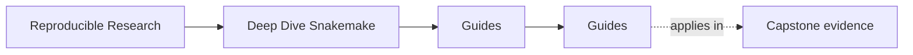
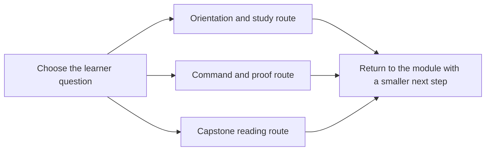

# Guides

<!-- page-maps:start -->
## Page Maps

<!-- page-maps:end -->

Use this page when you know you need support material but do not yet know which guide is
the right one.

The rule is simple: open the smallest page that answers the next honest learner question.

---

## Start The Course

Use these first if you are entering the program or returning after a break:

* [Start Here](start-here.md)
* [Module Promise Map](module-promise-map.md)
* [Module Checkpoints](module-checkpoints.md)
* [Course Guide](course-guide.md)
* [Platform Setup](platform-setup.md)
* [Learning Contract](learning-contract.md)

[Back to top](#top)

---

## Run Commands With Intent

Use these when the question is about execution, proof, or command boundaries:

* [Command Guide](command-guide.md)
* [Proof Matrix](proof-matrix.md)

[Back to top](#top)

---

## Enter The Capstone Deliberately

Use these when the module idea is already legible and you want the executable repository:

* [Capstone Guide](readme-capstone.md)
* [Capstone Map](capstone-map.md)
* [Capstone File Guide](capstone-file-guide.md)
* [Capstone Walkthrough](capstone-walkthrough.md)
* [Capstone Proof Guide](capstone-proof-guide.md)
* [Capstone Review Worksheet](capstone-review-worksheet.md)
* [Capstone Extension Guide](capstone-extension-guide.md)

[Back to top](#top)

---

## Review One Boundary At A Time

Use these when your review question is narrower than "how does the whole repository work":

* [Capstone Architecture Guide](capstone-architecture-guide.md)
* [Publish Review Guide](publish-review-guide.md)
* [Profile Audit Guide](profile-audit-guide.md)
* [Incident Review Guide](incident-review-guide.md)

[Back to top](#top)
