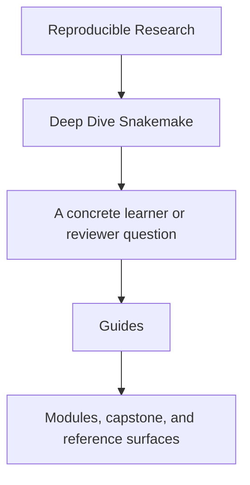
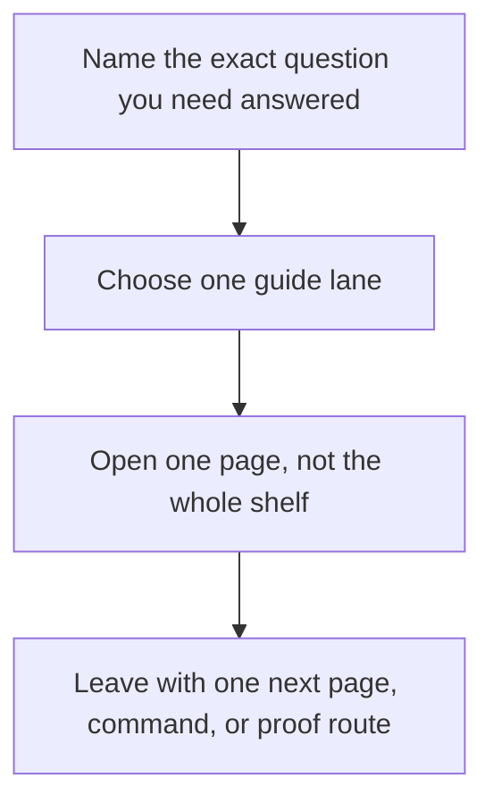

# Guides

<!-- page-maps:start -->
## Guide Fit

<!-- page-maps:end -->

Read the first diagram as a timing map: the guides shelf is for a named pressure, not
for wandering the whole course-book. Read the second diagram as the guide loop: choose
one lane, use one page, then leave with one smaller next move.

Use this shelf when you need route choice, proof sizing, or capstone entry help rather
than one module chapter.

## Choose one lane

| If you need... | Start here | Then use |
| --- | --- | --- |
| the shortest honest entry | [Start Here](start-here.md) | [Course Guide](course-guide.md) |
| the full support-page map | [Course Guide](course-guide.md) | [Learning Contract](learning-contract.md) |
| a route shaped by urgency | [Pressure Routes](pressure-routes.md) | [Proof Ladder](proof-ladder.md) |
| module promises and exit bars | [Module Promise Map](module-promise-map.md) | [Module Checkpoints](module-checkpoints.md) |
| workflow split decisions | [Workflow Modularization](workflow-modularization.md) | [Boundary Map](../reference/boundary-map.md) |
| capstone entry | [Capstone Guide](../capstone/index.md) | [Capstone Map](../capstone/capstone-map.md) |

## Study routes

- [Start Here](start-here.md) for the shortest stable route into the course
- [Course Guide](course-guide.md) for the role of each support surface
- [Learning Contract](learning-contract.md) for the teaching bar and proof expectations
- [Pressure Routes](pressure-routes.md) for repair, stewardship, and incident entry paths
- [Platform Setup](platform-setup.md) before you run local proof commands

## Module support

- [Workflow Modularization](workflow-modularization.md) when the question is how far to split the repository
- [Module Promise Map](module-promise-map.md) when you want each title translated into a learner contract
- [Module Checkpoints](module-checkpoints.md) when you need an exit bar before moving on
- [Module Dependency Map](../reference/module-dependency-map.md) when the reading order needs justification
- [Practice Map](../reference/practice-map.md) when you want the module-to-proof loop in one place

## Proof and command routes

- [Proof Ladder](proof-ladder.md) for choosing the smallest honest route
- [Proof Matrix](proof-matrix.md) for routing a claim to the right evidence surface
- [Boundary Map](../reference/boundary-map.md) when you need workflow-versus-policy separation
- [Glossary](../reference/glossary.md) when the vocabulary itself is the blocker
- [Command Guide](../capstone/command-guide.md) for command boundaries

## Capstone entry routes

- [Capstone Guide](../capstone/index.md) for the repository contract
- [Capstone Map](../capstone/capstone-map.md) for module and question routing
- [Capstone Walkthrough](../capstone/capstone-walkthrough.md) for a bounded first pass
- [Capstone Proof Guide](../capstone/capstone-proof-guide.md) for the shortest proof route
- [Capstone Review Worksheet](../capstone/capstone-review-worksheet.md) for steward-level workflow review
- [Capstone Extension Guide](../capstone/capstone-extension-guide.md) for safe evolution

## Good stopping point

Stop when you can name the single next page you need and the question it is supposed to
answer. If you are still opening whole shelves, go back to the table above and choose a
smaller lane.

## Directory glossary

Use [Glossary](glossary.md) when you want the recurring language in this shelf kept
stable while you move between study routes, proof routes, and support pages.
