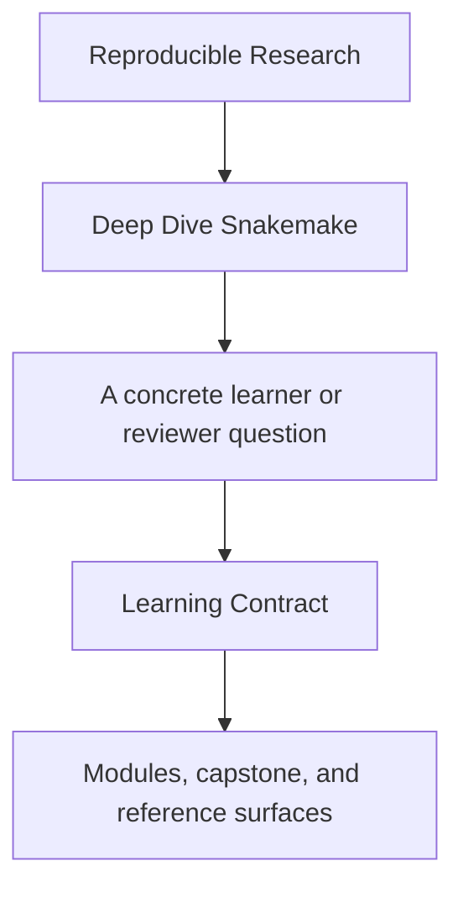
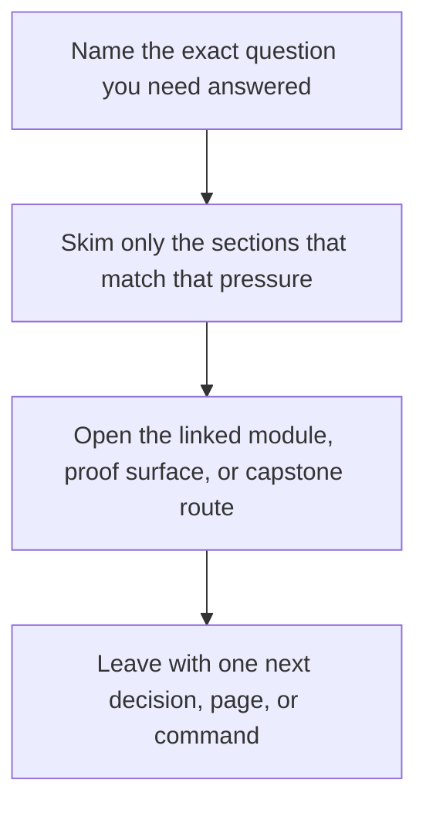

# Learning Contract

<!-- page-maps:start -->
## Guide Fit

<!-- page-maps:end -->

Read the first diagram as a timing map: this guide is for a named pressure, not for wandering the whole course-book. Read the second diagram as the guide loop: arrive with a concrete question, use only the matching sections, then leave with one smaller and more honest next move.

Deep Dive Snakemake is built around one rule: important workflow claims should be
checkable by files, commands, or proof artifacts rather than by trust in prose alone.

This page makes that rule explicit so the learner knows what the course expects and how
to use each module well.

---

## The Teaching Sequence

The strongest sections in this course follow this order:

1. contract question
2. failure mode
3. repair pattern
4. proof command
5. capstone corroboration

If a section jumps straight from advice to commands, it is weaker than the course should
be.

[Back to top](#top)

---

## The Learner's Responsibility

Your job is not to memorize Snakemake directives. Your job is to verify what contract the
workflow is making.

For each module, you should be able to answer:

* what boundary the workflow is claiming
* what would break if that boundary were false
* which file or artifact makes the claim reviewable
* which command proves the claim instead of only asserting it

[Back to top](#top)

---

## The Instructor's Responsibility

The course material should always provide:

* a clear workflow question
* an explanation of the failure mode it prevents
* a proof loop the learner can run
* a reason the capstone is or is not the right teaching surface yet

If those are missing, the learner has to reconstruct the pedagogy alone.

[Back to top](#top)

---

## The Proof Surfaces You Should Use Constantly

These surfaces appear throughout the course because they answer different workflow
questions:

| Surface | What it proves |
| --- | --- |
| dry-run output | the planned jobs and file contracts |
| `--summary` | the recorded state of outputs |
| `--list-changes` | why code, params, or inputs changed |
| `FILE_API.md` | what downstream users are allowed to trust |
| publish tree | the versioned external contract |
| tests and verification targets | whether the repository can defend its own claims |

[Back to top](#top)

---

## When To Use The Capstone

Use the capstone when the concept is already legible in a smaller local model and you
want to inspect how it behaves in a realistic workflow repository.

Do not use the capstone:

* as your first exposure to a concept
* as a substitute for understanding the workflow boundary in plain language
* as evidence that you understand dynamic behavior you still cannot explain simply

Use [`capstone/capstone-map.md`](../capstone/capstone-map.md) when you need a guided route through the
repository.

[Back to top](#top)

---

## Definition Of Done For A Module

A module is complete only when you can:

* explain the contract boundary it teaches
* identify one representative failure mode
* run its core proof loop
* connect the local idea to one capstone surface intentionally

If you can only repeat words like “reproducibility” or “workflow,” the module is not
done yet.

[Back to top](#top)
