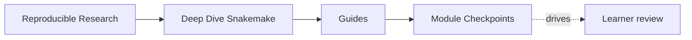
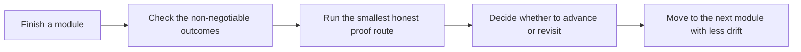

# Module Checkpoints

<!-- page-maps:start -->
## Page Maps

<!-- page-maps:end -->

This page is the missing study contract at the end of each module. It gives a human bar
for readiness instead of assuming that reading the prose once means the concept is
stable.

Use it when you are about to move on and want to know whether you are ready, what you are
still fuzzy on, and which proof route should settle the question.

---

## How To Use The Checkpoints

For each module:

1. read the module overview and main lessons
2. answer the checkpoint questions without looking at the text
3. run the smallest honest proof route
4. only advance when the concept feels explainable, not merely recognizable

[Back to top](#top)

---

## Checkpoint Table

| Module | You are ready when you can explain | You should be able to do | Useful proof route |
| --- | --- | --- | --- |
| 01 | why rules and targets form a file-driven DAG | explain a dry-run without hand-waving | `capstone-walkthrough` |
| 02 | why checkpoints need explicit, durable discovery artifacts | describe what discovery is allowed to change and what must stay stable | `test` |
| 03 | why profiles and retries are policy, not workflow meaning | distinguish execution context from workflow semantics | `capstone-tour` |
| 04 | how modularity and interfaces keep larger workflows reviewable | name which file boundary should absorb one scaling change | `capstone-tour` |
| 05 | why scripts, wrappers, and envs must stay reviewable | explain which logic belongs in rules versus helper code | `proof` |
| 06 | what makes a publish surface trustworthy downstream | explain the difference between internal state and public outputs | `capstone-verify-report` |
| 07 | how repository architecture protects workflow meaning | review ownership without guessing where the contract lives | `proof` |
| 08 | what may change across local, CI, and cluster contexts | explain which differences are policy and which would be semantic drift | `capstone-profile-audit` |
| 09 | how to move from workflow symptom to evidence-backed diagnosis | choose the right observability or incident surface first | `proof` |
| 10 | when Snakemake should stop owning a concern | review a workflow as a long-lived product with migration judgment | `capstone-confirm` |

[Back to top](#top)

---

## Failure Signals

Do not advance yet if any of these are still true:

* you recognize the term but cannot explain the invariant it protects
* you know the strongest proof command but not the smallest honest one
* you can follow the capstone mechanically but cannot name the owning boundary
* you can repeat the repair pattern but cannot say what failure it prevents

These are not small study gaps. They are signals that the next module will feel more
arbitrary than it should.

[Back to top](#top)

---

## Best Companion Pages

Use these with the checkpoints:

* [`module-promise-map.md`](module-promise-map.md) to see what each title promised
* [`proof-ladder.md`](proof-ladder.md) to keep proof proportional to the question
* [`practice-map.md`](../reference/practice-map.md) to match module work with proof loops
* [`capstone-review-worksheet.md`](capstone-review-worksheet.md) when you want to record what the evidence actually showed

[Back to top](#top)
