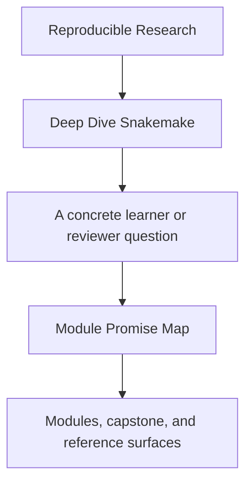
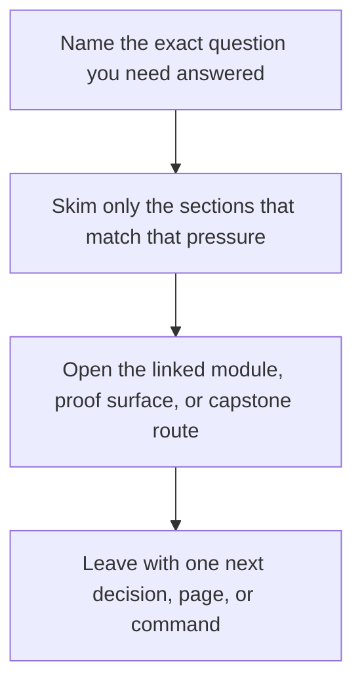

# Module Promise Map

<!-- page-maps:start -->
## Guide Fit

<!-- page-maps:end -->

Read the first diagram as a timing map: this guide is for a named pressure, not for wandering the whole course-book. Read the second diagram as the guide loop: arrive with a concrete question, use only the matching sections, then leave with one smaller and more honest next move.

This page exists because strong module titles are not enough. A learner should be able to
ask, for every module, “what is this module promising me, and how will I know it was
delivered?”

Use this guide when a title sounds right but still feels too broad, too compressed, or
too weakly tied to proof.

---

## How To Read This Page

Each row names four things:

* the module promise
* the boundary of that promise
* the learner outcome the module should leave behind
* the first honest capstone corroboration route

If a module page drifts away from this contract, the drift should become visible here.

[Back to top](#top)

---

## Promise Table

| Module | Promise | Boundary | Learner outcome | First corroboration |
| --- | --- | --- | --- | --- |
| 01 File-DAG Contract | teach Snakemake as explicit file semantics, not command folklore | rules, targets, dry-runs, publish boundary | explain why planned work exists before execution | `capstone-walkthrough` |
| 02 Dynamic DAGs | teach staged discovery without turning the plan into magic | checkpoints, discovery artifacts, deterministic planning | explain what a checkpoint may discover and what it must never hide | `test` |
| 03 Production Operations | teach policy surfaces without semantic drift | profiles, retries, staging, governance, verification gates | distinguish workflow meaning from run-context policy | `capstone-tour` |
| 04 Scaling Boundaries | teach larger repository design without interface blur | modules, file APIs, CI gates, executor-proof semantics | inspect a repository boundary without guessing where the contract lives | `capstone-tour` |
| 05 Software Boundaries | teach the line between workflow logic and software stack | wrappers, scripts, envs, helper-code ownership | explain which logic belongs in rules versus helper code | `proof` |
| 06 Downstream Contracts | teach stable outputs and publish trust | versioned publish surfaces, reports, manifests, checksums | review whether a downstream consumer could trust the workflow outputs | `capstone-verify-report` |
| 07 Workflow Architecture | teach repository ownership and reusable boundaries | rule families, helper code, file APIs, architectural split | point to the owning boundary for a workflow change | `proof` |
| 08 Operating Contexts | teach policy and environment variance honestly | profiles, executors, staging, storage, operating drift | explain what may change across contexts and what must not | `capstone-profile-audit` |
| 09 Incident Response | teach diagnosis under workflow pressure | logs, benchmarks, workflow-tour evidence, review order | move from symptom to responsible boundary with less guesswork | `proof` |
| 10 Tool Boundaries | teach stewardship, migration, and orchestration judgment | governance, anti-patterns, handoff boundaries, review method | decide whether Snakemake should still own the concern | `capstone-confirm` |

[Back to top](#top)

---

## Promise Failures This Page Guards Against

When module titles are strong but unchecked, courses usually fail in one of four ways:

* the title promises judgment, but the module only delivers syntax
* the title promises operations, but the proof routes stay abstract
* the title promises architecture, but ownership remains blurry
* the title promises publish trust or governance, but the capstone surface never corroborates it

This page makes those failures visible before they harden into course drift.

[Back to top](#top)

---

## Best Companion Pages

Use these pages with the promise map:

* [`course-guide.md`](course-guide.md) for the stable learner hub
* [`module-checkpoints.md`](module-checkpoints.md) for the end-of-module review bar
* [`proof-matrix.md`](proof-matrix.md) for claim-to-evidence routing
* [`capstone-map.md`](capstone-map.md) for module-to-capstone entry routes

[Back to top](#top)
