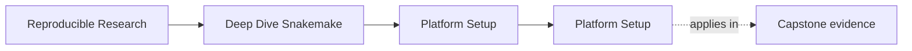
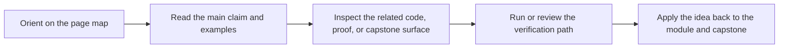

<a id="top"></a>

# Platform Setup


<!-- page-maps:start -->
## Page Maps




<!-- page-maps:end -->

Deep Dive Snakemake depends on more than a `snakemake` binary existing somewhere on the
machine. The course assumes a small, explicit platform contract.

This page makes that contract clear before the learner hits avoidable setup failures.

---

## Minimum Tooling

You need:

* Python 3.11 or newer
* Snakemake 8 or newer
* a writable local filesystem for the capstone working directories
* `dot` from Graphviz if you want DAG or rulegraph rendering

[Back to top](#top)

---

## Repository Root

The course-level commands use the repository root Makefile:

```sh
make PROGRAM=reproducible-research/deep-dive-snakemake program-help
make PROGRAM=reproducible-research/deep-dive-snakemake docs-build
```

Use these commands when you want docs or program-level verification.

[Back to top](#top)

---

## Capstone Setup

From `programs/reproducible-research/deep-dive-snakemake/capstone/`:

```sh
make info
make walkthrough
make wf-dryrun
```

That sequence confirms the visible toolchain, validates config when the optional Python
dependencies are present, and proves the workflow can at least plan correctly before a
full execution.

[Back to top](#top)

---

## Verify Your Setup

From the capstone directory:

```sh
make help
make walkthrough
make verify
```

If `make verify` succeeds, the capstone can execute, publish its bundle, and validate the
promoted artifacts.

[Back to top](#top)

---

## Common Setup Failures

| Symptom | Likely cause | Fix |
| --- | --- | --- |
| `snakemake` missing in `make info` | Snakemake not installed in the active shell | install Snakemake 8+ or point `SNAKEMAKE` at the intended binary |
| config validation skips unexpectedly | `jsonschema` or `pyyaml` missing | install the missing Python packages if you want schema validation to execute |
| `dag` or `rulegraph` fails | Graphviz `dot` missing | install Graphviz and rerun the target |
| `verify` fails after a successful dry-run | runtime dependencies or filesystem assumptions differ from the planning surface | inspect `profiles/`, `config/`, and the failing rule logs before changing workflow code |

[Back to top](#top)
