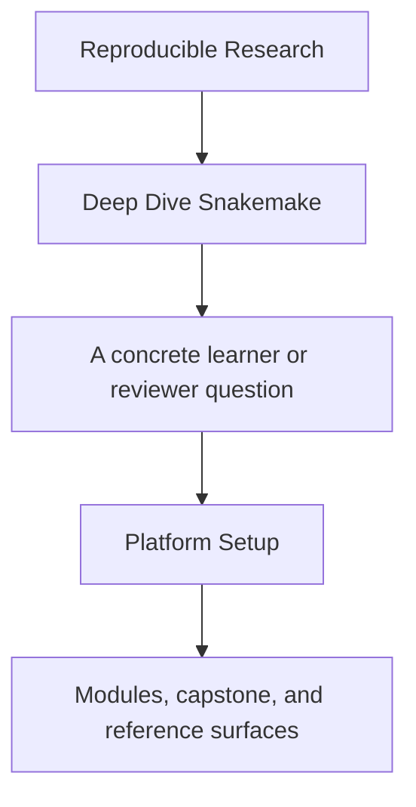
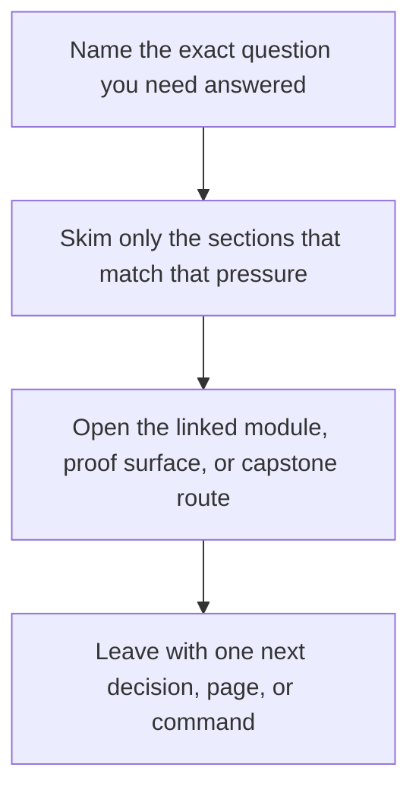

<a id="top"></a>

# Platform Setup


<!-- page-maps:start -->
## Guide Fit




<!-- page-maps:end -->

Read the first diagram as a timing map: this guide is for a named pressure, not for wandering the whole course-book. Read the second diagram as the guide loop: arrive with a concrete question, use only the matching sections, then leave with one smaller and more honest next move.

Deep Dive Snakemake depends on more than a `snakemake` binary existing somewhere on the
machine. The course assumes a small, explicit platform contract.

This page makes that contract clear before the learner hits avoidable setup failures.

---

## Minimum Tooling

You need:

* Python 3.11 or newer
* Snakemake **9.14.x** if you are using a preinstalled global binary
* a writable local filesystem for the capstone working directories
* `dot` from Graphviz if you want DAG or rulegraph rendering

The safest path on a fresh machine is still `make bootstrap-confirm`, because it creates
the supported local toolchain instead of depending on whatever `snakemake` happens to be
installed globally.

[Back to top](#top)

---

## Version Contract

The course and capstone teach **Snakemake 9.14.x semantics**. That matters because the
course relies on modern behavior around profiles, modules, reporting, and current CLI
surfaces.

Use one of these two routes:

* preferred: `make bootstrap-confirm` to create the pinned local toolchain and run the strongest clean-room proof route
* acceptable: use a preinstalled `snakemake`, but verify `snakemake --version` reports `9.14.x` before trusting course commands literally

[Back to top](#top)

---

## Repository Root

The course-level commands use the repository root Makefile:

```sh
make PROGRAM=reproducible-research/deep-dive-snakemake program-help
make PROGRAM=reproducible-research/deep-dive-snakemake docs-build
```

Use these commands when you want docs or program-level verification.

[Back to top](#top)

---

## Capstone Setup

From `programs/reproducible-research/deep-dive-snakemake/capstone/`:

```sh
make bootstrap
make walkthrough
make wf-dryrun
```

That sequence creates the supported local toolchain under `artifacts/venv/`,
prints the resolved versions, and proves the workflow can at least plan correctly before
a full execution.

[Back to top](#top)

---

## One-Command Truth Path

On a fresh machine, the shortest honest setup-and-proof route is:

```sh
make bootstrap-confirm
```

That target creates the supported local toolchain and then runs the clean-room
confirmation route without depending on a preinstalled global `snakemake`.

[Back to top](#top)

---

## Verify Your Setup

From the capstone directory:

```sh
make help
make bootstrap
make verify
```

If `make bootstrap` and `make verify` both succeed, the capstone can execute, publish
its bundle, and validate the promoted artifacts using the supported local toolchain.

[Back to top](#top)

---

## Common Setup Failures

| Symptom | Likely cause | Fix |
| --- | --- | --- |
| `make bootstrap` fails immediately | Python 3.11+ is missing or unavailable to `python3` | install Python 3.11+ and rerun `make bootstrap` |
| `snakemake` missing in `make info` | no global Snakemake is installed and `make bootstrap` has not been run yet | run `make bootstrap` or point `SNAKEMAKE` at the intended binary |
| config validation skips unexpectedly | `jsonschema` or `pyyaml` missing | install the missing Python packages if you want schema validation to execute |
| `dag` or `rulegraph` fails | Graphviz `dot` missing | install Graphviz and rerun the target |
| `verify` fails after a successful dry-run | runtime dependencies or filesystem assumptions differ from the planning surface | inspect `profiles/`, `config/`, and the failing rule logs before changing workflow code |

[Back to top](#top)
