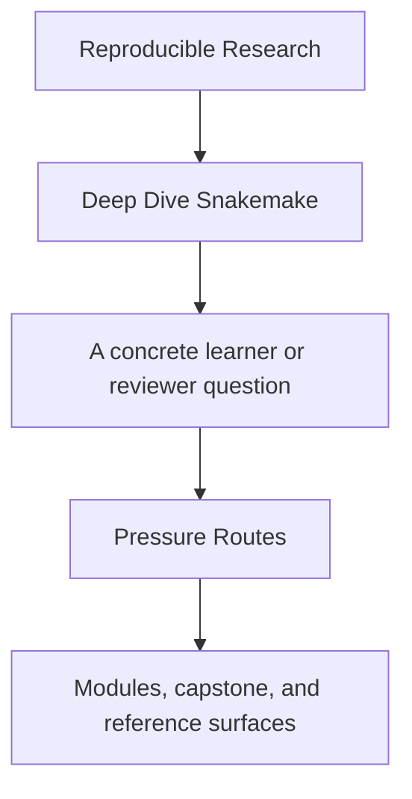
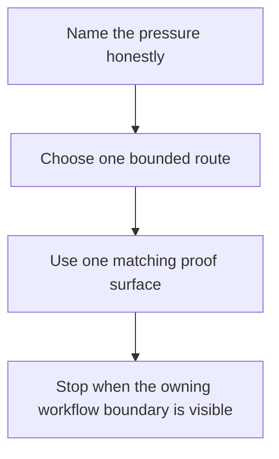

# Pressure Routes

<!-- page-maps:start -->
## Guide Fit

<!-- page-maps:end -->

Read the first diagram as a timing map: this page is for non-ideal reading conditions,
not calm full-course study. Read the second diagram as the loop: name the pressure,
choose one bounded route, use one proof surface, then stop when the owning workflow
boundary is visible.

Use this page when urgency is shaping what you can realistically read.

## Choose the route that matches the pressure

| Pressure | First page | First module or reference | First proof surface | Stop when you can name... |
| --- | --- | --- | --- | --- |
| first contact | [Start Here](start-here.md) | [Module 00](../module-00-orientation/index.md), [Module 01](../module-01-file-contracts-workflow-graph-truth/index.md) | [Capstone Walkthrough](../capstone/capstone-walkthrough.md) | one truthful file contract and one reason the capstone is not first contact |
| inherited workflow repair | [Anti-Pattern Atlas](../reference/anti-pattern-atlas.md) | [Module 03](../module-03-production-operations-policy-boundaries/index.md), [Module 04](../module-04-scaling-workflows-interface-boundaries/index.md) | [Command Guide](../capstone/command-guide.md) | whether the failure is workflow semantics, policy drift, interface sprawl, or execution context |
| publish and stewardship review | [Course Guide](course-guide.md) | [Module 06](../module-06-publishing-downstream-contracts/index.md), [Module 07](../module-07-workflow-architecture-file-apis/index.md), [Module 10](../module-10-governance-migration-tool-boundaries/index.md) | [Capstone Proof Guide](../capstone/capstone-proof-guide.md) | what downstream trust depends on and which route is strong enough to defend it |
| incident pressure | [Capstone Review Worksheet](../capstone/capstone-review-worksheet.md) | [Module 09](../module-09-performance-observability-incident-response/index.md), [Boundary Map](../reference/boundary-map.md) | [Profile Audit Guide](../capstone/profile-audit-guide.md) | the symptom, the owning workflow boundary, and the next smallest confirming command |

## What not to do under pressure

- do not start with the whole capstone repository
- do not escalate to the strongest proof route because the situation feels urgent
- do not read governance pages before the current workflow boundary is named
- do not open every support page when one route already matches the pressure

## Good companion pages

- [Module Promise Map](module-promise-map.md) when the route needs a sharper module contract
- [Proof Ladder](proof-ladder.md) when the current command still feels too heavy
- [Capstone Map](../capstone/capstone-map.md) when you know the module but not the repository surface
- [Topic Boundaries](../reference/topic-boundaries.md) when the pressure is really outside the course boundary

## Good stopping point

Stop when you know which workflow boundary owns the current problem and which next page
or command would test that claim directly. If you still cannot name the boundary, return
to the table above instead of widening the reading surface.
