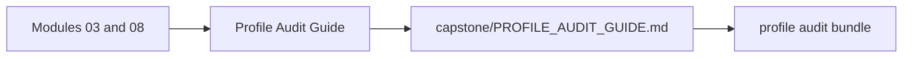
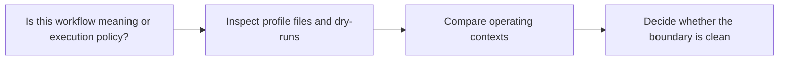

# Profile Audit Guide

<!-- page-maps:start -->
## Page Maps

<!-- page-maps:end -->

Use this page when the question is about local, CI, and scheduler execution contexts
rather than about rule contracts alone.

---

## Recommended Route

1. Read `capstone/PROFILE_AUDIT_GUIDE.md`.
2. Run `make -C capstone profile-audit` or the course-level equivalent.
3. Compare the resulting bundle with [Capstone Review Worksheet](capstone-review-worksheet.md) and [Boundary Map](../boundary-map.md).

[Back to top](#top)

---

## What A Good Audit Can Answer

- which settings are operating policy and which would change workflow meaning
- which context shift would be safest or riskiest for reproducibility
- where a reviewer should look first when execution context changes

[Back to top](#top)
