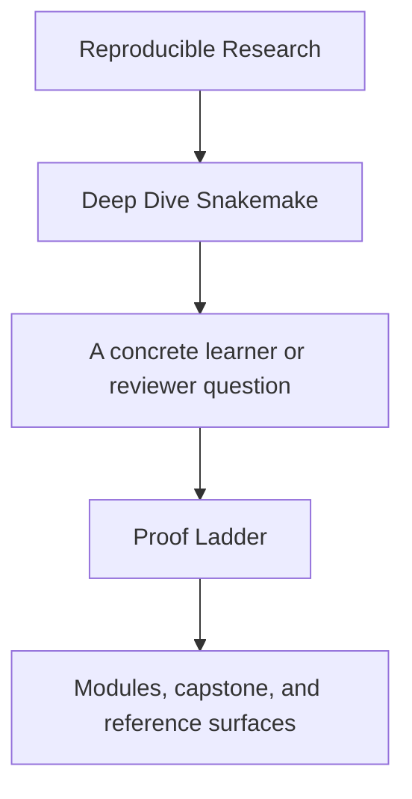
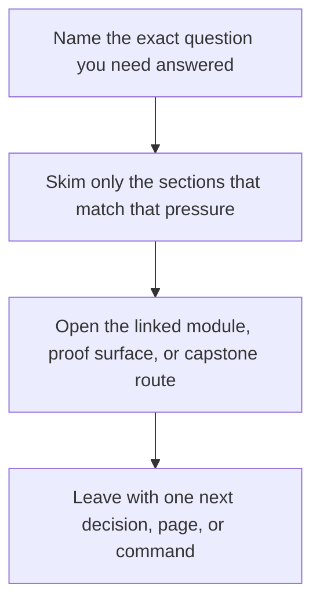

# Proof Ladder

<!-- page-maps:start -->
## Guide Fit

<!-- page-maps:end -->

Read the first diagram as a timing map: this guide is for a named pressure, not for wandering the whole course-book. Read the second diagram as the guide loop: arrive with a concrete question, use only the matching sections, then leave with one smaller and more honest next move.

This page fixes a recurring problem: the course has enough proof routes that learners can
easily overreach. They run the strongest command first, get buried in evidence, and lose
the idea they were trying to verify.

Use this page to keep proof proportional to the question.

---

## The Ladder

Move down this ladder only when the smaller step no longer answers the question honestly.

| Proof level | Command | Best use | Cost |
| --- | --- | --- | --- |
| 1 | `make PROGRAM=reproducible-research/deep-dive-snakemake capstone-walkthrough` | first contact with repository meaning | low |
| 2 | `make PROGRAM=reproducible-research/deep-dive-snakemake capstone-tour` | executed repository review with bounded scope | low to medium |
| 3 | `make PROGRAM=reproducible-research/deep-dive-snakemake test` | ordinary executable proof of the reference workflow | medium |
| 4 | `make PROGRAM=reproducible-research/deep-dive-snakemake capstone-verify-report` | durable saved publish-contract evidence | medium |
| 5 | `make PROGRAM=reproducible-research/deep-dive-snakemake capstone-profile-audit` | targeted execution-policy and context review | medium |
| 6 | `make PROGRAM=reproducible-research/deep-dive-snakemake proof` | sanctioned multi-bundle corroboration | high |
| 7 | `make PROGRAM=reproducible-research/deep-dive-snakemake capstone-confirm` | strongest stewardship and confirmation pass | highest |

[Back to top](#top)

---

## Which Questions Belong To Which Level

| Question | Start at |
| --- | --- |
| what is this repository trying to prove | capstone-walkthrough |
| how is the repository organized in executable form | capstone-tour |
| does the workflow still behave correctly | test |
| do I need durable proof I can review later | capstone-verify-report |
| what differs across local, CI, and cluster policy | capstone-profile-audit |
| how do the larger proof surfaces fit together | proof |
| is this repository ready for the strongest review pass | capstone-confirm |

[Back to top](#top)

---

## Anti-Patterns This Ladder Prevents

The ladder exists to prevent these clumsy review habits:

* running `capstone-confirm` when `capstone-walkthrough` would answer the question
* treating one large proof bundle as automatically better than a narrower one
* confusing publish review with operating-context review
* burying a first-contact learner in incident evidence before the workflow contract is legible

[Back to top](#top)

---

## Best Companion Pages

Use these with the ladder:

* [`capstone/command-guide.md`](../capstone/command-guide.md) for command-layer boundaries
* [`proof-matrix.md`](proof-matrix.md) for claim-to-evidence routing
* [`capstone/capstone-map.md`](../capstone/capstone-map.md) for module-aware entry routes
* [`workflow-glossary.md`](../reference/workflow-glossary.md) when the question is still too fuzzy to prove well

[Back to top](#top)
