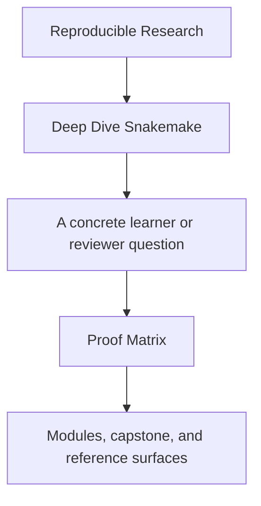
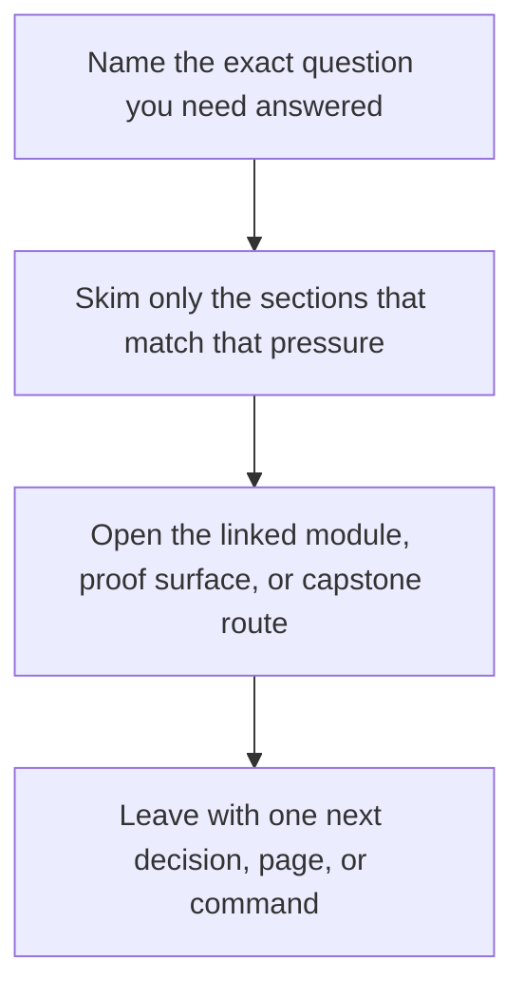

# Proof Matrix

<!-- page-maps:start -->
## Guide Fit

<!-- page-maps:end -->

Read the first diagram as a timing map: this guide is for a named pressure, not for wandering the whole course-book. Read the second diagram as the guide loop: arrive with a concrete question, use only the matching sections, then leave with one smaller and more honest next move.

This page maps the course's main claims to the commands and files that prove them.

Use it when you care about a concept but want the fastest evidence route.

---

## Core Workflow Claims

| Claim | Command | File surfaces |
| --- | --- | --- |
| the capstone has a bounded first-pass reading route | `make PROGRAM=reproducible-research/deep-dive-snakemake capstone-walkthrough` | `course-book/capstone/index.md`, `artifacts/make/workflow-walkthrough/` |
| the workflow exposes its public rule surface clearly | `make -C capstone walkthrough` | `capstone/Snakefile`, `artifacts/make/workflow-walkthrough/list-rules.txt` |
| dynamic discovery becomes explicit evidence instead of a hidden side effect | `make -C capstone verify` | `capstone/results/discovered_samples.json`, `capstone/publish/v1/discovered_samples.json` |
| profiles change execution policy without changing workflow meaning | `make -C capstone wf-dryrun PROFILE=profiles/local` and `PROFILE=profiles/ci` | `capstone/profiles/`, `capstone/Makefile` |
| promoted outputs are smaller than the full internal repository state | `make -C capstone tour` | [`publish-review-guide.md`](../capstone/publish-review-guide.md), `capstone/publish/v1/`, `capstone/results/` |

[Back to top](#top)

---

## Operational Claims

| Claim | Command | File surfaces |
| --- | --- | --- |
| the workflow validates configuration before execution | `make -C capstone validate-config` | `capstone/config/config.yaml`, `capstone/config/schema.yaml` |
| the workflow can explain its plan before a run | `make -C capstone wf-dryrun` | `artifacts/make/workflow-walkthrough/dryrun.txt`, `capstone/workflow/rules/` |
| the publish bundle can defend itself after execution | `make -C capstone verify-artifacts` | `capstone/publish/v1/manifest.json`, `capstone/publish/v1/provenance.json` |
| the publish boundary is reviewable as a durable contract | `make -C capstone verify-report` | [`publish-review-guide.md`](../capstone/publish-review-guide.md), `artifacts/proof/reproducible-research/deep-dive-snakemake/verify/` |
| the repository can prove itself through one stronger end-to-end route | `make -C capstone confirm` | `capstone/Makefile`, `capstone/tests/` |
| workflow incidents can be reviewed with narrower evidence than a full rewrite | `make -C capstone selftest` or `make -C capstone tour` | `capstone/tests/selftest.sh`, `capstone/logs/`, `artifacts/tour/reproducible-research/deep-dive-snakemake/` |

The root-level equivalents for the specialized review bundles are:

- `make PROGRAM=reproducible-research/deep-dive-snakemake capstone-verify-report`
- `make PROGRAM=reproducible-research/deep-dive-snakemake capstone-profile-audit`
- `make PROGRAM=reproducible-research/deep-dive-snakemake capstone-selftest`
| the executed workflow tour is reviewable as evidence | `make -C capstone tour` | `artifacts/make/workflow-tour/`, [`capstone-walkthrough.md`](../capstone/capstone-walkthrough.md) |

[Back to top](#top)

---

## Review Questions

| Question | Best first command | Best first file |
| --- | --- | --- |
| where should a new learner start in the capstone | `make PROGRAM=reproducible-research/deep-dive-snakemake capstone-walkthrough` | `course-book/capstone/index.md` |
| what does this workflow claim it will build | `make -C capstone wf-dryrun` | `capstone/Snakefile` |
| what exactly is public for downstream trust | `make -C capstone verify-artifacts` | [`publish-review-guide.md`](../capstone/publish-review-guide.md) |
| which surface explains dynamic discovery honestly | `make -C capstone verify` | `capstone/workflow/rules/preprocess.smk` |
| what would I inspect before migration | `make -C capstone confirm` | `course-book/capstone/index.md` |

[Back to top](#top)

---

## Companion Pages

The most useful companion pages for this matrix are:

* [`capstone/command-guide.md`](../capstone/command-guide.md)
* [`boundary-map.md`](../reference/boundary-map.md)
* [`practice-map.md`](../reference/practice-map.md)
* [`capstone-file-guide.md`](../capstone/capstone-file-guide.md)
* [`publish-review-guide.md`](../capstone/publish-review-guide.md)
* [`incident-review-guide.md`](../capstone/incident-review-guide.md)

[Back to top](#top)
