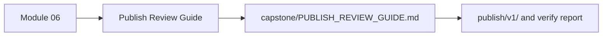
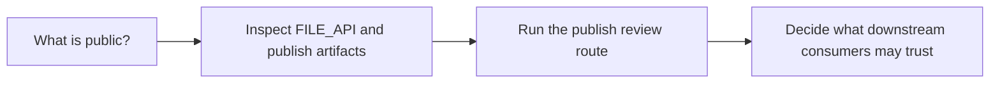

# Publish Review Guide

<!-- page-maps:start -->
## Page Maps

<!-- page-maps:end -->

Use this page when the question is not merely "did the workflow run?" but "what is the
stable published contract and how is it defended?"

---

## Recommended Route

1. Read `capstone/PUBLISH_REVIEW_GUIDE.md`.
2. Run `make -C capstone verify-report` or the course-level equivalent.
3. Compare the report bundle with [Capstone Review Worksheet](capstone-review-worksheet.md) and [Proof Matrix](proof-matrix.md).

[Back to top](#top)

---

## What A Good Review Can Answer

- which promoted files belong to the public contract
- which proofs are about publish trust rather than workflow execution generally
- which future change would require a versioned publish boundary change

[Back to top](#top)
