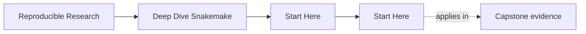
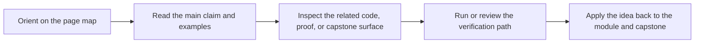

<a id="top"></a>

# Start Here


<!-- page-maps:start -->
## Page Maps




<!-- page-maps:end -->

Deep Dive Snakemake is not a syntax reference. It is a course about workflow design as an
engineering contract: explicit file boundaries, safe dynamic behavior, publishable
artifacts, and operationally stable execution.

Use this page to choose the right route before reading modules at random.

---

## Who This Course Helps Most

This course is a strong fit if you are:

* learning Snakemake and want a principled workflow model instead of disconnected snippets
* inheriting a pipeline that runs but is hard to trust, review, or extend
* already using Snakemake and now need stronger publish, profile, and workflow-boundary judgment
* reviewing whether a workflow can survive CI, shared filesystems, and long-lived change

This course is a weak fit if you only want a quick syntax reminder without caring how the
workflow behaves under pressure.

[Back to top](#top)

---

## Pick Your Route

### Route 1: First Contact

Choose this if Snakemake still feels new.

1. Read [`module-00-orientation/index.md`](../module-00-orientation/index.md)
2. Read [`module-01-file-contracts-and-the-workflow-dag/index.md`](../module-01-file-contracts-and-the-workflow-dag/index.md)
3. Read [`module-02-dynamic-dags-integrity-and-deterministic-discovery/index.md`](../module-02-dynamic-dags-integrity-and-deterministic-discovery/index.md)
4. Enter the capstone only after file contracts and dynamic DAG basics feel clear

### Route 2: Repair An Existing Workflow

Choose this if you already maintain a Snakemake repository.

1. Skim [`module-00-orientation/index.md`](../module-00-orientation/index.md)
2. Read [`module-03-production-operations-and-policy-boundaries/index.md`](../module-03-production-operations-and-policy-boundaries/index.md)
3. Read [`module-04-scaling-workflows-and-interface-boundaries/index.md`](../module-04-scaling-workflows-and-interface-boundaries/index.md)
4. Read [`module-08-operating-contexts-and-execution-policy/index.md`](../module-08-operating-contexts-and-execution-policy/index.md)
5. Use [`capstone-map.md`](capstone-map.md) to inspect the reference workflow selectively

### Route 3: Workflow Stewardship

Choose this if your main concern is architecture, publish boundaries, and long-lived operations.

1. Read [`module-06-publishing-and-downstream-contracts/index.md`](../module-06-publishing-and-downstream-contracts/index.md)
2. Read [`module-07-workflow-architecture-and-file-apis/index.md`](../module-07-workflow-architecture-and-file-apis/index.md)
3. Read [`module-09-observability-performance-and-incident-response/index.md`](../module-09-observability-performance-and-incident-response/index.md)
4. Read [`module-10-governance-migration-and-tool-boundaries/index.md`](../module-10-governance-migration-and-tool-boundaries/index.md)
5. Finish with the capstone review route

[Back to top](#top)

---

## What Success Looks Like

You are using the course correctly if you can do all of this without hand-waving:

* explain why a workflow would rerun with evidence instead of intuition
* distinguish workflow semantics from profile or executor policy
* say which outputs are internal versus safe for downstream consumers to trust
* explain what a checkpoint is allowed to discover and what it must never hide

If those answers are still weak, stay with the smaller module surfaces before treating
the capstone as your main learning surface.

[Back to top](#top)

---

## Best First Commands

From the repository root:

```bash
make PROGRAM=reproducible-research/deep-dive-snakemake program-help
make PROGRAM=reproducible-research/deep-dive-snakemake capstone-tour
```

From the capstone:

```bash
make walkthrough
make wf-dryrun
```

Then use:

* [`capstone-map.md`](capstone-map.md) when you want the repository route by module
* [`module-00-orientation/index.md`](../module-00-orientation/index.md) when you want the full course arc
* [`course-guide.md`](course-guide.md) when you want the right support page quickly

[Back to top](#top)
