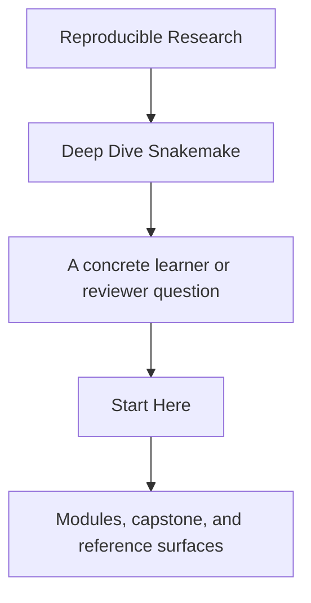
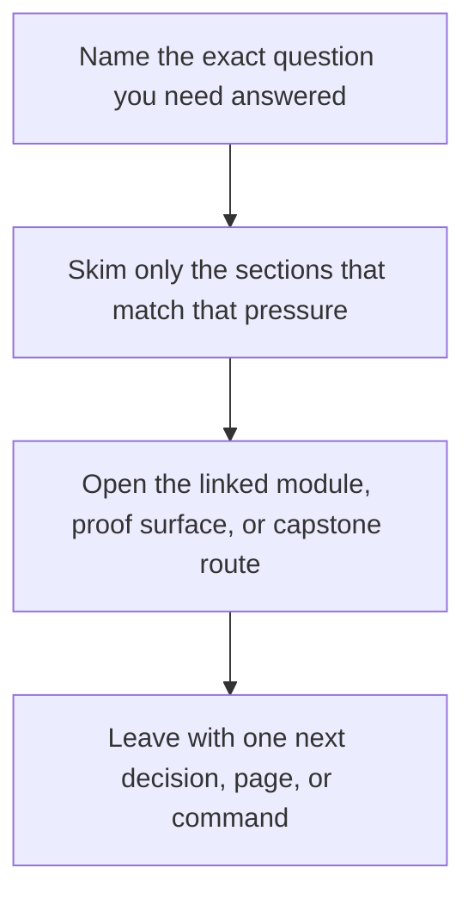

# Start Here

<!-- page-maps:start -->
## Guide Fit

<!-- page-maps:end -->

Read the first diagram as a timing map: this guide is for a named pressure, not for wandering the whole course-book. Read the second diagram as the guide loop: arrive with a concrete question, use only the matching sections, then leave with one smaller and more honest next move.

Deep Dive Snakemake is not a syntax reference. It is a course about workflow design as an
engineering contract: explicit file boundaries, safe dynamic behavior, publishable
artifacts, and operationally stable execution.

Use this page to choose the right route before reading modules at random.

## Use This Course If

- you are learning Snakemake and want a principled workflow model instead of disconnected snippets
- you inherited a pipeline that runs but is hard to trust, review, or extend
- you already use Snakemake and now need stronger publish, profile, and workflow-boundary judgment
- you review whether a workflow can survive CI, shared filesystems, and long-lived change

## Do Not Start Here If

- you only want a quick syntax reminder without caring how the workflow behaves under pressure
- you want executor or profile advice before you can explain the workflow contract
- you want dynamic behavior without explicit discovery and publish boundaries

## Best Reading Route

1. Read [Course Home](../index.md) for the program promise and support surfaces.
2. Read [Course Guide](course-guide.md) for the module arc and page roles.
3. Read [Learning Contract](learning-contract.md) before you start Module 01.
4. Read [Platform Setup](platform-setup.md) before you run proof commands so the Snakemake 9.14.x version contract is explicit.
5. Read [Module 00](../module-00-orientation/index.md) for the study model and capstone timing.
6. Use [Module Promise Map](module-promise-map.md) and [Module Checkpoints](module-checkpoints.md) to keep the titles honest as you move forward.
7. Keep [Boundary Map](../reference/boundary-map.md), [Workflow Modularization](workflow-modularization.md), and [Capstone Map](capstone-map.md) nearby, but enter the capstone only after the module idea is clear.

## Route By Pressure

### First contact

1. Read [Module 00](../module-00-orientation/index.md).
2. Read [Module 01](../module-01-file-contracts-and-the-workflow-dag/index.md).
3. Read [Module 02](../module-02-dynamic-dags-integrity-and-deterministic-discovery/index.md).
4. Use [Module Checkpoints](module-checkpoints.md) before moving on.

### Repair an existing workflow

1. Read [Pressure Routes](pressure-routes.md).
2. Skim [Module 00](../module-00-orientation/index.md).
3. Read [Module 03](../module-03-production-operations-and-policy-boundaries/index.md).
4. Read [Module 04](../module-04-scaling-workflows-and-interface-boundaries/index.md).
5. Read [Module 08](../module-08-operating-contexts-and-execution-policy/index.md).
6. Use [Anti-Pattern Atlas](../reference/anti-pattern-atlas.md) and [Capstone Map](capstone-map.md) to inspect the reference workflow selectively.

### Workflow stewardship

1. Read [Module 06](../module-06-publishing-and-downstream-contracts/index.md).
2. Read [Module 07](../module-07-workflow-architecture-and-file-apis/index.md).
3. Read [Module 09](../module-09-observability-performance-and-incident-response/index.md).
4. Read [Module 10](../module-10-governance-migration-and-tool-boundaries/index.md).
5. Finish with [Capstone Review Worksheet](capstone-review-worksheet.md) and [Capstone Extension Guide](capstone-extension-guide.md).

## Success Signal

You are using the course correctly if you can explain all of this without hand-waving:

- why a workflow would rerun with evidence instead of intuition
- the difference between workflow semantics and profile or executor policy
- which outputs are internal versus safe for downstream consumers to trust
- what a checkpoint may discover and what it must never hide

## First Pages To Keep Open

- [Course Home](../index.md)
- [Course Guide](course-guide.md)
- [Module 00](../module-00-orientation/index.md)
- [Boundary Map](../reference/boundary-map.md)
- [Capstone Guide](readme-capstone.md)

[Back to top](#top)
