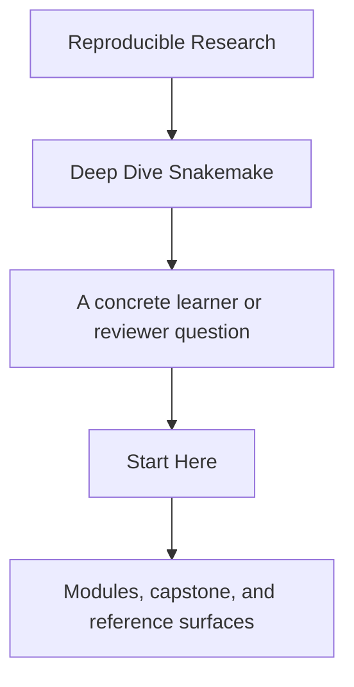
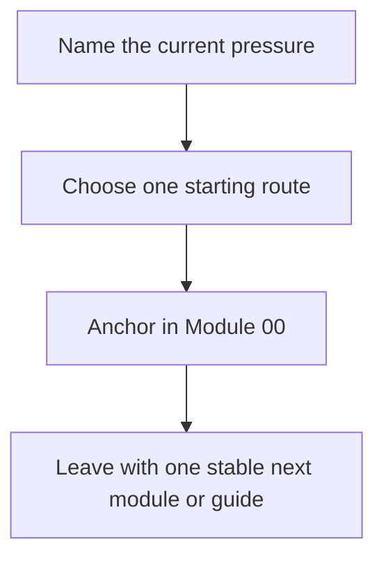

# Start Here

<!-- page-maps:start -->
## Guide Fit

<!-- page-maps:end -->

Read the first diagram as a timing map: this page is for choosing the first honest route,
not for replacing the course. Read the second diagram as the loop: choose one route,
anchor in Module 00, and leave with one stable next move.

Deep Dive Snakemake is not a syntax reference. It is a course about workflow design as an
engineering contract: explicit file boundaries, safe dynamic behavior, publishable
artifacts, and operationally stable execution.

## Use this page when

- Snakemake still feels new and you want the safest ramp
- the workflow is already confusing and you need the smallest justifiable route
- you steward a workflow repository and need the course without random browsing

## Do not use this page to

- replace the module sequence with support-page browsing
- enter the capstone before the local concept is legible
- choose the strongest proof route by default

## Best first pass

1. Read [Course Home](../index.md).
2. Read [Course Guide](course-guide.md).
3. Read [Learning Contract](learning-contract.md).
4. Read [Platform Setup](platform-setup.md).
5. Read [Module 00](../module-00-orientation/index.md).
6. Continue to [Module 01](../module-01-file-contracts-workflow-graph-truth/index.md).

Stop there before opening more shelves. That is enough to make the reading contract,
workflow contract, and capstone timing visible.

## Choose the route that matches your pressure

| If you need... | Read next | Keep nearby |
| --- | --- | --- |
| first contact with Snakemake | [Module 01](../module-01-file-contracts-workflow-graph-truth/index.md), [Module 02](../module-02-dynamic-dags-discovery-integrity/index.md) | [Module Checkpoints](module-checkpoints.md) |
| repair of an existing workflow | [Pressure Routes](pressure-routes.md), [Module 03](../module-03-production-operations-policy-boundaries/index.md), [Module 04](../module-04-scaling-workflows-interface-boundaries/index.md) | [Boundary Review Prompts](../reference/boundary-review-prompts.md) |
| stewardship of a long-lived workflow repository | [Module 06](../module-06-publishing-downstream-contracts/index.md), [Module 07](../module-07-workflow-architecture-file-apis/index.md), [Module 10](../module-10-governance-migration-tool-boundaries/index.md) | [Capstone Review Worksheet](../capstone/capstone-review-worksheet.md) |

## What to keep open

- [Course Guide](course-guide.md)
- [Module Promise Map](module-promise-map.md)
- [Module Checkpoints](module-checkpoints.md)
- [Boundary Review Prompts](../reference/boundary-review-prompts.md)
- [Capstone Guide](../capstone/index.md), but only as a later corroboration surface

## Success signal

You are using the course correctly if you can explain:

- what makes a workflow contract truthful
- why the capstone is not your first lesson
- which support page answers the next question without opening everything
- which proof route is proportionate to the claim in front of you
