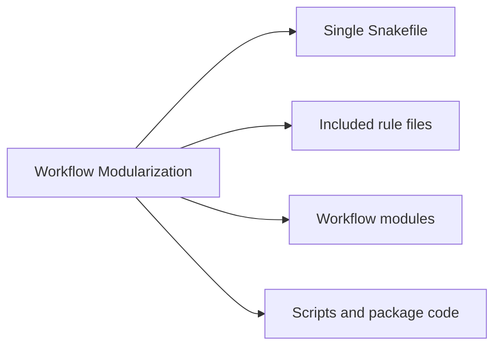
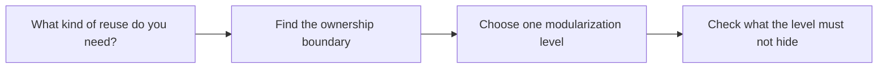

# Workflow Modularization

<!-- page-maps:start -->
## Page Maps

<!-- page-maps:end -->

Use this page when a workflow is growing and the main question is not "can we split it?"
but "which split keeps the workflow legible?"

## The Levels

| If the real need is... | Prefer this level | What it should own | What it must not hide |
| --- | --- | --- | --- |
| one small workflow with obvious rule relationships | a single `Snakefile` | the visible workflow graph | architecture complexity for its own sake |
| grouping coherent rule families inside one repository | `include:` files under `workflow/rules/` | rule families with shared file-contract concerns | cross-cutting defaults that only exist in helper files |
| reusing a workflow bundle with a clear boundary | `workflow/modules/` | a named workflow boundary with explicit inputs and outputs | the real DAG shape or consumer-facing file contracts |
| moving non-trivial implementation out of rule bodies | `workflow/scripts/` or `src/` package code | computation and reusable program logic | silent workflow semantics that are no longer visible from the rules |
| changing run context without changing meaning | `profiles/` | execution policy, retries, resources, and executor settings | analytical meaning or published output contracts |

## Fast Decision Rules

- Stay in one `Snakefile` while the workflow graph is still easier to review than the split.
- Use `include:` when the split mirrors rule ownership that a reviewer can name in one sentence.
- Use `workflow/modules/` only when the module has a stable interface and does not make the main graph harder to explain.
- Move logic into `workflow/scripts/` or `src/` when the code is real program logic, not merely shell glue.
- Keep `profiles/` for operating policy only; if a profile change would alter the workflow meaning, the boundary is wrong.

## Anti-Patterns

- Splitting files only because one file became long, while leaving ownership more confusing than before.
- Creating a "common" workflow module that everybody imports and nobody can review confidently.
- Hiding path conventions or wildcard assumptions in helper code that the rule surface never names.
- Treating profile settings as harmless when they actually change published behavior or scientific meaning.

## Best Companion Surfaces

- [Module 07](../module-07-workflow-architecture-and-file-apis/index.md) for the main teaching module
- [Repository Layer Guide](../reference/repository-layer-guide.md) for the capstone file layout
- [Capstone Map](capstone-map.md) for the module-to-repository route
