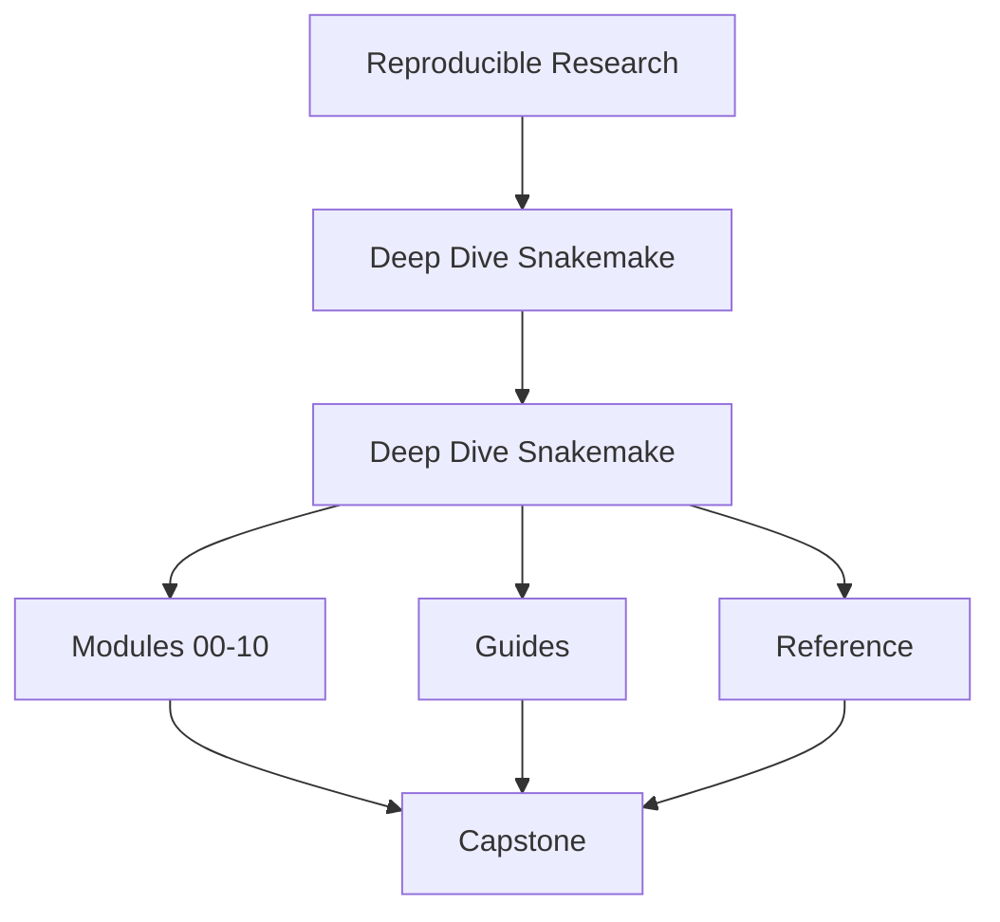
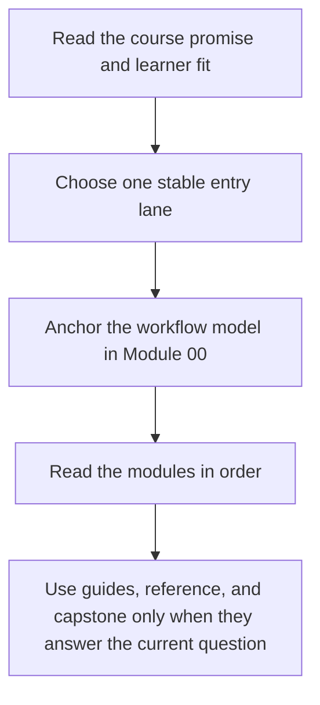

# Deep Dive Snakemake

<!-- page-maps:start -->
## Course Shape

<!-- page-maps:end -->

Read the first diagram as the shape of the whole book. Read the second diagram as the
intended learner route so the capstone and support shelves do not become accidental first
lessons.

Deep Dive Snakemake teaches workflow design as a discipline of explicit file contracts,
deterministic planning, safe dynamic behavior, and durable operational boundaries. The
goal is not to collect workflow tricks. The goal is to build workflows another engineer
can inspect, trust, and extend without folklore.

## Use this course if

- you want a workflow model instead of disconnected Snakemake snippets
- you inherited a pipeline that runs but is hard to trust, review, or extend
- you already use Snakemake and now need stronger publish, profile, and workflow-boundary judgment
- you review whether a workflow can survive CI, shared filesystems, and long-lived change

## Do not use this course as

- a syntax refresher detached from workflow contracts
- executor advice before workflow meaning is clear
- a reason to use dynamic behavior without explicit discovery and publish boundaries

## Choose one starting lane

| If you are here because... | Start with | Stop when you can say... |
| --- | --- | --- |
| Snakemake is still new | [Start Here](guides/start-here.md), [Course Guide](guides/course-guide.md), [Module 00](module-00-orientation/index.md) | what a truthful file contract is and why the capstone is not your first lesson |
| you need to repair an existing workflow | [Pressure Routes](guides/pressure-routes.md), [Module 03](module-03-production-operations-policy-boundaries/index.md), [Module 04](module-04-scaling-workflows-interface-boundaries/index.md) | whether the problem is workflow semantics, policy drift, interface sprawl, or incident pressure |
| you steward a long-lived workflow repository | [Course Guide](guides/course-guide.md), [Module 06](module-06-publishing-downstream-contracts/index.md), [Module 07](module-07-workflow-architecture-file-apis/index.md) | which surfaces are public, which are policy, and which proof route is proportionate |

## Keep these support pages nearby

| Need | Best page |
| --- | --- |
| shortest stable entry | [Start Here](guides/start-here.md) |
| route shaped by urgency | [Pressure Routes](guides/pressure-routes.md) |
| stable support hub | [Course Guide](guides/course-guide.md) |
| module titles translated into promises | [Module Promise Map](guides/module-promise-map.md) |
| module exit bar | [Module Checkpoints](guides/module-checkpoints.md) |
| workflow split decisions | [Workflow Modularization](guides/workflow-modularization.md) |
| smallest honest proof route | [Proof Ladder](guides/proof-ladder.md) |
| capstone entry by module and question | [Capstone Map](capstone/capstone-map.md) |

## Module Table of Contents

| Module | Title | Why it matters |
| --- | --- | --- |
| [Module 00](module-00-orientation/index.md) | Orientation and Study Practice | establishes the learner route, proof surfaces, and capstone timing |
| [Module 01](module-01-file-contracts-workflow-graph-truth/index.md) | File Contracts and Workflow Graph Truth | teaches the workflow as a file-driven DAG instead of a script |
| [Module 02](module-02-dynamic-dags-discovery-integrity/index.md) | Dynamic DAGs, Discovery, and Integrity | teaches deterministic discovery, checkpoint discipline, and publish integrity |
| [Module 03](module-03-production-operations-policy-boundaries/index.md) | Production Operations and Policy Boundaries | teaches profiles, recovery policy, staging discipline, and production proof routes |
| [Module 04](module-04-scaling-workflows-interface-boundaries/index.md) | Scaling Workflows and Interface Boundaries | teaches rule-family splits, module interfaces, file APIs, and scaling review gates |
| [Module 05](module-05-software-boundaries-reproducible-rules/index.md) | Software Boundaries and Reproducible Rules | keeps helper code and rule meaning in the right layer |
| [Module 06](module-06-publishing-downstream-contracts/index.md) | Publishing and Downstream Contracts | makes the public artifact boundary versioned and trustworthy |
| [Module 07](module-07-workflow-architecture-file-apis/index.md) | Workflow Architecture and File APIs | organizes the repository so ownership stays visible |
| [Module 08](module-08-operating-contexts-execution-policy/index.md) | Operating Contexts and Execution Policy | compares local, CI, and cluster policy without semantic drift |
| [Module 09](module-09-performance-observability-incident-response/index.md) | Performance, Observability, and Incident Response | reviews logs, benchmarks, and incidents with explicit evidence |
| [Module 10](module-10-governance-migration-tool-boundaries/index.md) | Governance, Migration, and Tool Boundaries | finishes with stewardship and tool-boundary judgment |

## How the capstone fits

The capstone is the executable proof surface for the course. It should corroborate a
module idea that is already legible, not replace first exposure.

Use it in this order:

1. learn the concept in the local module exercise
2. choose the smallest honest route with [Proof Ladder](guides/proof-ladder.md)
3. enter the repository through [Capstone Map](capstone/capstone-map.md) or [Command Guide](capstone/command-guide.md)
4. escalate to stronger review only when the current question actually needs it

## Success signal

The course home has done its job when you know:

- where to start without random browsing
- which support page answers the next question
- why the capstone is a proof surface rather than a first-contact playground
- why later modules are consequences of earlier file-contract and publish-boundary choices

## Failure modes this course is designed to prevent

- treating a workflow as a script rather than a file-driven DAG
- trusting a workflow because it ran once instead of because its contracts and proofs are visible
- using the capstone as first contact and confusing repository size with conceptual clarity
- treating publish, profile, and governance pages as substitutes for earlier workflow truth
