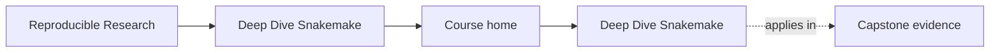
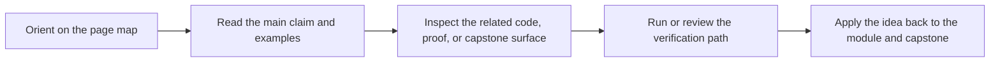

# Deep Dive Snakemake

<!-- page-maps:start -->
## Page Maps

<!-- page-maps:end -->

Deep Dive Snakemake teaches workflow design as a discipline of explicit file contracts,
deterministic planning, safe dynamic behavior, and durable operational boundaries. It is
now a ten-module beginner-to-mastery program, not only a compact advanced reference.

## Why this program exists

Many Snakemake resources stop too early. They explain rules, wildcards, and dry-runs,
but they do not prepare readers for the pressure that appears later:

- checkpoints that quietly hide nondeterminism
- profiles that mutate behavior without a clear policy boundary
- outputs that exist but are not trustworthy
- workflows that pass once locally and then drift in CI or on shared infrastructure

This program exists to close that gap.

## Reading contract

This is not a browse-at-random reference. The learner path is deliberate:

1. Start with orientation and the study map.
2. Learn truthful file contracts before dynamic DAG behavior.
3. Learn dynamic DAG behavior before production execution and governance.
4. Learn production execution before scaling boundaries and CI gates.
5. Continue into rule boundaries, publishing, architecture, operations, and mastery once the core feels stable.

If you skip that order, later material will still be readable, but the trade-offs will
feel arbitrary instead of principled.

## Start here

If you are not sure where to begin, use [`start-here.md`](guides/start-here.md) before diving
into the modules. It routes beginners, working maintainers, and workflow stewards to the
right entry path so the capstone does not become an accidental first lesson.

If you already know the course exists but are not sure which support page you need, use
[`course-guide.md`](guides/course-guide.md) as the stable hub.

Use [`guides/index.md`](guides/index.md) when you want the full learner-support surface
and [`reference/index.md`](reference/index.md) when you want the stable review shelf.

## Course shape at a glance

The top level is now deliberate:

* `guides/` for learner entry, proof routing, and capstone reading routes
* `reference/` for stable review surfaces and lookup pages
* `module-00-orientation/` through `module-10-*/` for the learning arc itself

## What each module contributes

- [Module 00](module-00-orientation/index.md) establishes the full program map and capstone relationship.
- [Module 01](module-01-file-contracts-and-the-workflow-dag/index.md) defines the semantic floor: file contracts, rebuild truth, wildcards, and publishing discipline.
- [Module 02](module-02-dynamic-dags-integrity-and-deterministic-discovery/index.md) explains dynamic DAGs, integrity, environments, and performance patterns.
- [Module 03](module-03-production-operations-and-policy-boundaries/index.md) turns profiles, retries, staging, and governance into operational contracts.
- [Module 04](module-04-scaling-workflows-and-interface-boundaries/index.md) explains modularity, interface boundaries, CI gates, and executor-proof semantics.
- [Module 05](module-05-software-boundaries-and-reproducible-rules/index.md) teaches software stacks, scripts, wrappers, and reproducible rule boundaries.
- [Module 06](module-06-publishing-and-downstream-contracts/index.md) teaches versioned publishing, reports, and downstream workflow contracts.
- [Module 07](module-07-workflow-architecture-and-file-apis/index.md) teaches workflow architecture, modules, file APIs, and reusable boundaries.
- [Module 08](module-08-operating-contexts-and-execution-policy/index.md) deepens profiles, executors, storage, and staging as operating-context boundaries.
- [Module 09](module-09-observability-performance-and-incident-response/index.md) teaches performance, observability, and workflow incident response.
- [Module 10](module-10-governance-migration-and-tool-boundaries/index.md) finishes with governance, migration, anti-patterns, and tool-boundary judgment.
- [Capstone](guides/readme-capstone.md) provides the executable reference workflow that keeps the program honest.

## Recommended route

1. Start with [Start Here](guides/start-here.md).
2. Read [Module 00](module-00-orientation/index.md).
3. Move through Modules 01 to 10 in order.
4. Enter the capstone through [Capstone Map](guides/capstone-map.md) or [Proof Matrix](guides/proof-matrix.md) instead of browsing the repository cold.

## How to use the capstone while reading

Guided route: [Capstone Map](capstone-map.md)

If you want the shortest stable proof route first, start with [Capstone Proof Guide](capstone-proof-guide.md).

- After Module 01, inspect its explicit file contracts and stable publish boundary.
- After Module 02, inspect the checkpoint and the way discovery is stabilized.
- After Module 03, inspect profiles, retries, artifact verification, and proof targets.
- After Module 04, inspect module boundaries, file APIs, and CI-style gates.
- After Modules 05 and 06, inspect software environments, provenance, publish rules, and `publish/v1/`.
- After Modules 07 to 09, inspect repository architecture, operating profiles, logs, benchmarks, and workflow-tour artifacts.
- In Module 10, use the capstone as a workflow review specimen rather than a first-contact example.

The capstone should function as your executable answer to “what does this rule look like in a real workflow?”

## Common failure modes this program is trying to prevent

- treating a workflow as a script rather than as a file-driven DAG
- allowing dynamic discovery to hide moving targets or unstable plans
- mixing workflow semantics with site policy or executor quirks
- publishing artifacts without a stable versioned interface
- letting helper code, environments, or wrappers mutate workflow meaning invisibly
- allowing repository architecture or profile drift to become hidden coupling
- trusting a workflow because it ran once rather than because its proofs are explicit

## Expected learner rhythm

- Read one module overview before reading the detailed module body.
- Pause at every major diagram or proof hook and explain what invariant it is protecting.
- Keep the capstone open while reading so the abstractions stay attached to a concrete workflow.
- Re-run verification commands regularly instead of waiting until the end.
