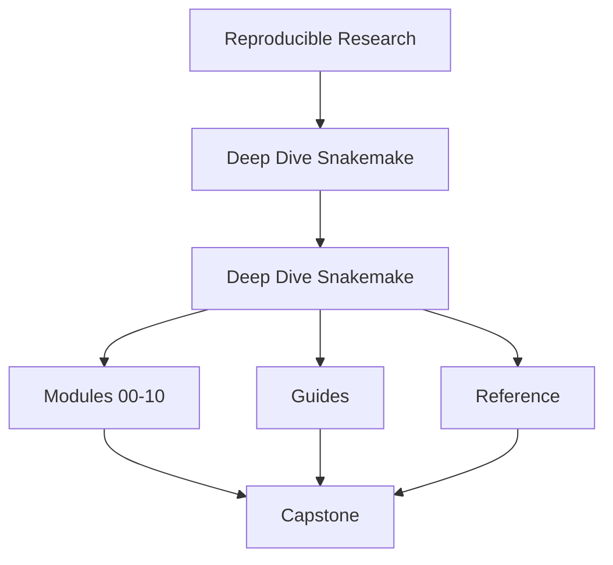
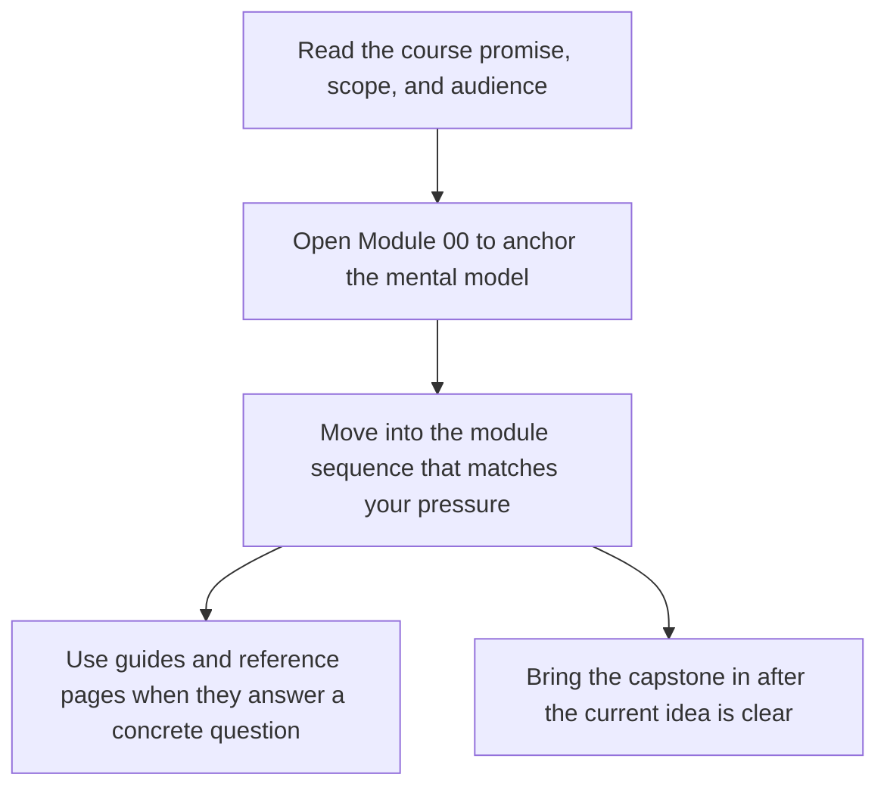

# Deep Dive Snakemake

<!-- page-maps:start -->
## Course Shape

<!-- page-maps:end -->

Read the first diagram as the shape of the whole book: it shows where the home page sits relative to the module sequence, the support shelf, and the capstone. Read the second diagram as the intended entry route so learners do not mistake the capstone or reference pages for the first stop.

Deep Dive Snakemake teaches workflow design as a discipline of explicit file contracts,
deterministic planning, safe dynamic behavior, and durable operational boundaries. It is
now a ten-module beginner-to-mastery program, not only a compact advanced reference.

The top-level course-book has three durable surfaces:

- [`guides/`](guides/index.md) for learner routes, module promises, checkpoints, and capstone entry
- [`reference/`](reference/index.md) for durable definitions, anti-pattern routing, and review aids
- Modules `00` to `10` for the teaching arc itself

## Why this program exists

Many Snakemake resources stop too early. They explain rules, wildcards, and dry-runs,
but they do not prepare readers for the pressure that appears later:

- checkpoints that quietly hide nondeterminism
- profiles that mutate behavior without a clear policy boundary
- outputs that exist but are not trustworthy
- workflows that pass once locally and then drift in CI or on shared infrastructure

This program exists to close that gap.

## Reading contract

This is not a browse-at-random reference. The learner path is deliberate:

1. Start with orientation and the study map.
2. Learn truthful file contracts before dynamic DAG behavior.
3. Learn dynamic DAG behavior before production execution and governance.
4. Learn production execution before scaling boundaries and CI gates.
5. Continue into rule boundaries, publishing, architecture, operations, and mastery once the core feels stable.

If you skip that order, later material will still be readable, but the trade-offs will
feel arbitrary instead of principled.

## Start here

If you are not sure where to begin, use [`start-here.md`](guides/start-here.md) before diving
into the modules. It routes beginners, working maintainers, and workflow stewards to the
right entry path so the capstone does not become an accidental first lesson.

If your route is shaped by urgency instead of calm study, use
[`pressure-routes.md`](guides/pressure-routes.md).

If you already know the course exists but are not sure which support page you need, use
[`course-guide.md`](guides/course-guide.md) as the stable hub.

Use [`guides/index.md`](guides/index.md) when you want the full learner-support surface
and [`reference/index.md`](reference/index.md) when you want the stable review shelf.

## Module Table of Contents

| Module | Title | Why it matters |
| --- | --- | --- |
| [Module 00](module-00-orientation/index.md) | Orientation and Study Practice | establishes the learner route, proof surfaces, and capstone timing |
| [Module 01](module-01-file-contracts-workflow-graph-truth/index.md) | File Contracts and Workflow Graph Truth | teaches the workflow as a file-driven DAG instead of a script |
| [Module 02](module-02-dynamic-dags-discovery-integrity/index.md) | Dynamic DAGs, Discovery, and Integrity | makes checkpoints and changing sample sets reviewable |
| [Module 03](module-03-production-operations-policy-boundaries/index.md) | Production Operations and Policy Boundaries | separates workflow semantics from operational policy |
| [Module 04](module-04-scaling-workflows-interface-boundaries/index.md) | Scaling Workflows and Interface Boundaries | scales the workflow without losing explicit interfaces |
| [Module 05](module-05-software-boundaries-reproducible-rules/index.md) | Software Boundaries and Reproducible Rules | keeps helper code and rule meaning in the right layer |
| [Module 06](module-06-publishing-downstream-contracts/index.md) | Publishing and Downstream Contracts | makes the public artifact boundary versioned and trustworthy |
| [Module 07](module-07-workflow-architecture-file-apis/index.md) | Workflow Architecture and File APIs | organizes the repository so ownership stays visible |
| [Module 08](module-08-operating-contexts-execution-policy/index.md) | Operating Contexts and Execution Policy | compares local, CI, and cluster policy without semantic drift |
| [Module 09](module-09-performance-observability-incident-response/index.md) | Performance, Observability, and Incident Response | reviews logs, benchmarks, and incidents with explicit evidence |
| [Module 10](module-10-governance-migration-tool-boundaries/index.md) | Governance, Migration, and Tool Boundaries | finishes with stewardship, migration, and tool-boundary judgment |

## Use these support pages first

These are the pages that make the course easier to trust and easier to finish:

| Need | Best page |
| --- | --- |
| first learner route | [`start-here.md`](guides/start-here.md) |
| route under repair, stewardship, or incident pressure | [`pressure-routes.md`](guides/pressure-routes.md) |
| stable support hub | [`course-guide.md`](guides/course-guide.md) |
| what each module title actually promises | [`module-promise-map.md`](guides/module-promise-map.md) |
| whether you are ready to move on | [`module-checkpoints.md`](guides/module-checkpoints.md) |
| smallest honest proof route | [`proof-ladder.md`](guides/proof-ladder.md) |
| capstone entry by module | [`capstone-map.md`](capstone/capstone-map.md) |

## Recommended route

1. Start with [Start Here](guides/start-here.md).
2. Read [Pressure Routes](guides/pressure-routes.md) if your context is not calm first-contact study.
3. Read [Module 00](module-00-orientation/index.md).
4. Move through Modules 01 to 10 in order.
5. Enter the capstone through [Capstone Map](capstone/capstone-map.md), [Proof Ladder](guides/proof-ladder.md), or [Proof Matrix](guides/proof-matrix.md) instead of browsing the repository cold.

## How to use the capstone while reading

Guided route: [Capstone Map](capstone/capstone-map.md)

If you want the shortest stable proof route first, start with [Capstone Proof Guide](capstone/capstone-proof-guide.md).

- After Module 01, inspect its explicit file contracts and stable publish boundary.
- After Module 02, inspect the checkpoint and the way discovery is stabilized.
- After Module 03, inspect profiles, retries, artifact verification, and proof targets.
- After Module 04, inspect module boundaries, file APIs, and CI-style gates.
- After Modules 05 and 06, inspect software environments, provenance, publish rules, and `publish/v1/`.
- After Modules 07 to 09, inspect repository architecture, operating profiles, logs, benchmarks, and workflow-tour artifacts.
- In Module 10, use the capstone as a workflow review specimen rather than a first-contact example.

The capstone should function as your executable answer to “what does this rule look like in a real workflow?”

## Review surfaces

When you are reviewing whether the course and capstone are actually coherent, use:

* [`topic-boundaries.md`](reference/topic-boundaries.md)
* [`anti-pattern-atlas.md`](reference/anti-pattern-atlas.md)
* [`module-promise-map.md`](guides/module-promise-map.md)
* [`module-checkpoints.md`](guides/module-checkpoints.md)
* [`completion-rubric.md`](reference/completion-rubric.md)

## Common failure modes this program is trying to prevent

- treating a workflow as a script rather than as a file-driven DAG
- allowing dynamic discovery to hide moving targets or unstable plans
- mixing workflow semantics with site policy or executor quirks
- publishing artifacts without a stable versioned interface
- letting helper code, environments, or wrappers mutate workflow meaning invisibly
- allowing repository architecture or profile drift to become hidden coupling
- trusting a workflow because it ran once rather than because its proofs are explicit

## Expected learner rhythm

- Read one module overview before reading the detailed module body.
- Pause at every major diagram or proof hook and explain what invariant it is protecting.
- Keep the capstone open while reading so the abstractions stay attached to a concrete workflow.
- Re-run verification commands regularly instead of waiting until the end.
