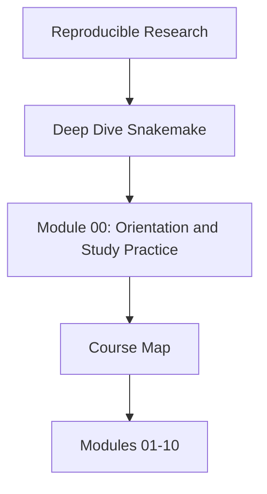
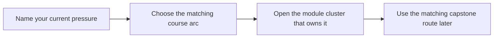

# Course Map

<!-- page-maps:start -->
## Concept Position

<!-- page-maps:end -->

Use this page when you need the whole course visible on one screen before you choose a
reading path.

## Arc 1: file contracts and dynamic discovery

Modules 01 to 02 establish the workflow's semantic floor.

- Module 01 teaches rules, targets, dry-runs, and explicit file contracts.
- Module 02 teaches dynamic DAGs, checkpoints, and disciplined discovery artifacts.

Leave this arc able to explain what the workflow plans to build and how discovery stays
reviewable.

## Arc 2: operations and software boundaries

Modules 03 to 05 turn workflow truth into a maintainable repository.

- Module 03 teaches profiles, retries, staging, and operational policy.
- Module 04 teaches scaling, interfaces, and reviewable repository structure.
- Module 05 teaches the boundary between Snakemake logic and the software it drives.

Leave this arc able to separate workflow meaning from execution policy and helper code.

## Arc 3: publish trust and architecture

Modules 06 to 08 scale the repository into a downstream-facing system.

- Module 06 teaches versioned publish contracts and downstream trust.
- Module 07 teaches workflow architecture and file APIs.
- Module 08 teaches operating contexts and execution-policy drift.

Leave this arc able to explain which surfaces are public, internal, or policy-only.

## Arc 4: incidents and governance

Modules 09 to 10 finish with long-lived workflow judgment.

- Module 09 teaches observability, performance, and incident response.
- Module 10 teaches governance, migration, and tool-boundary decisions.

Leave this arc able to review a real workflow repository and justify what should change next.

## Route markers

- Read [First-Contact Map](first-contact-map.md) when you need the smallest honest
  starting route.
- Read [Mid-Course Map](mid-course-map.md) when Modules 01 to 03 already feel stable and
  you need the bridge into scaling, software seams, publish trust, and operating contexts.
