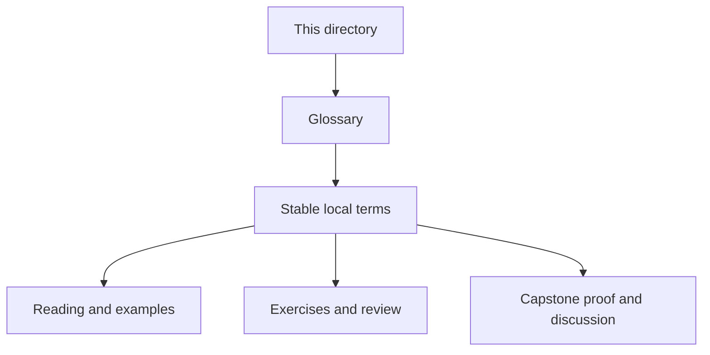
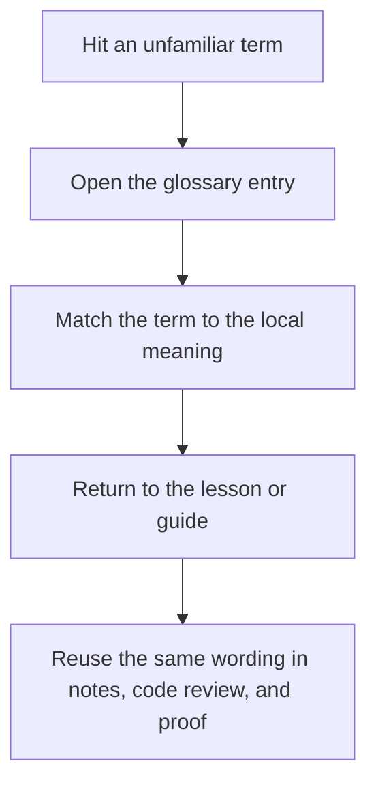

# Module Glossary

<!-- page-maps:start -->
## Glossary Fit

<!-- page-maps:end -->

Use this glossary when a Module 00 page uses a word that feels familiar but still needs a
precise local meaning before Module 01 starts.

## Terms in this module

| Term | Meaning in Deep Dive Snakemake |
| --- | --- |
| File contract | The declared relationship between inputs, outputs, logs, benchmarks, and the rule that owns them. |
| Dry-run | A plan-reading route that shows what the workflow intends to do before any jobs execute. |
| Checkpoint | A deliberate dynamic-discovery boundary that records a discovered set instead of hiding it. |
| Profile | An execution-policy surface for resources, executor choice, staging, and retries that should not change workflow meaning. |
| Publish boundary | The smaller versioned output surface another person may trust downstream. |
| Rule family | A coherent group of rules that own one workflow concern without hiding the overall DAG. |
| File API | The documented set of paths and payloads the workflow or downstream consumers are allowed to rely on. |
| Verification route | The command or saved bundle that proves a specific workflow claim with evidence. |
