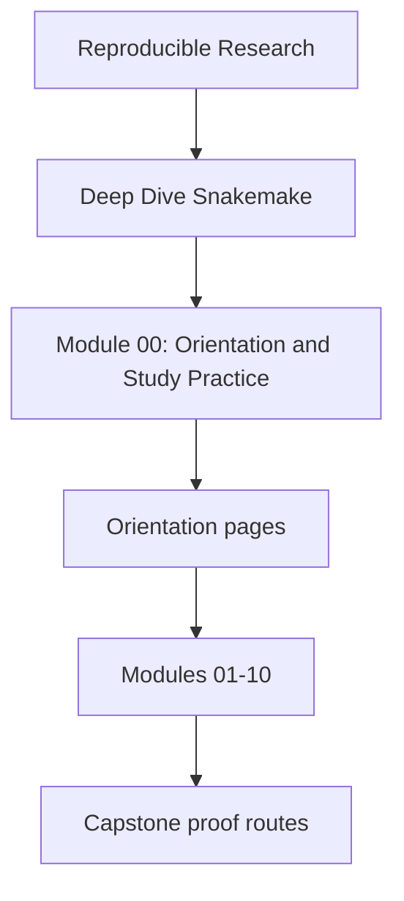
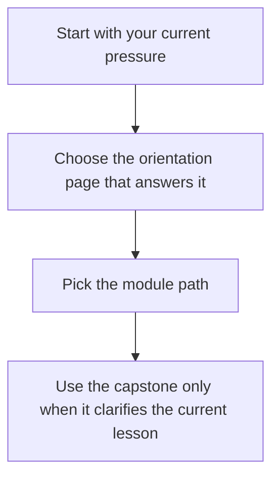

# Module 00: Orientation and Study Practice

<!-- page-maps:start -->
## Module Position




<!-- page-maps:end -->

This module exists to make the course legible before the first technical lesson starts.
Deep Dive Snakemake is not a tour of commands. It is a course about truthful file
contracts, explicit dynamic discovery, stable publish boundaries, operational policy that
does not mutate workflow meaning, and the review habits that keep those claims honest.

## Use this module when

- you want the course shape before committing to a reading path
- you need the shortest honest first session instead of browsing the whole shelf
- you want to know when the capstone helps and when it adds noise

## Study rhythm

Keep the rhythm small and repeatable:

1. read until the current workflow question is clear
2. read a bounded cluster instead of the whole shelf
3. use the capstone only when it sharpens the current claim
4. stop once you can name one rule, one evidence surface, and one failure mode

## Start here by question

| If the question is... | Read this first |
| --- | --- |
| what journey does the whole course take | [course-map.md](course-map.md) |
| what should my first session look like | [first-contact-map.md](first-contact-map.md) |
| how should I bridge from file contracts into scaling, publish trust, and operating contexts | [mid-course-map.md](mid-course-map.md) |
| how should I re-enter the course for stewardship, migration, or trust review | [mastery-map.md](mastery-map.md) |
| which recurring terms matter before Module 01 | [glossary.md](glossary.md) |

## What this course is trying to build

By the end of Deep Dive Snakemake, you should be able to:

- explain workflow behavior as a file-contract question rather than a CLI incantation
- keep checkpoints, profiles, and publish boundaries explicit and reviewable
- separate internal execution state from downstream trust surfaces
- judge when Snakemake still owns a concern and when another boundary should take over

## First proof route

When you want one executable companion route without overcommitting to the capstone:

```sh
make PROGRAM=reproducible-research/deep-dive-snakemake capstone-walkthrough
```

Use the walkthrough when the current module is clear enough that a repository specimen
will help. Stay in the smaller lesson model when the capstone starts feeling larger than
the concept you are studying.

## Orientation files in this module

- [course-map.md](course-map.md)
- [first-contact-map.md](first-contact-map.md)
- [mid-course-map.md](mid-course-map.md)
- [mastery-map.md](mastery-map.md)
- [glossary.md](glossary.md)
