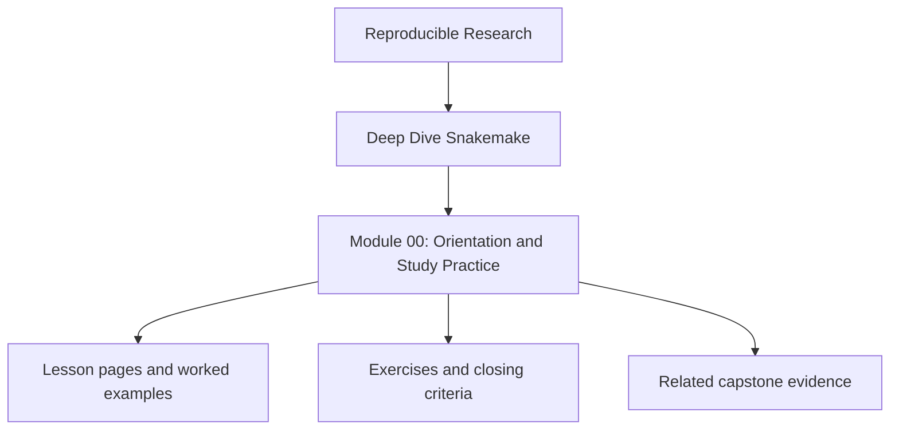
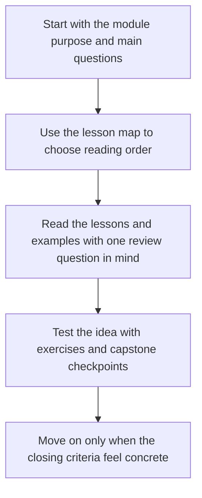

<a id="top"></a>

# Module 00: Orientation and Study Practice


<!-- page-maps:start -->
## Module Position




<!-- page-maps:end -->

Read the first diagram as a placement map: this page sits between the course promise, the lesson pages listed below, and the capstone surfaces that pressure-test the module. Read the second diagram as the study route for this page, so the diagrams point you toward the `Lesson map`, `Exercises`, and `Closing criteria` instead of acting like decoration.

Deep Dive Snakemake is now a ten-module program that starts from first-contact workflow
thinking and ends with long-lived workflow judgment. The through-line does not change:

- **Truthful file contracts**: every real input and output is declared.
- **Safe publication**: trusted outputs appear only at a deliberate boundary.
- **Dynamic discipline**: checkpoints and discovery stay explicit and reviewable.
- **Operational clarity**: profiles, staging, and retries change policy, not meaning.
- **Executable proof**: manifests, reports, tests, and verification surfaces back the claims.

This repository contains both the program guide in `course-book/` and the executable
reference workflow in `capstone/`.

---

## At a Glance

| What this course optimizes for | What this course refuses to optimize for |
| --- | --- |
| explicit workflow contracts | pipelines that only "seem to work" under one command |
| safe dynamic behavior | checkpoints used as hand-wavy magic |
| stable publish boundaries | results directories that require private context to trust |
| pedagogy that moves from file contracts to operational judgment | dropping the learner into a large repository too early |

---

## Program Arc

### Module 01: File Contracts and Workflow Graph Truth

Start from the essential Snakemake mental model: rules declare file contracts, targets
drive the DAG, and dry-runs explain planned work before execution.

**Deliverable:** a tiny workflow whose outputs, reruns, and publish boundary can be explained with evidence.

### Module 02: Dynamic DAGs, Discovery, and Integrity

Learn how a workflow can discover work in stages without turning the plan into a moving
target. This module introduces disciplined checkpoints, explicit discovery artifacts, and
integrity evidence.

**Deliverable:** a dynamic workflow whose discovered set is explicit and reproducible across runs.

### Module 03: Production Operations and Policy Boundaries

Move from local workflow semantics to operational policy. Profiles, retries, incomplete
handling, staging, and governance become deliberate contracts instead of tribal commands.

**Deliverable:** a workflow that can be run in different operating contexts without changing its meaning.

### Module 04: Scaling Workflows and Interface Boundaries

Learn how to grow a repository without losing its shape. Interfaces, file APIs, CI gates,
and executor-proof semantics keep larger workflows reviewable.

**Deliverable:** a modular workflow whose repository layout and review gates make change safer instead of harder.

### Module 05: Software Boundaries and Reproducible Rules

Define the boundary between Snakemake logic and the software it drives. Scripts,
packages, wrappers, and environment files become explicit parts of the workflow contract.

**Deliverable:** a workflow whose helper code and software stack can be reviewed without relying on local shell magic.

### Module 06: Publishing and Downstream Contracts

Separate internal execution state from stable published outputs. Versioned publish
surfaces, manifests, checksums, and reports become deliberate downstream interfaces.

**Deliverable:** a workflow that publishes a stable bundle another consumer can trust and validate.

### Module 07: Workflow Architecture and File APIs

Scale the repository itself: reusable rule families, helper code boundaries, and file APIs
that stay understandable as more people and more workflows touch the codebase.

**Deliverable:** a repository layout that a newcomer can inspect without guessing where the real contract lives.

### Module 08: Operating Contexts and Execution Policy

Go deeper on the difference between workflow semantics and execution context. Profiles,
executors, storage, and staging become policy surfaces that can change without corrupting
the workflow contract.

**Deliverable:** a workflow whose local, CI, and scheduler-oriented runs share one stable meaning.

### Module 09: Performance, Observability, and Incident Response

Learn how to measure workflow cost, inspect drift, read operational artifacts, and
respond to slow or flaky behavior without hiding the truth.

**Deliverable:** an evidence-first incident ladder for real workflow runs under pressure.

### Module 10: Governance, Migration, and Tool Boundaries

Finish with workflow judgment: reviewing real repositories, planning migrations, setting
governance rules, and deciding when Snakemake should remain the orchestrator or hand a
concern to another tool.

**Deliverable:** an evidence-based workflow review and a migration or stewardship plan for a real repository.

---

## Study Paths

### Full course path

Use this if you are learning Snakemake from the ground up.

1. Modules 01-02 for file contracts and dynamic DAG discipline
2. Modules 03-05 for operations, scaling boundaries, and software-rule separation
3. Modules 06-09 for publish contracts, architecture, operating contexts, and incident response
4. Module 10 for review, migration, and governance

### Working maintainer path

Use this if you already operate a Snakemake repository.

1. [`pressure-routes.md`](../guides/pressure-routes.md) for the repair-first route
2. Module 03 for production operation
3. Module 04 for scaling and interfaces
4. Module 08 for operating-context drift
5. Module 09 for observability and incidents
6. Module 10 for stewardship judgment

### Workflow steward path

Use this if your main concern is architecture, publishing, and long-lived workflow ownership.

1. Module 06 for publish contracts
2. Module 07 for repository architecture
3. Module 08 for policy and operating boundaries
4. Module 10 for governance and migration
5. [`module-promise-map.md`](../guides/module-promise-map.md) for title-to-deliverable review

---

## Recommended Reading Path

1. Read Modules 01 to 10 in order.
2. Use the capstone as corroboration after every module, but rely on it most heavily from Modules 02 to 09.
3. Re-run proof commands as you go instead of trusting prose summaries.
4. Treat Module 10 as the finish of the program, not as optional reference material.

If you are completely new to Snakemake, spend extra time in Module 01 before moving on.
If you already run Snakemake in production, Modules 03, 04, 08, 09, and 10 are the
fastest route to operational value.

---

## Capstone Relationship

The capstone is strongest as the executable companion to Modules 02 to 09, where dynamic
behavior, publish boundaries, profiles, modularity, and operational review become
concrete. Module 01 still benefits from smaller local exercises first so the learner sees
Snakemake semantics before the repository becomes larger.

Use [capstone-map.md](../capstone/capstone-map.md) when you want a module-by-module route through the
repository instead of jumping into the capstone cold.

**Proof command:**

```bash
make PROGRAM=reproducible-research/deep-dive-snakemake test
```

---

## Milestones

| Milestone | Modules | What you should be able to do |
| --- | --- | --- |
| Workflow literacy | 01-02 | explain file contracts, dry-runs, and disciplined dynamic discovery |
| Operational stability | 03-05 | separate policy from semantics and explain reproducible rule boundaries |
| Downstream trust | 06-08 | publish stable artifacts and keep operating contexts from changing workflow meaning |
| Review judgment | 09-10 | run incident triage and review a workflow as a long-lived product |

---

## Capstone Timing

Enter the capstone at three deliberate moments:

* after Module 01 if you want to inspect the basic file-contract shape
* after Modules 02-06 if you want to inspect discovery, publish, and rule-boundary discipline
* after Modules 08-10 if you want to review the full repository as an operational and governance specimen

If the capstone feels larger than the concept you are studying, return to the module and
restore the smaller workflow model first.

Use the capstone to answer this question repeatedly: if a workflow behavior changed
tomorrow, which file or boundary should absorb that change, and why?

Use [`module-checkpoints.md`](../guides/module-checkpoints.md) when you are deciding whether the
current module is actually stable enough to justify entering the larger repository.

[Back to top](#top)

## Directory glossary

Use [Glossary](glossary.md) when you want the recurring language in this module kept stable while you move between lessons, exercises, and capstone checkpoints.
