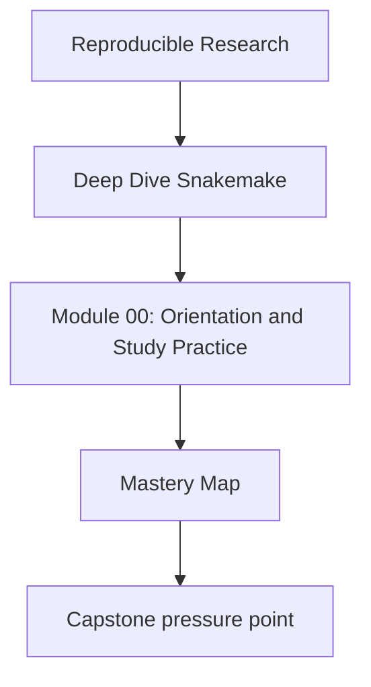
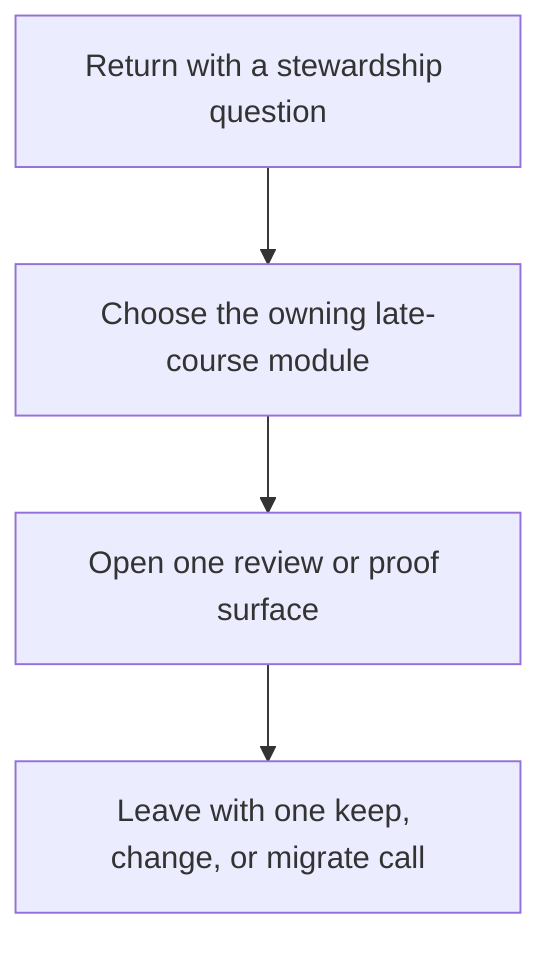

# Mastery Map

<!-- page-maps:start -->
## Concept Position

<!-- page-maps:end -->

Use this page when the course is no longer about first contact or ordinary study rhythm.
The goal here is stewardship: decide what the workflow can still promise honestly, what
must change, and what should move outside Snakemake instead of being hidden inside it.

## Return by late-course pressure

| If the pressure is... | Revisit | Keep nearby | Capstone cross-check |
| --- | --- | --- | --- |
| what evidence should come before editing a slow or flaky workflow | Module 09 | [Review Checklist](../reference/review-checklist.md) | [Capstone Review Worksheet](../capstone/capstone-review-worksheet.md) |
| what downstream users are actually allowed to trust | Modules 06 to 09 | [Boundary Review Prompts](../reference/boundary-review-prompts.md) | [Capstone Proof Guide](../capstone/capstone-proof-guide.md) |
| whether policy drift is being mistaken for workflow meaning | Modules 08 to 10 | [Topic Boundaries](../reference/topic-boundaries.md) | [Capstone Architecture Guide](../capstone/capstone-architecture-guide.md) |
| whether Snakemake should keep owning the concern at all | Module 10 | [Anti-Pattern Atlas](../reference/anti-pattern-atlas.md) | [Capstone Review Worksheet](../capstone/capstone-review-worksheet.md) |

## Late-course route

### Module 09: incident response

Use Module 09 when the review question is observability, incident pressure, or what the
next evidence surface should be before any workflow edit.

### Module 10: governance and migration

Use Module 10 when the review question is long-lived ownership.

- Re-read the module as a boundary decision, not as a recap.
- Ask which responsibilities still belong in the workflow layer and which should move to
  clearer software, policy, or publish boundaries.

## Good mastery signal

You are using this map well when you can say all three:

- which workflow claim is under review right now
- which proof route is proportionate instead of theatrical
- what you would still reject even if the repository currently runs
