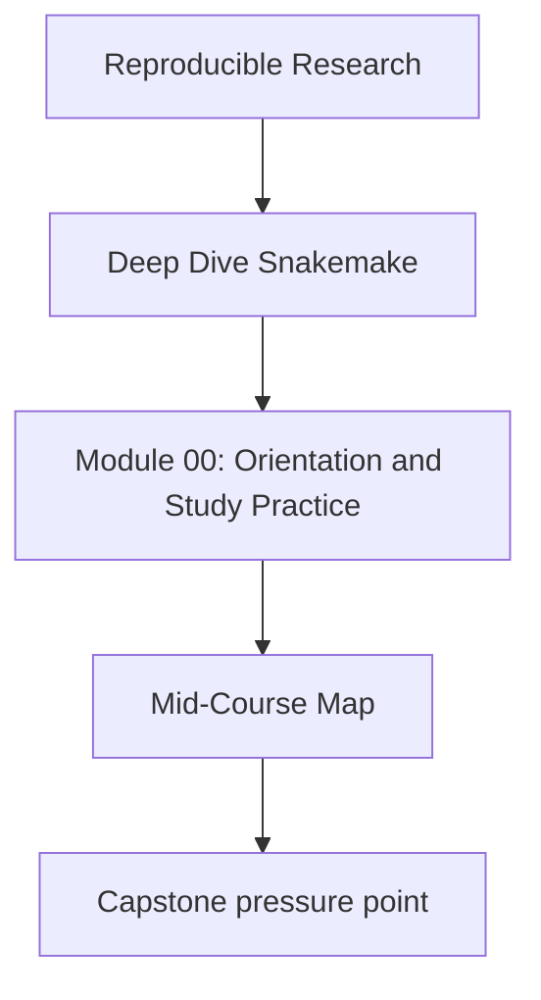
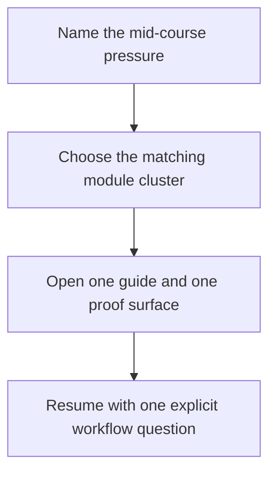

# Mid-Course Map

<!-- page-maps:start -->
## Concept Position

<!-- page-maps:end -->

Use this page when Modules 01 to 03 feel stable and you need a deliberate bridge into
scaling, software boundaries, publish trust, and operating-context review. The goal is to
keep the middle of the course shaped by workflow questions instead of by repository sprawl.

## Use this map for these pressures

| If the pressure is... | Start with | Keep nearby | Capstone cross-check |
| --- | --- | --- | --- |
| where a structural workflow change belongs | Module 04 | [Boundary Review Prompts](../reference/boundary-review-prompts.md) | [Capstone File Guide](../capstone/capstone-file-guide.md) |
| where workflow orchestration ends and helper software begins | Module 05 | [Review Checklist](../reference/review-checklist.md) | [Capstone Architecture Guide](../capstone/capstone-architecture-guide.md) |
| what downstream users are actually allowed to trust | Modules 06 to 07 | [Proof Matrix](../guides/proof-matrix.md) | [Capstone Review Worksheet](../capstone/capstone-review-worksheet.md) |
| which differences across local, CI, and scheduler contexts are policy-only | Module 08 | [Topic Boundaries](../reference/topic-boundaries.md) | [Capstone Proof Guide](../capstone/capstone-proof-guide.md) |

## Module clusters

### Modules 04 to 05: scaling and software seams

Use this cluster when the workflow already feels real, but the repository is starting to
split across files, helper code, and validation surfaces.

- Module 04 teaches scaling, interfaces, and reviewable repository structure.
- Module 05 teaches the boundary between Snakemake logic and the software it drives.

Leave this cluster able to explain where a change belongs before you edit it.

### Modules 06 to 07: publish trust and architecture

Use this cluster when the workflow is becoming a downstream-facing system.

- Module 06 teaches versioned publish contracts and downstream trust.
- Module 07 teaches workflow architecture and stable file APIs.

Leave this cluster able to separate internal run state from public outputs.

### Module 08: operating contexts

Use this step when the main pressure is execution context rather than workflow meaning.

- Module 08 teaches how local, CI, and scheduler policy differ without semantic drift.

Leave this step able to explain what changed across contexts and why the workflow promise
did or did not change.

## Good next move after this map

Open exactly one of these before resuming:

- [Module Checkpoints](../guides/module-checkpoints.md) if you need the exit bar
- [Pressure Routes](../guides/pressure-routes.md) if urgency is shaping the reading order
- [Capstone Map](../capstone/capstone-map.md) if the module is clear but the repository
  surface is not
