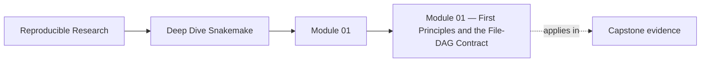
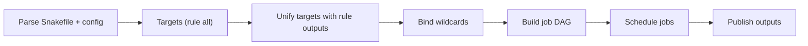
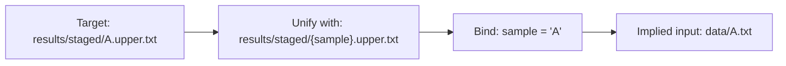

<a id="top"></a>

# Module 01 — First Principles and the File-DAG Contract


<!-- page-maps:start -->
## Page Maps




<!-- page-maps:end -->

This module establishes the semantic floor for the whole program. You build a tiny
workflow, break it in controlled ways, diagnose using Snakemake-native artifacts, apply
canonical fixes, and prove convergence.

Capstone exists here as corroboration, not first exposure. The local exercises in this
module should already make workflow truth and rerun causes legible before you inspect the
reference repository.

---

## Version & scope contract

* Target: **Snakemake 9.x** semantics. Verify your deployed version first:

  ```bash
  snakemake --version
  ```

* In scope:

  * file-contract semantics (inputs/outputs define the DAG)
  * rebuild truth (convergence, rerun causes, hidden inputs)
  * wildcards (binding/unification, ambiguity, constraints)
  * config-as-data + profiles-as-policy + parse-time validation
  * publishing discipline (atomic outputs, poison artifact avoidance, logs/benchmarks, shadow)
  * DAG-first debugging playbook

* Out of scope (later modules):

  * checkpoints / dynamic DAGs
  * conda/containers
  * cluster/cloud executors, remote storage
  * deep performance tuning

## Why this module matters

Most workflow failures that look “advanced” are still caused by Module 01 mistakes:

- undeclared inputs
- ambiguous or over-broad wildcards
- outputs that publish partial state
- reruns that nobody can explain with evidence

If the file contract is not truthful, later scaling features only make the workflow fail faster and less predictably.

## Reading path

1. Read the mental model and debug commands before the deeper sections.
2. Study file contracts and rebuild truth before touching wildcard discipline.
3. Read configuration discipline before publishing discipline.
4. Use the exercises only after you can explain the failure signatures in your own words.

## Capstone connection

This module is the reason the capstone has a stable publish boundary, explicit inputs and outputs,
structured logs, and proof-oriented verification. When the capstone says `publish/v1/` is the
contract and `results/` is not, that is a Module 01 design claim, not only an implementation detail.

## At a Glance

| Focus | Learner question | Capstone timing |
| --- | --- | --- |
| file contracts | "Why does this workflow produce or rerun these files?" | use the capstone lightly here, mainly to inspect stable boundaries |
| wildcard discipline | "Which targets are precise enough to keep the DAG honest?" | enter the capstone only after local examples feel predictable |
| publish discipline | "Which outputs are safe to treat as trusted?" | inspect `publish/v1/` only after the basic contract model is clear |

---

## Orientation

### The unified predictive model

Most Snakemake failures are predictable:

> **Total pain ≈**
> (A) **contract lies** (missing edges, hidden inputs, multi-writer outputs) +
> (B) **poison artifacts** (partials treated as done) +
> (C) **rerun mystery** (nondeterministic params/code/env drift) +
> (D) **operational friction** (scheduler overhead + filesystem metadata storms)

Module 01 eliminates (A)(B)(C). If your file-DAG contract is truthful, scaling becomes an execution detail.

### Mental model (one diagram)



**Law:** If an edge is not in `input:`/`output:`, it does not exist. If an output exists but is wrong, you lied to the DAG.

---

## Table of contents

1. Setup: runnable minimal project + golden outputs
2. Debug commands: what each answers + expected outputs
3. Core 1 — File contracts → DAG → jobs
4. Core 2 — Rebuild truth: convergence and hidden inputs
5. Core 3 — Wildcards: unification, ambiguity, constraints
6. Core 4 — Config discipline: validate early, isolate policy
7. Core 5 — Publishing discipline: atomic outputs, logs, shadow, temp/protected
8. Debugging playbook table
9. Exercises (with golden states)
10. Closing recap

---

## 1) Setup: runnable minimal project + golden outputs

## 1.1 Create the project

Create this structure:

```text
project/
  workflow/
    Snakefile
    profiles/
      default/
        config.yaml
  config/
    config.yaml
    config.schema.json
  data/
    A.txt
    B.txt
```

Inputs:

**`data/A.txt`**

```text
alpha
alpha
alpha
```

**`data/B.txt`**

```text
beta
beta
```

Config:

**`config/config.yaml`**

```yaml
samples: ["A", "B"]
```

Schema (fail fast):

**`config/config.schema.json`**

```json
{
  "$schema": "http://json-schema.org/draft-07/schema#",
  "type": "object",
  "required": ["samples"],
  "properties": {
    "samples": {
      "type": "array",
      "minItems": 1,
      "items": { "type": "string", "pattern": "^[A-Za-z0-9_]+$" }
    }
  },
  "additionalProperties": false
}
```

Profile (policy only):

**`workflow/profiles/default/config.yaml`**

```yaml
cores: 2
printshellcmds: true
rerun-incomplete: true
latency-wait: 3
keep-going: false
```

Paste the **reference Snakefile** from Core 5 into `workflow/Snakefile`.

---

## 1.2 Run it

From `project/`:

```bash
snakemake --profile workflow/profiles/default
```

### Expected console output (representative)

Exact formatting varies slightly across 9.x, but you should see the same invariants:

```text
Building DAG of jobs...
Provided cores: 2
Job stats:
job               count
----------------  -----
all                   1
stage_upper           2
summarize_counts      1
total                 4

[ ... ] rule stage_upper:
    input: data/A.txt
    output: results/staged/A.upper.txt
    log: logs/stage/A.log
    ...

[ ... ] rule stage_upper:
    input: data/B.txt
    output: results/staged/B.upper.txt
    log: logs/stage/B.log
    ...

[ ... ] rule summarize_counts:
    input: results/staged/A.upper.txt, results/staged/B.upper.txt
    output: results/summary/counts.tsv
    log: logs/summarize.log
    ...

[ ... ] localrule all:
    input: results/summary/counts.tsv, results/staged/A.upper.txt, results/staged/B.upper.txt
```

### Expected filesystem state (golden)

```text
results/
  staged/
    A.upper.txt
    B.upper.txt
  summary/
    counts.tsv
logs/
  stage/
    A.log
    B.log
  summarize.log
bench/
  stage/
    A.tsv
    B.tsv
  summarize.tsv
```

### Expected content (golden)

`results/staged/A.upper.txt`

```text
ALPHA
ALPHA
ALPHA
```

`results/summary/counts.tsv`

```text
sample	lines
A	3
B	2
```

---

## 2) Debug commands: what each answers + expected outputs

These commands are your ground truth. If your explanation cannot be grounded in these artifacts, it is not an explanation.

## 2.1 Dry-run (what would run?)

```bash
snakemake -n --profile workflow/profiles/default
```

Expected after a clean run:

```text
Building DAG of jobs...
Nothing to be done.
```

## 2.2 Summary (who owns what? what’s missing?)

```bash
snakemake --summary --profile workflow/profiles/default
```

Expected invariants:

* `results/staged/A.upper.txt` is produced by `stage_upper`
* `results/staged/B.upper.txt` is produced by `stage_upper`
* `results/summary/counts.tsv` is produced by `summarize_counts`
* No output is “missing” or “incomplete” after a clean run

(Exact table columns vary; ownership and existence must be obvious.)

## 2.3 DAG (why is a job scheduled?)

```bash
snakemake --dag --profile workflow/profiles/default | dot -Tpdf > dag.pdf
```

Expected DAG shape:

* two `stage_upper` jobs → one `summarize_counts` job → `all`
* no extra branches

## 2.4 Rule graph (macro dependency view)

```bash
snakemake --rulegraph --profile workflow/profiles/default | dot -Tpdf > rulegraph.pdf
```

Expected:

* `stage_upper` feeds `summarize_counts`
* no ambiguity / no duplicate producers

## 2.5 Lint (structural defects)

```bash
snakemake --lint --profile workflow/profiles/default
```

Expected: clean or warnings you can justify. Ignoring lint is accepting workflow drift.

---

## Core template

Every core uses the same structure:

* Learning objectives
* Definition
* Semantics (diagram if useful)
* Failure signatures
* Minimal reproducible example (complete + runnable)
* Expected output (verbatim representative)
* Fix pattern
* Proof hook (commands + required evidence)

---

## 3) Core 1 — File contracts → DAG → jobs

## Learning objectives

You will be able to:

* Explain a rule as a **file publish contract**, not an execution step.
* Predict the job DAG from targets.
* Diagnose “missing steps” as missing edges or missing targets.

## Definition

A rule defines a transformation:

* **inputs**: files required
* **outputs**: files published
* **action**: how outputs are produced

Snakemake constructs the DAG by matching targets to rule outputs, recursively expanding inputs.

## Semantics

* Targets define intent (usually `rule all`).
* Ordering comes only from file dependencies.
* If a rule is not required to build the requested targets, it will not run.

## Failure signatures

* “It didn’t run rule X.” → X’s outputs are not required by the targets.
* “It ran out of order.” → you relied on textual order; the dependency edge is missing.
* “It works only sometimes.” → you depended on side-effects, not declared files.

## Minimal repro (a rule that never runs)

Create `workflow/Snakefile.missing_target`:

```python
rule all:
    input:
        "results/final.txt"

rule producer:
    output:
        "results/final.txt"
    shell:
        r"""
        mkdir -p results
        echo "final" > {output}
        """

rule never_called:
    output:
        "results/ghost.txt"
    shell:
        r"""
        mkdir -p results
        echo "ghost" > {output}
        """
```

Dry-run:

```bash
snakemake -s workflow/Snakefile.missing_target -n
```

## Expected output (representative)

```text
Building DAG of jobs...
Job stats:
job         count
----------  -----
all             1
producer        1
total           2
```

`never_called` is absent because no target requires it.

## Fix pattern

Either:

* add `results/ghost.txt` to targets, or
* make `final.txt` depend on it (declare the edge)

No target, no run. No edge, no dependency.

## Proof hook

Render the DAG and confirm `never_called` is absent:

```bash
snakemake -s workflow/Snakefile.missing_target --dag | head -n 80
```

Evidence required: no job node for `never_called`.

---

## 4) Core 2 — Rebuild truth: convergence and hidden inputs

## Learning objectives

You will be able to:

* Define and prove **convergence** with `-n`.
* Reproduce non-convergence via nondeterministic params.
* Fix rerun mystery by making influences tracked (stable params/config/manifest).

## Definition

A workflow **converges** if:

```bash
snakemake
snakemake -n
# -> Nothing to be done.
```

Non-convergence means your contract is unstable (or you publish partials).

## Semantics

Reruns happen when Snakemake believes outputs are not valid for the current workflow state. The major categories (verify exact triggers in your version) are:

* input file changes (timestamps/content)
* parameter changes
* code changes
* incomplete outputs
* (optionally) environment/tool changes

If a value can change an output but is not tracked, you get silent staleness.

## Failure signatures

* “Reruns every time.” → unstable params/code/env-dependent logic.
* “Doesn’t rerun when it should.” → hidden input not represented.
* “Failure leaves junk, later runs skip incorrectly.” → poison artifacts.

## Minimal repro (nondeterministic params → infinite reruns)

Create `workflow/Snakefile.nondet`:

```python
import time

rule all:
    input:
        "results/nondet.txt"

rule nondet:
    output:
        "results/nondet.txt"
    params:
        salt=lambda: time.time()
    shell:
        r"""
        mkdir -p results
        echo "{params.salt}" > {output}
        """
```

Run:

```bash
snakemake -s workflow/Snakefile.nondet
snakemake -s workflow/Snakefile.nondet -n
```

## Expected output (verbatim representative)

Second command should **not** say “Nothing to be done.” You should see it plans `nondet` again, e.g.:

```text
Building DAG of jobs...
Job stats:
job      count
-------  -----
all          1
nondet       1
total        2
```

## Fix pattern

* Remove nondeterminism from tracked params.
* If you need variability, make it **explicit and stable** via `config.yaml` (pinned run ID).
* For complex external truth (tool versions, upstream catalogs), generate a **manifest file** and declare it as an input.

## Proof hook

After fixing:

```bash
snakemake -n -s workflow/Snakefile.nondet
# Nothing to be done.
```

---

## 5) Core 3 — Wildcards: unification, ambiguity, constraints

## Learning objectives

You will be able to:

* Explain wildcard binding as unification against concrete filenames.
* Produce and recognize ambiguity errors (multi-producer outputs).
* Use constraints to prevent accidental wildcard leakage.

## Definition

Wildcards like `{sample}` are placeholders that bind by matching concrete file paths.

## Semantics (binding/unification)

Concrete target:

* `results/staged/A.upper.txt`

Rule output pattern:

* `results/staged/{sample}.upper.txt`

Binding:

* `{sample} = A`

Then input pattern `data/{sample}.txt` becomes `data/A.txt`.

A tiny binding diagram:



Constraints restrict allowed bindings and prevent accidental matches.

## Failure signatures

* Ambiguous producer: two rules can create the same target.
* Wildcard leakage: IDs include separators/dots that collide with patterns.
* Expansion explosion: generating targets that don’t map to real samples.

## Minimal repro (ambiguity)

Create `workflow/Snakefile.ambig`:

```python
rule all:
    input:
        "results/test.txt"

rule r1:
    output:
        "results/{x}.txt"
    shell:
        r"""mkdir -p results; echo r1 > {output}"""

rule r2:
    output:
        "results/{x}.txt"
    shell:
        r"""mkdir -p results; echo r2 > {output}"""
```

Dry-run:

```bash
snakemake -s workflow/Snakefile.ambig -n
```

## Expected output (verbatim representative)

In Snakemake, this typically appears as:

```text
AmbiguousRuleException:
Rules r1 and r2 are ambiguous for the file results/test.txt.
Consider starting rule output with a unique prefix, constrain your wildcards, or use the ruleorder directive.
```

Exact wording may vary slightly, but it must clearly name both rules and the ambiguous file.

## Fix pattern

* Enforce **one writer per output path** (design fix).
* Constraints help prevent accidental overlaps, but do not solve multi-writer design:

```python
wildcard_constraints:
    x=r"[A-Za-z0-9_]+"
```

## Proof hook

After redesign:

* `snakemake -n` should plan a single producer for `results/test.txt`
* `--rulegraph` should be unambiguous
* `--summary` should show exactly one owning rule for each output

---

## 6) Core 4 — Config discipline: validate early, isolate policy

## Learning objectives

You will be able to:

* Separate config (semantic inputs) from profiles (execution policy).
* Force config errors to fail at parse-time using schemas.
* Prove profile changes don’t alter the DAG (only scheduling).

## Definition

* **Config**: data that changes *what* you compute.
* **Profile**: policy that changes *how* you execute.

## Semantics

* Config must be the single source of truth for workflow variability.
* Profiles must not encode semantic decisions like sample lists or thresholds.

## Failure signatures

* Late KeyErrors: missing config keys discovered during execution.
* “Works only from this directory”: path discipline unclear.
* “Different behavior on different machines”: leaked policy or hidden env dependencies.

## Minimal repro (schema catches the error early)

Break config:

**`config/config.yaml`**

```yaml
samplez: ["A", "B"]
```

Run:

```bash
snakemake --profile workflow/profiles/default
```

## Expected output (representative)

A parse/startup failure before any job runs, e.g. a schema validation error indicating `samples` is required (exact formatting varies).

## Fix pattern

* Keep `validate(config, schema)` at the top of the Snakefile.
* Keep execution policy in profiles only.

## Proof hook

* Invalid config fails immediately.
* Fix config and run; workflow succeeds.
* Change `cores` in profile; outputs remain identical.

---

## 7) Core 5 — Publishing discipline: atomic outputs, logs, shadow, temp/protected

## Learning objectives

You will be able to:

* Prevent poison artifacts via atomic publishing (temp → rename).
* Make failures diagnosable via per-job logs/benchmarks.
* Use `temp`, `protected`, and `shadow` to represent reality (not to silence reruns).

## Definition

A published output must be either **complete and correct**, or **absent**.

## Semantics

* Atomic publish prevents partials from being mistaken as final outputs.
* Logs are evidence. Benchmarks quantify runtime and resource usage.
* Shadow directories isolate messy tools and reduce shared filesystem stress.

## Failure signatures

* Downstream consumes truncated output: non-atomic publishing.
* Resume skips work after failure: partials persisted as “done.”
* Debugging is guesswork: missing logs.

## Minimal repro (poison artifact)

Create `workflow/Snakefile.poison`:

```python
rule all:
    input:
        "results/poison.txt"

rule poison:
    output:
        "results/poison.txt"
    shell:
        r"""
        mkdir -p results
        echo "partial" > {output}
        exit 1
        """
```

Run:

```bash
snakemake -s workflow/Snakefile.poison
```

## Expected output (representative)

* The job fails (non-zero exit).
* You may observe `results/poison.txt` exists with `partial` (depending on cleanup settings). That file is poison.

## Fix pattern (atomic publish)

Rewrite:

```python
rule safe:
    output:
        "results/poison.txt"
    shell:
        r"""
        set -euo pipefail
        mkdir -p results
        tmp="{output}.tmp"
        echo "complete" > "$tmp"
        mv -f "$tmp" {output}
        """
```

To test failure safety, insert `exit 1` **before** the `mv` and prove the final output is absent.

## Proof hook

* Failure before `mv` leaves no `results/poison.txt`.
* Success creates it.
* Second run converges (`-n` → “Nothing to be done.”).

---

## Core 5 reference Snakefile (golden baseline)

Paste into `workflow/Snakefile`:

```python
from pathlib import Path
from snakemake.utils import validate

configfile: "config/config.yaml"
validate(config, "config/config.schema.json")

SAMPLES = config["samples"]

RESULTS = Path("results")
LOGS    = Path("logs")
BENCH   = Path("bench")

wildcard_constraints:
    sample=r"[A-Za-z0-9_]+"

rule all:
    input:
        RESULTS / "summary" / "counts.tsv",
        expand(RESULTS / "staged" / "{sample}.upper.txt", sample=SAMPLES)

rule stage_upper:
    input:
        "data/{sample}.txt"
    output:
        RESULTS / "staged" / "{sample}.upper.txt"
    log:
        LOGS / "stage" / "{sample}.log"
    benchmark:
        BENCH / "stage" / "{sample}.tsv"
    threads: 1
    shell:
        r"""
        set -euo pipefail
        mkdir -p "{RESULTS}/staged" "{LOGS}/stage" "{BENCH}/stage"
        tmp="{output}.tmp"
        tr '[:lower:]' '[:upper:]' < "{input}" > "$tmp" 2> "{log}"
        mv -f "$tmp" "{output}"
        """

rule summarize_counts:
    input:
        expand(RESULTS / "staged" / "{sample}.upper.txt", sample=SAMPLES)
    output:
        RESULTS / "summary" / "counts.tsv"
    log:
        LOGS / "summarize.log"
    benchmark:
        BENCH / "summarize.tsv"
    threads: 1
    shell:
        r"""
        set -euo pipefail
        mkdir -p "{RESULTS}/summary" "{LOGS}" "{BENCH}"
        tmp="{output}.tmp"
        printf "sample\tlines\n" > "$tmp"
        for f in {input}; do
          s="$(basename "$f" .upper.txt)"
          n="$(wc -l < "$f" | tr -d ' ')"
          printf "%s\t%s\n" "$s" "$n" >> "$tmp"
        done 2> "{log}"
        mv -f "$tmp" "{output}"
        """
```

---

## 8) Debugging playbook table

| Symptom                              | First command         | Required evidence                        | Primary cause                 | First fix                                        |
| ------------------------------------ | --------------------- | ---------------------------------------- | ----------------------------- | ------------------------------------------------ |
| “Nothing runs but outputs are wrong” | `--summary`           | outputs exist + shown up-to-date         | hidden inputs / missing edges | surface truth as tracked params/config/inputs    |
| “Reruns every time”                  | `-n`                  | jobs scheduled without file edits        | nondeterministic params/code  | stabilize params; pin config; remove time/random |
| “Runs in weird order”                | `--dag`               | missing edge between jobs                | implicit dependency           | declare file edge; stop relying on order         |
| Ambiguous rule                       | `-n`                  | AmbiguousRuleException naming rules+file | multi-writer outputs          | redesign filenames; one writer per path          |
| Downstream reads partial             | inspect output + logs | file exists but wrong                    | non-atomic publish            | temp+rename; publish only at end                 |
| Hard to debug failures               | inspect `logs/`       | missing or mixed logs                    | no per-job logs               | always declare `log:` and capture stderr         |

---

## 9) Exercises (with golden states)

Each exercise submission must include: symptom → violated contract → fix → proof artifacts (`-n`, `--summary`, DAG/rulegraph).

## Exercise 1 — Convergence proof (golden)

* Run baseline workflow.
* Provide:

  * `snakemake -n` output: **“Nothing to be done.”**
  * `results/summary/counts.tsv` matching the golden file exactly.

## Exercise 2 — Non-convergence via nondeterministic params (golden)

* Inject a changing param (e.g., `time.time()`).
* Show dry-run schedules rerun.
* Fix by moving the value to config and pinning it (or removing it).
* Golden end state: `-n` converges.

## Exercise 3 — Ambiguity (golden)

* Create overlapping producers for `results/{x}.txt`.
* Capture the ambiguity error message.
* Fix by redesigning outputs (one writer per path).
* Golden end state: `--rulegraph` is unambiguous; `--summary` shows unique owners.

## Exercise 4 — Side-effect dependency (golden)

* Write an undeclared side-effect file in rule A and consume it in rule B.
* Prove the edge is missing (DAG does not include it / summary ownership mismatch).
* Fix by declaring the side-effect as a real output (or removing it).
* Golden end state: DAG explicitly includes the edge; workflow converges.

## Exercise 5 — Poison artifact (golden)

* Create a rule that writes output then fails.
* Demonstrate the poison artifact risk.
* Fix with atomic publish (temp→rename).
* Golden end state: failure leaves no final output path; success converges.

---

## 10) Closing recap

Snakemake is a file-DAG engine. Your job is not to “run steps.” Your job is to keep the DAG truthful.

If you keep only four rules:

1. **No edge, no dependency.** If it isn’t in `input`/`output`, it doesn’t exist.
2. **One writer per path.** Ambiguity is a design defect.
3. **Publish atomically.** Outputs must be complete or absent.
4. **Prove everything.** Dry-run, summary, DAG renderings, and logs are the evidence.

[Back to top](#top)
