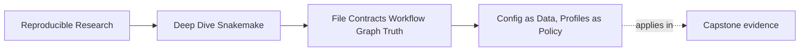

# Config as Data, Profiles as Policy


<!-- page-maps:start -->
## Page Maps




<!-- page-maps:end -->

This page separates two ideas people often mix together: workflow meaning and execution
policy.

## The sentence to keep

When you add a setting, ask:

> does this change what the workflow computes, or only how Snakemake executes it?

That one question prevents a lot of confusion.

## The boundary in plain language

Module 01 wants a simple split:

- config describes semantic workflow choices
- profiles describe execution policy

Config changes meaning.
Profiles change operating conditions.

This is not bureaucratic tidiness. It is how you keep workflows explainable.

## What belongs in config

Config is for values that affect the outputs you mean to compute.

Typical examples:

- sample lists
- thresholds
- reference paths
- selected assays or panels
- output modes that change report meaning

If changing the value should produce a meaningfully different result, config is a good home
for it.

## What belongs in profiles

Profiles are for execution behavior.

Typical examples:

- core count
- latency wait
- retry policy
- printing shell commands
- cluster or executor settings

These change how the workflow runs, not what the final outputs mean.

That distinction matters because you need to know whether a change should alter the DAG
or just alter scheduling and execution policy.

## A small table that helps

| Question | If yes, prefer... |
| --- | --- |
| does changing this alter output meaning | config |
| does changing this alter execution behavior only | profile |
| should another reader review this as part of workflow semantics | config |
| should this vary by machine or execution environment without changing the science or logic | profile |

This is not mathematically perfect, but it is a strong beginner rule.

## Why this split matters

When the boundary is blurry, several bad things happen:

- semantic choices drift into machine-local profile files
- the same workflow means different things on different systems
- debugging becomes harder because you cannot tell whether the issue is workflow
  logic or operating context
- reviewers miss important meaning changes because they look like execution changes

Strong workflows keep that boundary teachable.

## A simple healthy setup

Example config:

```yaml
samples:
  - A
  - B
threshold: 10
reference: data/reference/ref.fa
```

Example profile:

```yaml
cores: 4
printshellcmds: true
rerun-incomplete: true
latency-wait: 5
```

The config explains the workflow's semantic universe.
The profile explains how Snakemake should behave in this operating context.

## The most common beginner mistake

A beginner often stores semantic choices in a profile because it feels convenient:

```yaml
cores: 4
samples:
  - A
  - B
```

This is a bad boundary.

Why:

- `samples` changes the intended target set and output meaning
- a profile should be swappable across machines or environments
- semantic workflow meaning should not hide inside an execution-policy bundle

If a sample list changes, that should be a workflow-data discussion, not a machine-profile
discussion.

## Validation should happen early

Once config holds meaningful workflow data, the next responsibility is obvious:

validate it before jobs start.

Example:

```python
from snakemake.utils import validate

configfile: "config/config.yaml"
validate(config, "config/schema.yaml")
```

This is a very strong beginner habit because it changes a vague late failure into an early
explicit one.

Without early validation, people often discover mistakes too late:

- missing keys
- wrong shapes
- invalid sample names
- unsupported options

Those are easier to teach and repair at parse time than during job execution.

## A concrete example of failing early

Suppose the schema requires `samples`, but the config says:

```yaml
samplez:
  - A
  - B
```

Without validation, you may later hit:

- a `KeyError`
- a confusing expansion failure
- an empty target list that feels mysterious

With validation, the workflow fails immediately and says the config shape is wrong.

That is much more humane.

## Profiles should not smuggle in workflow meaning

A profile can absolutely influence the run experience.

It can control:

- concurrency
- logging verbosity
- retries
- executor behavior

What it should not do is quietly choose:

- which samples exist
- what threshold defines success
- which reference or panel is the scientific source of truth

If you change a profile and the outputs mean something different, the boundary has
likely drifted.

## Keep paths understandable

Config often carries paths. That is fine, but beginners need a rule:

paths in config are still semantic inputs if they determine what data or reference the rule
uses.

That means they deserve:

- clear naming
- validation where possible
- review attention when they change

They are not just operational details because they happen to be strings.

## A useful review habit

When looking at a setting, try this short review:

1. if this value changes, should the result meaning change
2. if yes, can another reader find it in config easily
3. if no, does it belong in a profile or execution context instead
4. if it is in config, is its shape validated before any jobs start

Those questions keep the boundary stable.

## A small example of the right explanation

Weak explanation:

> the workflow behaves differently on my machine.

Stronger explanation:

> the sample list was stored in a profile instead of config, so the workflow's semantic
> target surface changed with the execution context rather than with intentional workflow
> data.

Or:

> the workflow failed late because the required config key was missing and the Snakefile did
> not validate config at parse time.

Those are repairable explanations.

## Failure signatures worth recognizing

### "It works with one profile but builds a different artifact set with another"

That often means semantic workflow data leaked into profiles.

### "The workflow crashes halfway through because a config key is missing"

That usually means validation happened too late or not at all.

### "We cannot tell whether this option belongs to science, workflow logic, or cluster policy"

That means the boundary between config and policy has not been written clearly enough.

### "A machine-specific setting changed the meaning of results"

That is a strong sign the workflow meaning is not isolated cleanly.

## What this page wants you to remember

Config is for meaning.
Profiles are for operating policy.

If you keep that one split clear and validate config early, the workflow becomes easier to
read, easier to review, and much less likely to surprise readers for the wrong reasons.
