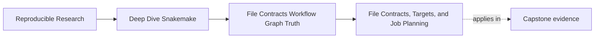
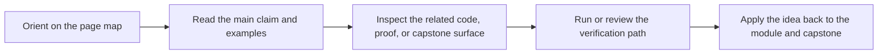
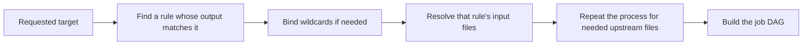

# File Contracts, Targets, and Job Planning


<!-- page-maps:start -->
## Page Maps




<!-- page-maps:end -->

This page explains the first mental shift you need in Snakemake: a rule is not just
an execution step. It is a promise about files.

## The sentence to keep

When you read a Snakemake rule, ask:

> which files does this rule promise to publish, and which files must already exist for
> that promise to make sense?

That question is stronger than "what command does this rule run?" because commands are only
part of the story.

## A rule is a file contract

A Snakemake rule has three essential parts:

- the files it needs
- the files it promises to create
- the action that turns the first into the second

That means the workflow is built from file relationships, not from the textual order of
rules in the Snakefile.

If you keep that one idea clear, many beginner confusions disappear:

- "why did this rule not run?"
- "why did it run before that other rule?"
- "why is this rule absent from the DAG?"

The answer is usually in the file contract, not in the shell body.

## Targets are how intent enters the workflow

Snakemake starts from the targets you request.

Sometimes you request them directly:

```bash
snakemake results/summary/counts.tsv
```

Often you request them through `rule all`:

```python
rule all:
    input:
        "results/summary/counts.tsv"
```

That target is not a convenience only. It is the statement of intent that tells Snakemake
what "done" means for this run.

If a file is not required by the requested targets, its producing rule does not become part
of the current plan.

## How Snakemake gets from a target to jobs

At a high level, Snakemake does this:



The key word is `matches`.

Snakemake does not ask:

- which rule appears first
- which shell body looks important
- which rule name sounds like it should run

It asks:

- which output path matches the requested file
- which upstream files are therefore required

That is why file naming and output precision matter so much.

## A tiny truthful workflow

Here is a small example:

```python
rule all:
    input:
        "results/summary/counts.tsv"

rule stage_upper:
    input:
        "data/{sample}.txt"
    output:
        "results/staged/{sample}.upper.txt"
    shell:
        r"""
        mkdir -p results/staged
        tr '[:lower:]' '[:upper:]' < {input} > {output}
        """

rule summarize_counts:
    input:
        "results/staged/A.upper.txt",
        "results/staged/B.upper.txt"
    output:
        "results/summary/counts.tsv"
    shell:
        r"""
        mkdir -p results/summary
        printf "sample\tlines\nA\t3\nB\t2\n" > {output}
        """
```

If the target is `results/summary/counts.tsv`, Snakemake reasons like this:

1. `summarize_counts` can publish that target
2. therefore its inputs are needed
3. `stage_upper` can publish each staged file
4. therefore the source files in `data/` are needed

That is the workflow graph.

## Why rules "go missing"

One of the first beginner complaints is:

> I wrote the rule, but Snakemake never runs it.

Usually the rule is not broken. It is simply irrelevant to the current target set.

Example:

```python
rule all:
    input:
        "results/final.txt"

rule producer:
    output:
        "results/final.txt"
    shell:
        r"""
        mkdir -p results
        echo final > {output}
        """

rule never_called:
    output:
        "results/ghost.txt"
    shell:
        r"""
        mkdir -p results
        echo ghost > {output}
        """
```

If you dry-run this workflow:

```bash
snakemake -n
```

you should expect only `producer` and `all`. `never_called` is absent because no requested
target requires `results/ghost.txt`.

This is not Snakemake being clever or lazy. It is Snakemake being faithful to the target
contract.

## A common misunderstanding: rule order is not dependency order

People often read a Snakefile from top to bottom and assume rules above will run before
rules below.

That intuition is understandable. It is also wrong.

This workflow:

```python
rule summarize_counts:
    input:
        "results/staged/A.upper.txt"
    output:
        "results/summary/counts.tsv"
    shell:
        "..."

rule stage_upper:
    input:
        "data/A.txt"
    output:
        "results/staged/A.upper.txt"
    shell:
        "..."
```

still causes `stage_upper` to run before `summarize_counts`, because the file edge says so.

Conversely, if the file edge is missing, putting one rule above another does not rescue the
workflow.

## Missing steps are usually missing edges

Suppose you say:

> the summary rule runs, but it should have waited for my preparation rule.

The review question is:

> which file produced by the preparation rule appears in the summary rule's `input:`?

If the answer is "none," then there is no dependency.

Snakemake does not know that one shell command feels like preparation for another. It only
knows the declared file relationships.

This is one of the most important habits in the whole course:

- stop explaining workflows in terms of vague step order
- start explaining workflows in terms of file edges

## The role of `rule all`

`rule all` is often introduced as a default target. That is true, but incomplete.

Its deeper job is to define the finished artifact set for normal use.

A good `rule all`:

- names the outputs you or a CI user actually care about
- keeps internal helper files out of the public completion surface
- makes dry-runs and summaries easier to interpret

A weak `rule all` does one of two bad things:

- it is too small, so important outputs are not part of ordinary workflow truth
- it is too broad, so private or temporary files become part of the public contract

This matters because the chosen target surface shapes how the entire DAG is built.

## A small diagnostic loop

When a rule behaves unexpectedly, use this loop:

1. ask what target was requested
2. ask which rule output matches that target
3. ask which input files justify the next upstream jobs
4. inspect the planned DAG before changing code

The commands are simple:

```bash
snakemake -n
snakemake --summary
snakemake --dag | dot -Tpdf > dag.pdf
```

Each one answers a different piece:

- `-n`: what would run
- `--summary`: who owns which outputs
- `--dag`: how the planned jobs depend on one another

These commands are more educational than rerunning the workflow blindly.

## An example of the right explanation

Weak explanation:

> Snakemake skipped my preprocessing rule for some reason.

Stronger explanation:

> The requested target was `results/report.tsv`. That target matched `build_report`, whose
> `input:` did not include the preprocessing output. The preprocessing rule therefore had no
> edge into the requested DAG and could not be scheduled.

That second explanation is much stronger because it names the contract defect precisely.

## Failure signatures worth recognizing

### "I wrote a rule and nothing happened"

That usually means no requested target depends on its output.

### "The jobs ran in a strange order"

That usually means you expected textual order to matter more than file edges.

### "The workflow needs a step, but Snakemake does not know that"

That usually means the step was described operationally instead of through declared files.

### "A helper file is getting built even though nobody asked for it"

That often means the helper file accidentally became part of the target surface through
`rule all` or through another broad output path.

## What this page wants you to remember

Snakemake does not run stories. It runs file contracts.

If you can answer these three questions, you understand the core of the system:

1. what file was requested
2. which rule can publish it
3. which upstream files make that publication possible

That is the foundation for everything else in Module 01.
