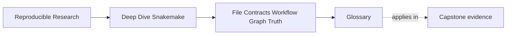
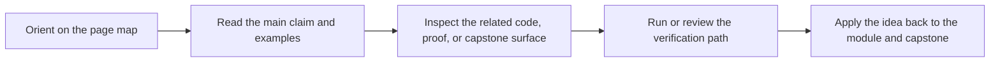

# Glossary

<!-- page-maps:start -->
## Page Maps

<!-- page-maps:end -->

Use this glossary to keep the language of Module 01 stable while you move between the core
lessons, worked example, and exercises.

The goal is not extra jargon. The goal is to make sure the same beginner-level workflow
facts keep the same names whenever you explain them.

## How to use this glossary

If a Snakemake explanation starts drifting into phrases like "it just runs that step" or
"the wildcard is weird," stop and look up the precise term that should replace that vague
phrase. Module 01 becomes much clearer when the nouns are stable.

## Terms in this module

| Term | Meaning in this module |
| --- | --- |
| ambiguity | A design situation where more than one rule can claim the same target path. |
| atomic publication | Writing to a temporary path and renaming only on success so the final output is complete or absent. |
| config | Workflow data that changes what the workflow computes, such as samples, thresholds, or references. |
| convergence | The state where a successful run followed by `snakemake -n` reports nothing more to do for the current tracked workflow meaning. |
| file contract | The rule-level promise connecting declared inputs, declared outputs, and the action that produces those outputs. |
| hidden input | A real output influence that is not represented clearly as config, declared input files, or other intentional tracked workflow meaning. |
| output ownership | The question of which rule is responsible for publishing a given output path. |
| poison artifact | A final-looking output left behind by failure even though it is incomplete or untrustworthy. |
| profile | Execution policy for running the workflow, such as core count, retries, or latency behavior. |
| requested target | The concrete file path or default completion surface that Snakemake is asked to build. |
| rerun cause | The specific tracked or untracked reason a rule runs again or fails to rerun when it should. |
| rule all | The conventional rule that defines the normal finished output set for a workflow run. |
| rule graph | A structural view of rule relationships, as distinct from the concrete job DAG for one requested target set. |
| target surface | The set of outputs that define what "done" means for a normal invocation of the workflow. |
| wildcard binding | The act of matching a concrete filename against an output pattern and assigning values such as `sample = A`. |
| wildcard constraint | A regex restriction that narrows which filename shapes a wildcard may claim. |
| workflow meaning | The semantic content of what the workflow computes, as distinct from execution policy. |
| summary evidence | Output from commands such as `snakemake --summary` that helps explain which rules own which files and what state those files are in. |

## The vocabulary standard for this module

When you explain a Module 01 situation, aim to say things like:

- "that rule is outside the current target surface"
- "the workflow fails to converge because the tracked meaning is unstable"
- "this is a wildcard ownership problem, not just a naming annoyance"
- "that setting belongs in config, not in execution policy"
- "the final path is a poison artifact because it was published before success"

Those sentences are much more useful than saying only "Snakemake is confusing."
