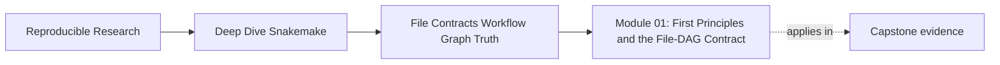
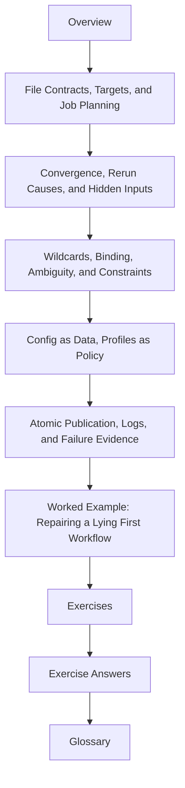

# Module 01: First Principles and the File-DAG Contract


<!-- page-maps:start -->
## Page Maps




<!-- page-maps:end -->

Module 01 is where the whole Snakemake program either becomes clear or stays mystical.

This module is not about memorizing rule syntax. It is about learning the contract Snakemake
actually enforces:

- targets declare intent
- files define dependency truth
- rules publish outputs that other rules are allowed to trust
- reruns only make sense when the workflow tells the truth about its inputs, outputs, and
  tracked changes

If that model is shaky, every later feature in the course becomes harder to reason about.

## What this module is for

By the end of Module 01, you should be able to explain five things clearly:

- how a rule acts as a file contract rather than a vague workflow step
- how targets become a DAG and then concrete jobs
- why convergence fails when hidden inputs or unstable parameters leak in
- how wildcard binding can stay precise or become ambiguous
- how config, profiles, logs, and atomic publication keep a small workflow trustworthy

## Study route



Read the module in that order the first time. Later, jump directly to the page that matches
the failure or design question you are facing.

## The ten files in this module

1. Overview (`index.md`)
2. [File Contracts, Targets, and Job Planning](file-contracts-targets-and-job-planning.md)
3. [Convergence, Rerun Causes, and Hidden Inputs](convergence-rerun-causes-and-hidden-inputs.md)
4. [Wildcards, Binding, Ambiguity, and Constraints](wildcards-binding-ambiguity-and-constraints.md)
5. [Config as Data, Profiles as Policy](config-as-data-profiles-as-policy.md)
6. [Atomic Publication, Logs, and Failure Evidence](atomic-publication-logs-and-failure-evidence.md)
7. [Worked Example: Repairing a Lying First Workflow](worked-example-repairing-a-lying-first-workflow.md)
8. [Exercises](exercises.md)
9. [Exercise Answers](exercise-answers.md)
10. [Glossary](glossary.md)

## How to use the file set

| If you need to... | Start here |
| --- | --- |
| understand why a rule runs, does not run, or is absent from the DAG | [File Contracts, Targets, and Job Planning](file-contracts-targets-and-job-planning.md) |
| explain why a workflow reruns forever or fails to rerun when it should | [Convergence, Rerun Causes, and Hidden Inputs](convergence-rerun-causes-and-hidden-inputs.md) |
| make wildcard patterns precise enough to avoid accidental matches | [Wildcards, Binding, Ambiguity, and Constraints](wildcards-binding-ambiguity-and-constraints.md) |
| keep semantic inputs separate from execution policy | [Config as Data, Profiles as Policy](config-as-data-profiles-as-policy.md) |
| stop partial outputs and improve failure evidence | [Atomic Publication, Logs, and Failure Evidence](atomic-publication-logs-and-failure-evidence.md) |
| see the whole module as one repaired beginner workflow | [Worked Example: Repairing a Lying First Workflow](worked-example-repairing-a-lying-first-workflow.md) |
| test your own understanding | [Exercises](exercises.md) |
| compare your reasoning against a reference | [Exercise Answers](exercise-answers.md) |
| stabilize the module vocabulary | [Glossary](glossary.md) |

## The running question

Carry this question through every page:

> what exact file contract or tracked change explains why Snakemake builds, skips, or reruns
> this output?

Good Module 01 answers usually mention one or more of these:

- a concrete target path
- the rule output pattern that matches it
- the input or parameter that justifies the job
- the evidence route that confirms the explanation, such as dry-run, summary, DAG, or logs
- the publication rule that makes a final output trustworthy

## Commands to keep close

These commands form the evidence loop for Module 01:

```bash
snakemake -n
snakemake --summary
snakemake --dag | dot -Tpdf > dag.pdf
snakemake --rulegraph | dot -Tpdf > rulegraph.pdf
snakemake --lint
```

They answer different questions:

- what would run
- who owns which files
- how jobs depend on each other
- how rules relate structurally
- which design smells already exist

## Learning outcomes

By the end of this module, you should be able to:

- explain rules as file contracts and predict the resulting jobs
- prove convergence and diagnose rerun causes
- use wildcards precisely and recognize ambiguity early
- validate config early and keep profiles out of semantic workflow meaning
- publish outputs atomically and leave behind usable failure evidence

## Exit standard

Do not move on until all of these are true:

- you can explain why a small workflow does or does not run a rule
- you can make a tiny workflow converge after a clean run
- you can show one ambiguous wildcard design and repair it
- you can distinguish config data from execution policy clearly
- you can explain why a final output is trustworthy or why it is poison

When those feel ordinary, Module 01 has done its job.
