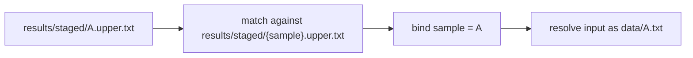

# Wildcards, Binding, Ambiguity, and Constraints

This page explains how Snakemake binds wildcards to concrete filenames, and why careless
patterns quickly turn into ambiguity or accidental matches.

## The sentence to keep

When you see a wildcard, ask:

> what exact filename shapes am I allowing this rule to claim?

That question is much better than asking only:

> what value will go into `{sample}`?

The real design issue is what paths the rule is permitted to own.

## What a wildcard actually does

A wildcard is a placeholder inside an output or input pattern.

For example:

```python
rule stage_upper:
    input:
        "data/{sample}.txt"
    output:
        "results/staged/{sample}.upper.txt"
    shell:
        "..."
```

If the requested target is:

```text
results/staged/A.upper.txt
```

Snakemake can bind:

```text
sample = A
```

That binding then makes the corresponding input path:

```text
data/A.txt
```

This is why wildcards feel magical at first. But the magic is just filename matching.

## The binding story in one diagram



That is the core model.

If you remember this diagram, wildcards become much less mysterious.

## Wildcards are about path ownership

The most important consequence is not the value itself. It is what paths the rule claims.

This rule:

```python
output:
    "results/{name}.txt"
```

is not just saying "there will be some name." It is saying:

this rule may become the owner of any file that fits `results/*.txt`.

That can be perfectly fine in a small workflow. It can also become dangerously broad.

## Precision matters more than cleverness

Beginners sometimes write wildcard patterns that are technically flexible but hard to
reason about:

```python
output:
    "results/{anything}.txt"
```

or:

```python
output:
    "results/{sample}.{kind}.txt"
```

These may work. The question is whether a reader can still predict:

- which files belong to this rule
- which files definitely do not
- whether another rule could claim the same target

Readable workflows prefer precise path ownership over clever generality.

## The classic beginner failure: ambiguity

Ambiguity happens when more than one rule could produce the same target.

Example:

```python
rule all:
    input:
        "results/test.txt"

rule r1:
    output:
        "results/{x}.txt"
    shell:
        r"""mkdir -p results; echo r1 > {output}"""

rule r2:
    output:
        "results/{x}.txt"
    shell:
        r"""mkdir -p results; echo r2 > {output}"""
```

Now `results/test.txt` can be claimed by both `r1` and `r2`.

That is not a small inconvenience. It is a design defect: the workflow has two writers for
one path pattern.

The right lesson is not "add a workaround quickly." The right lesson is:

one path should have one clear owner.

## Constraints are a tool, not a rescue plan

Snakemake lets you constrain wildcards:

```python
wildcard_constraints:
    sample = r"[A-Za-z0-9_]+"
```

This is useful because it narrows what filenames a rule can claim.

Constraints help with cases like:

- sample names should not contain slashes
- dots should not be absorbed accidentally
- unexpected separators should be rejected

But constraints do not fix a fundamentally bad ownership design.

If two rules still claim the same shape, the workflow is still ambiguous.

## Wildcard leakage is a real beginner problem

Suppose sample IDs can contain dots:

```text
tumor.v1
```

and your output pattern is:

```python
"results/{sample}.{kind}.txt"
```

Now a reader has to ask:

- does `tumor.v1.report.txt` mean `sample=tumor` and `kind=v1.report`
- or `sample=tumor.v1` and `kind=report`

That kind of looseness makes the workflow harder to predict and easier to break.

A cleaner design might use directory boundaries or clearer prefixes instead:

```python
"results/{sample}/report.txt"
```

or:

```python
"results/report.{sample}.txt"
```

The best wildcard fix is often a better path design.

## Expansion should stay tied to reality

Wildcards are often paired with `expand()`:

```python
SAMPLES = ["A", "B"]

rule all:
    input:
        expand("results/staged/{sample}.upper.txt", sample=SAMPLES)
```

This is a healthy pattern when `SAMPLES` is a real, validated list.

It becomes risky when expansion generates targets that do not represent reality:

- stale sample IDs remain in config
- filenames are discovered inconsistently
- helper lists and real data drift apart

Then you experience "weird missing input" or "why is Snakemake looking for this
file?" when the real issue is target generation drift.

## The best review question for wildcard design

When you review a wildcard pattern, ask:

1. which files is this rule allowed to own
2. could another rule claim any of those same files
3. could a strange filename bind in an unexpected way
4. does the path shape teach the reader what kind of file this is

Those questions catch more issues than staring at the braces.

## A small repair example

Weak design:

```python
rule build_text:
    output:
        "results/{name}.txt"
```

Better design:

```python
rule build_report:
    output:
        "results/reports/{sample}.report.txt"
```

Why it is better:

- the directory states the artifact family
- the suffix states the artifact kind
- the wildcard has one clear job
- collisions with unrelated text outputs become less likely

This is a path design improvement, not just a regex improvement.

## What `ruleorder` cannot solve for you

People who meet ambiguity often discover `ruleorder` and feel relieved.

`ruleorder` can help in some advanced cases. It should not be the first fix for a beginner
workflow whose file ownership is already muddy.

If the problem is:

- two rules can publish the same file

then the first fix should usually be:

- redesign the outputs so the ownership is unique

In Module 01, the lesson to internalize is one-writer-per-path, not precedence tricks.

## Evidence routes for wildcard problems

When wildcard behavior feels confusing, these commands help most:

```bash
snakemake -n
snakemake --rulegraph | dot -Tpdf > rulegraph.pdf
snakemake --summary
```

Use them to answer:

- which rule is being chosen
- whether more than one rule could claim the same file
- which outputs each rule actually owns in practice

If the ownership story is still vague after that, the pattern design probably needs work.

## A strong explanation sounds like this

Weak explanation:

> the wildcard is weird.

Stronger explanation:

> the output pattern `results/{x}.txt` is too broad because two rules can claim
> `results/test.txt`, so the workflow has ambiguous ownership for that path.

Or:

> the pattern `results/{sample}.{kind}.txt` allows filenames with dots to bind in multiple
> plausible ways, so the path design does not communicate ownership clearly enough.

Those explanations are specific enough to guide repair.

## Failure signatures worth recognizing

### "Snakemake says two rules are ambiguous for one file"

That means the file-ownership design is unclear, not merely the regex.

### "The wildcard seems to swallow too much of the filename"

That usually means the path pattern is too loose for the artifact naming scheme.

### "A generated target looks valid syntactically but should never exist logically"

That often means expansion and real data discovery have drifted apart.

### "I can make it work if I guess the right filename pattern"

That is a sign the path contract is not teaching the reader enough.

## What this page wants you to remember

Wildcards are not primarily about braces. They are about ownership of filename shapes.

If you can answer these three questions, your wildcard reasoning is already much stronger:

1. what concrete target is being matched
2. how the wildcard binds to that target
3. whether any other rule could claim the same path

That is the beginner-level discipline that prevents a lot of later pain.
