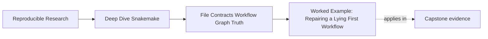
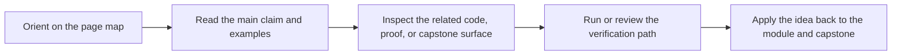

# Worked Example: Repairing a Lying First Workflow


<!-- page-maps:start -->
## Page Maps




<!-- page-maps:end -->

This example follows one small beginner workflow from misleading first draft to a version
that tells the truth about files, reruns, and published outputs.

## The situation

Assume you are building a tiny workflow over two text files:

- `data/A.txt`
- `data/B.txt`

The intended goal is simple:

1. uppercase each file
2. summarize the line counts
3. treat the summary as the main finished result

This sounds like an easy first Snakemake exercise. It is also exactly the kind of exercise
where beginners accidentally build a workflow that looks fine while teaching bad habits.

## The first draft

You write this:

```python
import time

SAMPLES = ["A", "B"]

rule all:
    input:
        "results/summary.txt"

rule prepare:
    output:
        "results/ready.flag"
    shell:
        r"""
        mkdir -p results staged
        echo ready > {output}
        """

rule upper:
    input:
        "data/{sample}.txt"
    output:
        "staged/{sample}.txt"
    shell:
        r"""
        tr '[:lower:]' '[:upper:]' < {input} > {output}
        """

rule summarize:
    input:
        expand("staged/{sample}.txt", sample=SAMPLES)
    output:
        "results/summary.txt"
    params:
        stamp=lambda: time.time()
    shell:
        r"""
        echo "built_at={params.stamp}" > {output}
        wc -l {input} >> {output}
        """
```

At first glance this looks reasonable. It has a default target, a helper rule, a wildcard
rule, and a summary.

It is still lying in several ways.

## What is wrong with it

The first draft has at least five issues:

1. `prepare` never runs because nothing depends on `results/ready.flag`.
2. `staged/{sample}.txt` is a vague output family with no artifact-specific naming.
3. `summarize` embeds a time-based parameter, so the workflow will not converge.
4. `summary.txt` is written directly in place, so failure could leave poison.
5. there are no per-job logs, so failures are harder to inspect.

That is a good Module 01 example because none of these problems are exotic.

## Step 1: review the target story

The first question is not "how do I fix the shell?"

The first question is:

> what outputs are supposed to count as finished results?

Right now `rule all` says the finished result is `results/summary.txt`.

That means `prepare` is outside the real target story unless its output becomes part of an
explicit input chain.

This is Core 1 in action. You realize:

- `prepare` is not "forgotten by Snakemake"
- it is irrelevant to the requested target

The honest repair is either:

- remove `prepare` entirely
- or make a real downstream edge depend on it

In this example, the right answer is removal. The flag is not real workflow truth.

## Step 2: fix the rerun lie

You then run:

```bash
snakemake
snakemake -n
```

and notices that the dry-run still wants to execute `summarize`.

The reason is not mysterious:

- `params.stamp` changes every parse
- the rule meaning is unstable
- the workflow cannot converge

This is Core 2.

The repair is to remove the unstable time value from the rule's meaning. If you
actually needs a run identifier, it should be an explicit stable config value or sidecar
audit artifact, not part of the summary's semantic content.

## Step 3: make the wildcard output teach the reader

The next issue is the staging path:

```python
"staged/{sample}.txt"
```

This path is not wrong, but it is weak:

- it does not say this is an uppercased artifact
- it is easy to collide with other staged text outputs later
- it does not teach the reader enough about ownership

A stronger path is:

```python
"results/staged/{sample}.upper.txt"
```

This is Core 3:

- the directory says the artifact family
- the suffix says the artifact kind
- the wildcard has one clear role

The fix is not about pretty naming only. It is about path precision and future ambiguity
avoidance.

## Step 4: separate meaning from policy

Suppose you now want to make the sample list configurable.

A weak move would be putting samples into a profile.

A stronger move is:

**`config/config.yaml`**

```yaml
samples:
  - A
  - B
```

**`profiles/default/config.yaml`**

```yaml
cores: 2
printshellcmds: true
rerun-incomplete: true
```

Then the Snakefile can read:

```python
from snakemake.utils import validate

configfile: "config/config.yaml"
validate(config, "config/schema.yaml")

SAMPLES = config["samples"]
```

This is Core 4. You now have a clean story:

- config changes workflow meaning
- profile changes execution behavior

## Step 5: repair publication and failure evidence

You also notice that the summary rule writes directly to the final output.

That means a failure could leave a half-written `results/summary/counts.tsv`.

The repair is the Module 01 publication pattern:

- write to a temp sibling
- rename only when complete
- add per-job logs

So the repaired summary rule becomes closer to:

```python
rule summarize_counts:
    input:
        expand("results/staged/{sample}.upper.txt", sample=SAMPLES)
    output:
        "results/summary/counts.tsv"
    log:
        "logs/summarize.log"
    shell:
        r"""
        set -euo pipefail
        mkdir -p results/summary logs
        tmp="{output}.tmp"
        printf "sample\tlines\n" > "$tmp"
        for f in {input}; do
          s="$(basename "$f" .upper.txt)"
          n="$(wc -l < "$f" | tr -d ' ')"
          printf "%s\t%s\n" "$s" "$n" >> "$tmp"
        done 2> {log}
        mv -f "$tmp" {output}
        """
```

This is Core 5:

- final output is complete or absent
- failure has a log
- the publication point is explicit

## The repaired workflow

After the fixes, you have something much healthier:

```python
from snakemake.utils import validate

configfile: "config/config.yaml"
validate(config, "config/schema.yaml")

SAMPLES = config["samples"]

rule all:
    input:
        "results/summary/counts.tsv",
        expand("results/staged/{sample}.upper.txt", sample=SAMPLES)

rule stage_upper:
    input:
        "data/{sample}.txt"
    output:
        "results/staged/{sample}.upper.txt"
    log:
        "logs/stage/{sample}.log"
    shell:
        r"""
        set -euo pipefail
        mkdir -p results/staged logs/stage
        tmp="{output}.tmp"
        tr '[:lower:]' '[:upper:]' < {input} > "$tmp" 2> {log}
        mv -f "$tmp" {output}
        """

rule summarize_counts:
    input:
        expand("results/staged/{sample}.upper.txt", sample=SAMPLES)
    output:
        "results/summary/counts.tsv"
    log:
        "logs/summarize.log"
    shell:
        r"""
        set -euo pipefail
        mkdir -p results/summary logs
        tmp="{output}.tmp"
        printf "sample\tlines\n" > "$tmp"
        for f in {input}; do
          s="$(basename "$f" .upper.txt)"
          n="$(wc -l < "$f" | tr -d ' ')"
          printf "%s\t%s\n" "$s" "$n" >> "$tmp"
        done 2> {log}
        mv -f "$tmp" {output}
        """
```

This version is not advanced. It is honest.

## The evidence after repair

You can now ask much better questions and get clear answers.

Dry-run:

```bash
snakemake -n
```

After a successful clean run, the expected answer is:

```text
Nothing to be done.
```

Summary:

```bash
snakemake --summary
```

The important facts should be obvious:

- staged upper files are owned by `stage_upper`
- `results/summary/counts.tsv` is owned by `summarize_counts`
- the workflow has one clear summary output contract

DAG:

```bash
snakemake --dag | dot -Tpdf > dag.pdf
```

You should now see:

- two `stage_upper` jobs
- one `summarize_counts` job
- one `all` target

That is a workflow you can explain, not just run.

## What changed conceptually

```mermaid
flowchart TD
  start["Plausible first draft"] --> c1["Core 1: remove fake helper target"]
  c1 --> c2["Core 2: remove unstable rerun cause"]
  c2 --> c3["Core 3: tighten output naming and wildcard ownership"]
  c3 --> c4["Core 4: move workflow meaning into config"]
  c4 --> c5["Core 5: publish atomically and log failures"]
  c5 --> end["Small workflow with honest file contracts"]
```

That diagram is the real lesson of the example. Each repair made the workflow easier to
predict.

## What a strong summary sounds like

A strong summary sounds like this:

> The first draft looked acceptable, but it lied about what mattered. One helper rule was
> not part of the target graph, the summary rule changed meaning every run, staged outputs
> were named too loosely, semantic workflow data was not clearly separated from policy, and
> final outputs were written in place without reliable failure evidence. The repaired
> workflow tightened the target contract, converged after clean runs, used clearer wildcard
> ownership, validated config early, and published final outputs atomically with logs.

That summary is much better than:

> We cleaned up the Snakefile.

## What to practice after this example

Take one tiny workflow of your own and ask:

- which rule feels present but is actually irrelevant to the target graph
- which value might prevent convergence
- which path pattern is too vague
- which setting belongs in config rather than policy
- which final output is still published too early

If you can answer those five questions, Module 01 is becoming practical instead of only
theoretical.
