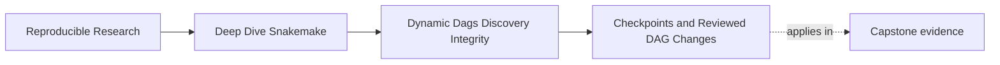
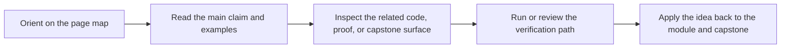
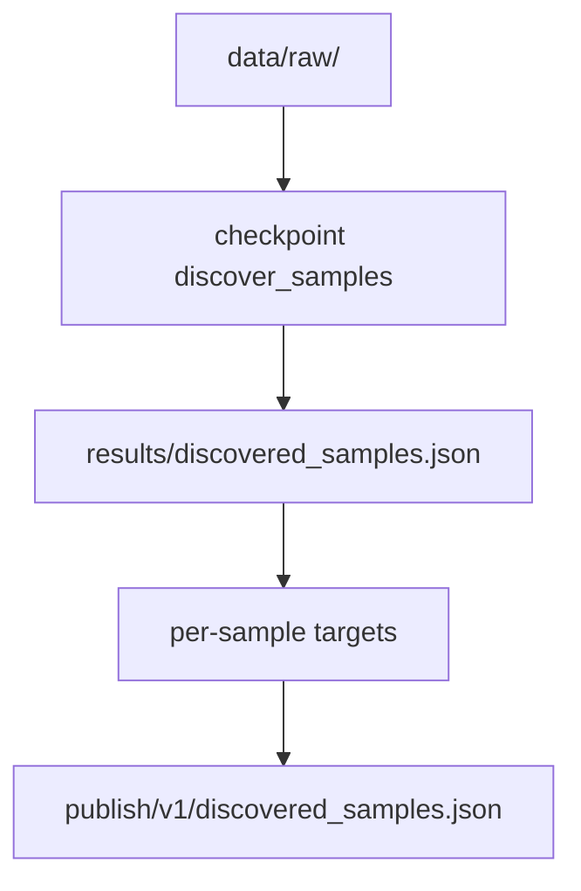

# Checkpoints and Reviewed DAG Changes


<!-- page-maps:start -->
## Page Maps




<!-- page-maps:end -->

Checkpoints are where many Snakemake courses become mystical.

This module takes the opposite approach:

> a checkpoint is acceptable only when it makes a data-dependent change to the DAG more explicit than the alternatives.

If it hides the real target story, it is a bad checkpoint even if the code runs.

## What a checkpoint actually does

A normal rule lets Snakemake build the job graph up front.

A checkpoint says:

- build the graph as far as this step
- run the checkpoint
- inspect its declared output
- reevaluate downstream job construction using that new fact

That is all. A checkpoint is not "dynamic magic." It is controlled graph reevaluation.

## When a checkpoint is justified

Use a checkpoint when downstream targets genuinely cannot be known until some declared
input has been inspected or produced.

Good examples:

- discovering which samples are present in a newly staged raw-data directory
- splitting one input into a data-dependent set of shards
- enumerating outputs from a tool whose count depends on validated input content

In all three cases, the checkpoint exists because the workflow learns a real new fact.

## When a checkpoint is a smell

Do not use a checkpoint for problems that are really about weak workflow design:

- you could have read the sample list from config instead
- the target list was already known but nobody modeled it cleanly
- multiple rules keep rescanning the filesystem and disagreeing about what exists
- the rule wants to hide side effects that should have been explicit outputs

Those are not checkpoint problems. They are modeling problems.

## The checkpoint contract

A healthy checkpoint has four properties:

1. one clear discovery question
2. one owned output that records the answer
3. deterministic behavior for fixed declared inputs
4. downstream fanout that reads the recorded answer instead of rediscovering it

If any of those are missing, the checkpoint usually leaves the workflow harder to review.

## A good shape



This picture matters because the discovery step leaves behind a durable registry. The
checkpoint is not trusted because it is dynamic. It is trusted because its result is
reviewable.

## Minimal checkpoint pattern

```python
checkpoint discover_samples:
    input:
        directory("data/raw")
    output:
        directory("results/discovery")
    run:
        import json
        from pathlib import Path

        outdir = Path(output[0])
        outdir.mkdir(parents=True, exist_ok=True)

        samples = sorted(
            path.name.removesuffix(".fastq.gz")
            for path in Path(input[0]).glob("*.fastq.gz")
        )
        (outdir / "samples.json").write_text(
            json.dumps({"samples": samples}, indent=2) + "\n",
            encoding="utf-8",
        )


def discovered_qc_targets(_wildcards):
    import json
    from pathlib import Path

    checkpoint_job = checkpoints.discover_samples.get()
    registry = Path(checkpoint_job.output[0]) / "samples.json"
    samples = json.loads(registry.read_text(encoding="utf-8"))["samples"]
    return expand("results/{sample}/qc.json", sample=samples)


rule all:
    input:
        discovered_qc_targets
```

Two parts matter here:

- the checkpoint writes one owned registry
- downstream expansion reads that registry, not the raw directory again

That is the core Module 02 pattern.

## What the checkpoint must never hide

A checkpoint must never be used to smuggle in these facts:

- undeclared input files
- random or time-based discovery
- side effects that later rules depend on but cannot name
- a second private discovery pass inside downstream helper code

If the downstream DAG changes, the workflow should be able to point to one declared input
surface and one concrete checkpoint output that explain why.

## Determinism matters more than dynamism

The hardest checkpoint bug to debug is often not code failure. It is discovery drift.

Example bad shape:

```python
import random

checkpoint discover_samples:
    output:
        directory("results/discovery")
    run:
        import json
        from pathlib import Path

        outdir = Path(output[0])
        outdir.mkdir(parents=True, exist_ok=True)
        samples = [f"sample{random.randint(1, 99)}" for _ in range(2)]
        (outdir / "samples.json").write_text(json.dumps({"samples": samples}))
```

This code proves the point:

- the checkpoint output is not a fact about declared inputs
- reruns can change the discovered set without any honest cause
- downstream results become impossible to defend

The fix is never "dynamic DAGs are flaky." The fix is "discovery must be a deterministic
function of declared inputs."

## A good review checklist

When you review a checkpoint, ask:

- what exact question is this checkpoint answering
- what file records the answer
- could I inspect that file after the run and understand the discovered set
- do downstream rules read that file or perform their own fresh discovery
- would the same declared inputs produce the same answer again

If those questions are easy to answer, the checkpoint is probably healthy.

## The explanation a reviewer trusts

Strong explanation:

> the checkpoint exists because the sample set is unknown until `data/raw/` is inspected,
> it writes `results/discovery/samples.json`, and all downstream fanout reads that file,
> so the dynamic change to the DAG is explicit and reproducible.

Weak explanation:

> we needed a checkpoint because Snakemake could not figure it out otherwise.

The first sentence explains the contract. The second sentence hides it.

## End-of-page checkpoint

Before leaving this page, you should be able to:

- explain a checkpoint as controlled DAG reevaluation
- name one case where a checkpoint is justified
- name one case where a checkpoint is really covering for weak target design
- describe the durable output a healthy checkpoint should leave behind
