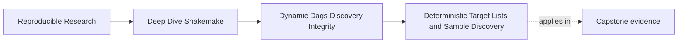
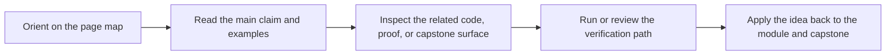

# Deterministic Target Lists and Sample Discovery


<!-- page-maps:start -->
## Page Maps




<!-- page-maps:end -->

Dynamic workflows begin with a simple promise:

> if the set of samples changes, the workflow can explain exactly how it learned that fact.

That promise sounds obvious. Many real workflows still break it by discovering work in
ways that are unstable, implicit, or impossible to review later.

## Discovery is not permission to be vague

People often say "Snakemake discovers samples for me" when they really mean one of
three different things:

- the sample list is written in config
- a script scans a directory and turns filenames into sample identities
- a checkpoint produces a discovered-set file that later rules consume

Those are not the same design.

The healthy question is not "can Snakemake discover this?" The healthy question is:

> what exact input surface decides which targets exist?

If that surface is unclear, the workflow may still run, but the run story is weak.

## The stable model

Module 02 uses this model throughout:

1. choose one declared discovery surface
2. normalize it into a deterministic sample list
3. validate the result
4. materialize it as an artifact when later rules need to trust it
5. fan out from that list, not from fresh filesystem guesses

That is how dynamic behavior stays reviewable.

## Three discovery surfaces, from simplest to strongest

### 1. Config or sample sheet

This is the easiest surface to teach:

- you write the sample list deliberately
- version control captures the change
- `rule all` or a helper function expands from known data

This is a strong default when the workflow does not need to discover new inputs at run
time.

### 2. Deterministic scan at parse time

Sometimes the workflow must inspect a directory to know what exists. That can still be
honest if the scan is narrow and stable:

- the input directory is declared
- matching rules are explicit
- the result is sorted
- filename parsing is validated

This is fine for a small workflow when the discovered set is not yet an important
downstream contract.

### 3. Checkpoint-produced discovery artifact

This is the strongest version:

- discovery happens in one owned step
- the discovered set is written to a durable file
- downstream fanout reads that file
- later review can inspect the exact set that drove the DAG

That is the design the rest of this module is trying to earn.

## A bad first draft

This shape looks convenient:

```python
from pathlib import Path

SAMPLES = [path.stem for path in Path("data/raw").glob("*.fastq.gz")]

rule all:
    input:
        expand("results/{sample}/qc.json", sample=SAMPLES)
```

Why this is weak:

- `Path.glob()` order is not the lesson you want readers to trust
- the filename parsing is wrong because `.stem` drops only the final suffix
- there is no validation for duplicate logical sample IDs
- nothing records the discovered set for later review

The workflow may appear to work while teaching the wrong habit.

## A better pattern for small workflows

If parse-time discovery is enough, make it explicit and deterministic:

```python
from pathlib import Path

RAW_DIR = Path("data/raw")


def discover_samples():
    fastqs = sorted(RAW_DIR.glob("*.fastq.gz"))
    if not fastqs:
        raise ValueError(f"No FASTQ files found in {RAW_DIR}")

    samples = []
    for path in fastqs:
        name = path.name.removesuffix(".fastq.gz")
        if not name.replace("_", "").isalnum():
            raise ValueError(f"Unsafe sample name: {name}")
        samples.append(name)

    if len(samples) != len(set(samples)):
        raise ValueError("Duplicate sample IDs after filename normalization")

    return samples


SAMPLES = discover_samples()

rule all:
    input:
        expand("results/{sample}/qc.json", sample=SAMPLES)
```

This still uses discovery, but it stops pretending the filesystem is self-explanatory.

## When discovery must become an artifact

Once discovery drives a dynamic DAG or a publish boundary, a Python list at parse time is
usually not enough. Another engineer should be able to inspect the exact discovered set
from the run itself.

That is when the workflow should produce something like:

- `results/discovered_samples.json`
- `results/discovered_samples.tsv`
- `results/discovery/registry.json`

The filename is less important than the contract:

- it is the owned output of discovery
- it is durable enough to reread later
- downstream rules fan out from it

## A simple discovered-set artifact

```python
rule discover_samples:
    input:
        directory("data/raw")
    output:
        "results/discovered_samples.json"
    run:
        import json
        from pathlib import Path

        raw_dir = Path(input[0])
        samples = sorted(
            path.name.removesuffix(".fastq.gz")
            for path in raw_dir.glob("*.fastq.gz")
        )
        Path(output[0]).parent.mkdir(parents=True, exist_ok=True)
        Path(output[0]).write_text(
            json.dumps({"samples": samples}, indent=2) + "\n",
            encoding="utf-8",
        )
```

This rule does two useful things for you:

- it names discovery as a real step with a real output
- it gives later review one file that answers "what did this run discover?"

## What makes discovery deterministic

Discovery is deterministic when the same declared inputs produce the same discovered set.

That usually requires four habits:

- sort every scan result
- normalize names exactly once
- reject invalid or duplicate identities early
- avoid ambient inputs that the rule never admits

If discovery depends on hidden machine state, current time, or whichever files happened to
be copied first, it is not a trustworthy basis for DAG construction.

## Common failure modes

| Failure mode | What it looks like | Better repair |
| --- | --- | --- |
| unordered scan | sample order changes between runs or machines | sort explicitly before writing or expanding |
| weak filename parsing | `sampleA.fastq` and `sampleA.fastq.gz` collapse badly | normalize with one clear suffix rule |
| duplicate logical IDs | one sample silently shadows another | validate uniqueness after normalization |
| re-scanning everywhere | each rule performs its own fresh discovery | introduce one owned discovery artifact |
| hidden discovery surface | rules depend on files nobody declared | make the discovery input boundary explicit |

## The sentence a reviewer wants to hear

Strong explanation:

> the workflow discovers samples from `data/raw/*.fastq.gz`, sorts the filenames, normalizes
> them into sample IDs once, writes the result to `results/discovered_samples.json`, and fans
> out downstream work from that file.

Weak explanation:

> Snakemake looks around and finds the samples.

The difference is not style. It is whether the workflow meaning is actually reviewable.

## End-of-page checkpoint

Before leaving this page, you should be able to:

- name the discovery surface for one workflow without hand-waving
- explain when a Python list is enough and when a discovered-set artifact is needed
- describe two validation checks that belong in discovery
- explain why downstream fanout should trust one owned artifact instead of repeated scans
