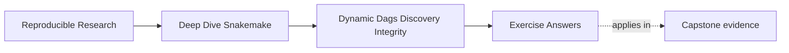
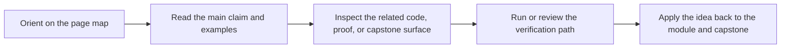

# Exercise Answers

<!-- page-maps:start -->
## Page Maps

<!-- page-maps:end -->

Use this page after you have written your own answers. The point is comparison, not
copying.

The strongest Module 02 answers usually do four things:

- they name the discovery or integrity boundary directly
- they explain why the current shape is weak or strong
- they point to one evidence route
- they describe the repair in terms of reviewable artifacts, not workflow folklore

## Answer 1: Turn ambient discovery into a declared contract

A strong answer sounds like this:

> the weak version scanned `data/raw/` at parse time and immediately expanded targets from
> that list, so the workflow had no durable record of what it discovered. The repair gives
> discovery one owned output such as `results/discovered_samples.json`, and downstream rules
> fan out from that artifact. Another reviewer can now inspect the exact discovered set
> instead of trusting a transient directory scan.

Why this is strong:

- it names the old weakness clearly
- it adds one owned artifact instead of vague "better organization"
- it explains why review got easier

## Answer 2: Prevent one accidental fanout explosion

A strong answer makes the multiplication visible.

Example answer shape:

- buggy design:
  - `expand("results/{sample}/{panel}/report.json", sample=SAMPLES, panel=PANELS)`
- unintended effect:
  - every sample is paired with every panel, even when the data model is one panel per sample
- repair:
  - build targets from validated records such as `{"sample": "sampleA", "panel": "dna"}`
- evidence:
  - `snakemake -n` shows four planned jobs before the repair and two after it

Why this is strong:

- it explains the wrong relationship, not just the wrong count
- it keeps one data source of truth for paired values

## Answer 3: Justify one checkpoint and reject one fake one

A strong answer contrasts the two designs directly.

Example:

- justified checkpoint:
  - the workflow cannot know which samples exist until it inspects `data/raw/`
  - the checkpoint writes `results/discovery/samples.json`
  - downstream targets read that file
- unjustified checkpoint:
  - the sample list already lives in config
  - using a checkpoint would only hide a target list that was already known
  - the cleaner alternative is to expand directly from validated config data

Why this is strong:

- it shows that checkpoints are for genuine new facts
- it rejects the temptation to use checkpoints as a dramatic wrapper for weak modeling

## Answer 4: Design the integrity trail for a dynamic run

A strong answer gives three explicit paths and one explicit role for each:

- discovery artifact:
  - `results/discovered_samples.json`
  - proves which sample set drove the run
- provenance artifact:
  - `publish/v1/provenance.json`
  - proves the resolved run identity and materialized config
- manifest artifact:
  - `publish/v1/manifest.json`
  - proves which files belong to the public boundary

The strongest answers also mention a published copy of the discovery artifact, such as
`publish/v1/discovered_samples.json`, because downstream review often needs the same fact.

## Answer 5: Improve performance without weakening truth

A strong answer sounds like this:

> the original workflow created one environment file per nearly identical Python rule and
> one trivial job per tiny fragment, so setup overhead dominated useful work. The repair
> reuses one shared Python environment for the related rules and batches work at the sample
> boundary. This lowers environment solve and launch cost without hiding required artifacts
> or changing the meaning of the publish boundary.

Why this is strong:

- it names the overhead source
- it repairs the boundary instead of deleting evidence
- it explicitly says why workflow truth stayed intact

## What all five answers should have in common

The best Module 02 answers usually:

1. explain dynamic behavior without mystical language
2. identify one artifact or boundary that carries the truth
3. point to a concrete proof route such as `snakemake -n`, a discovered-set file, or a publish manifest
4. describe repairs as stronger contracts, not just shorter code

If your answers do those four things, you are learning the module in the right direction.
