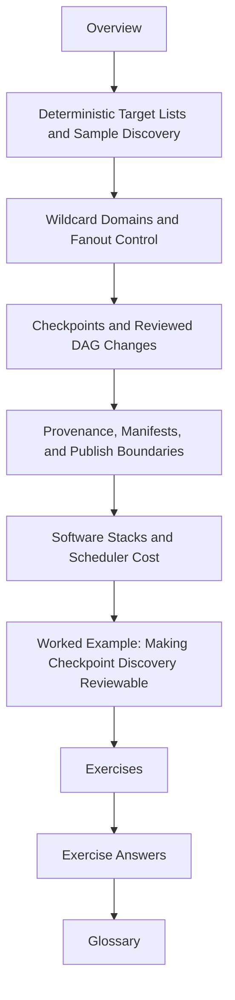

# Module 02: Dynamic DAGs, Discovery, and Integrity

Module 01 taught you how Snakemake plans work from explicit file contracts. Module 02
asks the harder question:

> what happens when the set of jobs is not fully known until the workflow starts looking at data?

This module is about making that situation reviewable instead of magical.

Dynamic behavior is not the enemy. Hidden discovery is.

## What this module is for

By the end of Module 02, you should be able to explain five things in plain language:

- how a changing sample set becomes an explicit target list instead of ambient filesystem luck
- how wildcard domains stay narrow enough to prevent accidental fanout
- what a checkpoint is allowed to discover and what it must never hide
- which artifacts make dynamic behavior durable enough for review and downstream trust
- when environment design and job granularity help the workflow, and when they quietly make it worse

## Study route



Read the module in that order the first time through. When you return later, jump to the
page that matches the failure or design pressure in front of you.

## The ten files in this module

1. Overview (`index.md`)
2. [Deterministic Target Lists and Sample Discovery](deterministic-target-lists-and-sample-discovery.md)
3. [Wildcard Domains and Fanout Control](wildcard-domains-and-fanout-control.md)
4. [Checkpoints and Reviewed DAG Changes](checkpoints-and-reviewed-dag-changes.md)
5. [Provenance, Manifests, and Publish Boundaries](provenance-manifests-and-publish-boundaries.md)
6. [Software Stacks and Scheduler Cost](software-stacks-and-scheduler-cost.md)
7. [Worked Example: Making Checkpoint Discovery Reviewable](worked-example-making-checkpoint-discovery-reviewable.md)
8. [Exercises](exercises.md)
9. [Exercise Answers](exercise-answers.md)
10. [Glossary](glossary.md)

## How to use the file set

| If you need to... | Start here |
| --- | --- |
| stop discovery from drifting with directory noise or unordered scans | [Deterministic Target Lists and Sample Discovery](deterministic-target-lists-and-sample-discovery.md) |
| prevent wildcards and `expand()` from creating nonsense work | [Wildcard Domains and Fanout Control](wildcard-domains-and-fanout-control.md) |
| decide whether a checkpoint is the right tool or a design smell | [Checkpoints and Reviewed DAG Changes](checkpoints-and-reviewed-dag-changes.md) |
| make dynamic behavior visible to reviewers and downstream consumers | [Provenance, Manifests, and Publish Boundaries](provenance-manifests-and-publish-boundaries.md) |
| keep environments and job granularity from turning correctness into slowness | [Software Stacks and Scheduler Cost](software-stacks-and-scheduler-cost.md) |
| see the module as one repaired workflow rather than five isolated rules | [Worked Example: Making Checkpoint Discovery Reviewable](worked-example-making-checkpoint-discovery-reviewable.md) |
| test your own understanding | [Exercises](exercises.md) |
| compare your reasoning against a reference answer | [Exercise Answers](exercise-answers.md) |
| stabilize the module vocabulary | [Glossary](glossary.md) |

## The running question

Carry this question through every page:

> if discovery changes the DAG, what exact artifact lets another person review that change later?

Good Module 02 answers usually mention one or more of these:

- a concrete discovered-set file
- a validated target list
- a wildcard boundary that limits what can be claimed
- a checkpoint output that is durable enough to reread
- a publish or provenance artifact that preserves the run story

## The running example

This module keeps returning to one simple workflow shape:

- raw sequencing files appear in `data/raw/`
- the workflow discovers which samples exist
- per-sample jobs fan out from that discovery
- the discovered set is recorded before downstream work trusts it
- a publish surface carries that discovery forward for review

That shape is small enough to teach, but realistic enough to reveal the real design
mistakes people make with Snakemake.

## Commands to keep close

These commands form the evidence loop for Module 02:

```bash
snakemake -n
snakemake --summary
snakemake --dag | dot -Tpdf > dag.pdf
snakemake --lint
snakemake --list-changes params input code
```

They answer different questions:

- what would run
- which files Snakemake believes it owns
- how the current jobs relate
- which design smells are already visible
- which tracked changes justify reruns

## Learning outcomes

By the end of this module, you should be able to:

- materialize a deterministic target list from changing data
- constrain wildcard domains so the DAG matches the real problem
- use checkpoints to reveal dynamic structure instead of hiding it
- explain how discovery, provenance, and publish artifacts fit together
- recognize when too many environments or too many tiny jobs are degrading the workflow

## Exit standard

Do not move on until all of these are true:

- you can explain one discovery route without saying "Snakemake just figures it out"
- you can show where the discovered set is recorded and why that location matters
- you can describe one checkpoint that is justified and one that is really a smell
- you can say which artifacts are internal execution state and which are safe to publish
- you can explain one performance repair without weakening workflow truth

When those become ordinary, Module 02 has done its job.
