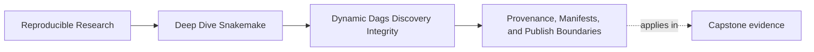
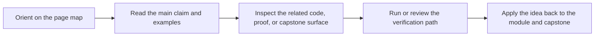
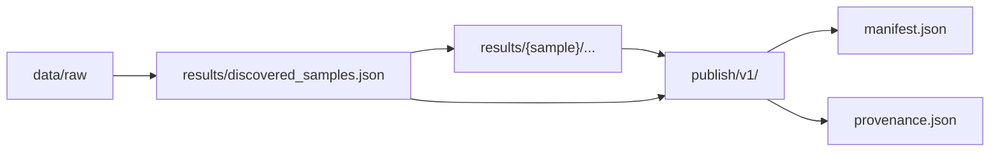

# Provenance, Manifests, and Publish Boundaries


<!-- page-maps:start -->
## Page Maps




<!-- page-maps:end -->

Discovery is only half the problem.

Once the workflow has learned a changing set of samples, another question appears:

> where does that fact live after the run, and which later consumer is allowed to trust it?

This page answers that question.

## Internal execution state is not automatically a public contract

Many workflows create useful files during execution:

- discovered sample registries
- per-sample summaries
- logs
- benchmarks
- intermediate reports

Those files may be valuable without all being safe to publish as downstream truth.

Module 02 wants a clean separation:

- internal workflow state helps the run remain inspectable
- published outputs define what downstream users may rely on

If you blur those together, review becomes harder.

## The three artifact roles

### 1. Discovery artifacts

These answer:

- what did the workflow discover
- from which declared surface
- in what normalized order

Typical example:

- `results/discovered_samples.json`

### 2. Provenance artifacts

These answer:

- what configuration actually ran
- which software or workflow version produced the outputs
- which runtime identity matters for review

Typical example:

- `publish/v1/provenance.json`

### 3. Publish artifacts

These answer:

- which outputs are now part of the downstream contract
- where they live
- how a reviewer can verify the published bundle

Typical examples:

- `publish/v1/discovered_samples.json`
- `publish/v1/manifest.json`
- `publish/v1/report/index.html`

The names can vary. The separation of roles should not.

## Why the discovered set deserves special treatment

The discovered sample set is not just one more intermediate file.

In a dynamic workflow it often explains:

- why certain jobs existed at all
- why some downstream outputs are present
- why the publish surface contains the sample families it does

If that artifact disappears or stays private forever, the run story becomes harder to
reconstruct.

That is why the capstone carries discovery into the publish boundary instead of treating it
as disposable setup state.

## A healthy boundary



This design does something subtle but important:

- dynamic discovery remains visible inside the run
- the same discovery fact is preserved at the public boundary
- manifest and provenance make the publish surface reviewable as a set

## What belongs in a discovery artifact

A weak registry usually lists only names.

A stronger registry records enough context for later review, for example:

```json
{
  "schema_version": 1,
  "source": "data/raw/*.fastq.gz",
  "samples": {
    "sampleA": {
      "reads": {
        "R1": "data/raw/sampleA_R1.fastq.gz",
        "R2": "data/raw/sampleA_R2.fastq.gz"
      }
    }
  }
}
```

The exact schema is up to the workflow. The lesson is that the discovered set should be
specific enough to answer later review questions without forcing a second raw-data scan.

## What belongs in provenance

Provenance should capture resolved run facts, not vague aspirations.

Typical examples:

- the materialized config used for the run
- the Snakemake version
- the workflow commit or repository state
- the profile or execution context that matters for interpretation

This page is not asking for maximal metadata. It is asking for enough evidence to explain
what run produced the published boundary.

## Why manifests matter

A manifest gives the publish boundary a durable inventory.

That usually means:

- which files belong to the boundary
- where they are relative to the publish root
- an integrity surface such as checksums or hashes

Without a manifest, a publish directory is often just a bag of files someone hopes is
complete.

With a manifest, the boundary becomes reviewable as a declared set.

## One useful publication pattern

Use the workflow in two stages:

1. produce internal execution artifacts under `results/`
2. promote selected artifacts into `publish/v1/`

That pattern makes review easier because it answers two different questions cleanly:

- what did the workflow need to run correctly
- what may a downstream consumer trust later

Those questions overlap, but they are not identical.

## Common integrity mistakes

| Mistake | Why it hurts | Better repair |
| --- | --- | --- |
| discovery artifact is overwritten or discarded | later review cannot explain the DAG | keep the registry as a durable run artifact |
| publish boundary omits discovery | downstream users cannot tell why sample outputs exist | promote the discovered set into the publish bundle |
| provenance captures only a timestamp | run identity stays vague | record resolved config and software identity too |
| publish directory has no inventory | reviewers cannot tell what belongs there | add a manifest with explicit paths and checksums |
| internal and public files share the same location with no distinction | ownership and review scope blur together | keep `results/` and `publish/` responsibilities separate |

## The explanation a reviewer trusts

Strong explanation:

> the workflow records discovery in `results/discovered_samples.json`, publishes a reviewed
> copy at `publish/v1/discovered_samples.json`, records run identity in
> `publish/v1/provenance.json`, and inventories the bundle in `publish/v1/manifest.json`, so
> a reviewer can explain both why the DAG changed and what the public contract now contains.

Weak explanation:

> we keep a few JSON files around for debugging.

The strong version names ownership and trust. The weak version treats integrity as
optional decoration.

## End-of-page checkpoint

Before leaving this page, you should be able to:

- distinguish discovery artifacts from provenance artifacts from publish artifacts
- explain why a discovered-set file may belong both inside the run and at the publish boundary
- describe what a manifest adds that a directory listing does not
- explain why internal execution state should not automatically become the public contract
