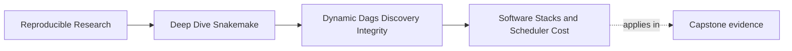

# Software Stacks and Scheduler Cost


<!-- page-maps:start -->
## Page Maps




<!-- page-maps:end -->

Dynamic workflows do not fail only because their DAG is wrong. They also fail because the
workflow is technically honest but operationally clumsy.

Module 02 cares about two forms of operational drag:

- software environments that are too fragmented to reuse
- job graphs that are too fine-grained to run efficiently

Both problems feel like performance problems. Both are really design problems first.

## The sentence to keep

When a workflow feels slow, ask:

> is the work itself expensive, or did I design too many setup costs around it?

That question prevents a lot of cargo-cult optimization.

## Reproducible software is part of workflow meaning

If a rule only works on one maintainer's laptop because of unrecorded packages, the
workflow is not reproducible no matter how clean the DAG looks.

That is why Snakemake offers explicit software boundaries such as:

- `conda:` environments
- `container:` images
- wrapper- and script-level software contracts

The purpose is not tool fashion. The purpose is to make the software stack inspectable and
repeatable.

## Environment reuse is a quality issue

Learners often create one environment file per rule because it feels neat:

```python
rule qc:
    conda: "envs/qc.yaml"

rule summarize:
    conda: "envs/summarize.yaml"

rule report:
    conda: "envs/report.yaml"
```

That can be fine when the tools are genuinely different.

It becomes a problem when the environment split is accidental:

- identical Python stacks are solved three times
- environment review becomes noisy
- cold-start cost dominates the workflow

The better question is not "can every rule have its own env?" The better question is:

> which environment boundaries represent real software differences?

## A healthier environment shape

Use separate environments when the rules truly need different stacks.

Reuse one environment when the software boundary is the same:

```python
rule qc_raw:
    conda: "workflow/envs/python.yaml"

rule qc_trimmed:
    conda: "workflow/envs/python.yaml"

rule summarize:
    conda: "workflow/envs/python.yaml"
```

That makes three things easier:

- warm runs reuse the same solved environment
- reviewers can inspect one file instead of three near-duplicates
- the environment boundary matches the real software boundary

## Pinning matters because "works today" is not a contract

A reusable environment should still be stable enough to rebuild later.

That usually means:

- pinning important package versions
- keeping the environment file under version control
- avoiding casual unbounded upgrades in the middle of the course

Containers solve the same class of problem differently:

- stronger cross-machine isolation
- heavier artifact and image management

The course does not need you to memorize every deployment flag here. It does need you to
understand that software reproducibility is an explicit workflow surface, not background
luck.

## Tiny jobs can make a correct DAG feel broken

Now look at the job graph itself.

This workflow shape is often technically correct:

```python
rule tiny_qc:
    input:
        "results/{sample}/chunk-{chunk}.txt"
    output:
        "results/{sample}/chunk-{chunk}.qc.json"
```

If there are 200 samples and 100 chunks each, the workflow may now schedule 20,000 tiny
jobs.

That can hurt because each job carries overhead:

- process startup
- environment activation
- filesystem metadata traffic
- scheduler bookkeeping

When overhead dominates, the workflow feels slow before the actual science or analysis has
even begun.

## Healthy granularity is part of workflow design

The right question is not "how do I make Snakemake launch tiny jobs faster?" The right
question is:

> what is the smallest job boundary that still represents meaningful work?

Good answers often look like:

- one job per sample instead of one job per trivial file fragment
- one summary job over a validated sample registry instead of many tiny join jobs
- one reused environment per tool family instead of one environment per wrapper script

## A smell table

| Smell | What you notice | Better repair |
| --- | --- | --- |
| one env file per nearly identical Python rule | cold-start cost and review noise | merge into one shared environment boundary |
| hundreds of trivial jobs | scheduling overhead dominates useful work | batch at the sample or shard family level |
| profile changes are the only performance story | workflow shape stays untouched | repair job granularity before tuning execution policy |
| dynamic discovery emits thousands of tiny units casually | the DAG becomes harder to run and harder to review | validate whether those units are meaningful artifacts |
| environment choice is hidden in someone’s shell | another machine cannot reproduce the run | declare the software boundary in the workflow |

## Performance repairs must preserve truth

Not every speedup is honest.

Weak performance repair:

- disable checks because they are "too slow"
- collapse outputs into one file without preserving ownership
- skip discovery artifacts so the DAG feels smaller

Strong performance repair:

- batch work at a meaningful boundary
- reuse environments where the software boundary is genuinely shared
- reduce unnecessary intermediate artifacts without hiding required ones

The difference is whether the repair keeps the workflow legible.

## The explanation a reviewer trusts

Strong explanation:

> these rules share one Python toolchain, so they reuse `workflow/envs/python.yaml`; the
> workflow also processes one job per sample instead of one job per tiny fragment, which
> reduces setup overhead without changing file ownership or publish semantics.

Weak explanation:

> we optimized it by making Snakemake do less stuff.

The strong version explains which costs were removed and why the workflow contract stayed
intact.

## End-of-page checkpoint

Before leaving this page, you should be able to:

- explain why environment reuse is a design choice rather than a mere speed trick
- name one situation where separate environments are justified
- explain why too many tiny jobs are often a workflow-shape problem
- describe one performance repair that improves speed without weakening workflow truth
