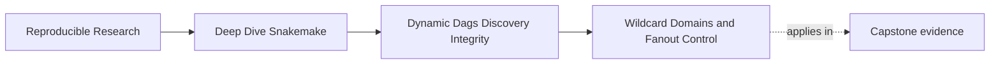
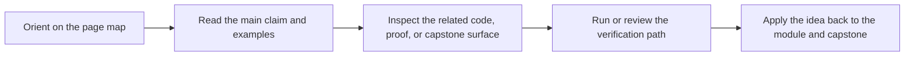
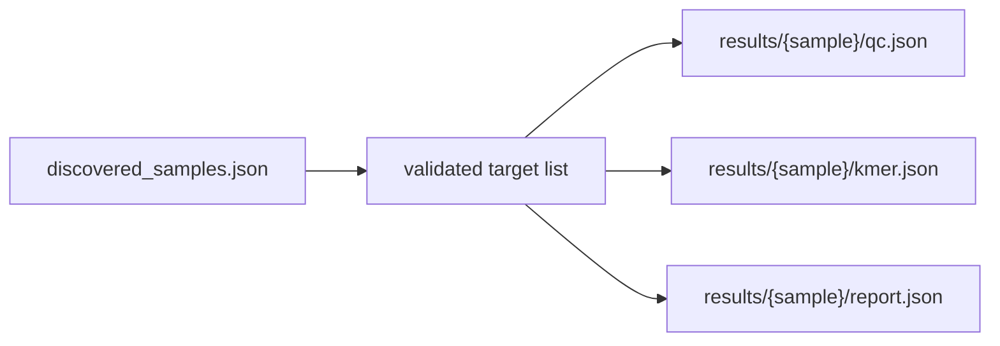

# Wildcard Domains and Fanout Control


<!-- page-maps:start -->
## Page Maps




<!-- page-maps:end -->

Once a workflow has a discovered sample set, the next danger is not discovery itself.
The next danger is accidental multiplication.

This page is about keeping the DAG proportional to the real problem instead of letting
wildcards and `expand()` invent extra work.

## The sentence to keep

When you add a wildcard or an expansion, ask:

> what exact family of paths am I allowing this rule to own?

That question is better than asking only whether the syntax works.

## Wildcards define a domain, not just a variable

This output:

```python
"results/{sample}/qc.json"
```

does not merely say "some value goes into `sample`." It says:

- this rule may claim files under `results/`
- each claimed path carries one sample identity
- downstream reasoning depends on that mapping staying narrow and obvious

That is why wildcard design is a correctness topic, not a naming topic.

## How dynamic workflows explode

Most Module 02 fanout bugs come from one of these shapes:

- a wildcard is broader than the real artifact family
- `expand()` builds a cartesian product when the relationship is actually paired
- the workflow expands from two drifting lists instead of one validated data source
- a rule rescans the filesystem and creates a different domain than earlier steps used

All four bugs can produce an impressive DAG. None produce a trustworthy one.

## The classic `expand()` trap

```python
SAMPLES = ["sampleA", "sampleB"]
PANELS = ["dna", "rna"]

rule all:
    input:
        expand("results/{sample}/{panel}/report.json", sample=SAMPLES, panel=PANELS)
```

This produces four targets:

- `sampleA/dna`
- `sampleA/rna`
- `sampleB/dna`
- `sampleB/rna`

That is correct only if every sample truly needs every panel.

If the real problem is "sampleA is DNA and sampleB is RNA," the cartesian product is not
power. It is lying.

## Pair from one source of truth

When values belong together, keep them together in data:

```python
RUNS = [
    {"sample": "sampleA", "panel": "dna"},
    {"sample": "sampleB", "panel": "rna"},
]


def report_targets():
    return [
        f"results/{run['sample']}/{run['panel']}/report.json"
        for run in RUNS
    ]


rule all:
    input:
        report_targets()
```

This is less clever than `expand()`. That is exactly why it is easier to trust.

## One wildcard should carry one idea

Weak design:

```python
"results/{sample}.{artifact}.json"
```

This shape often grows into trouble:

- `sample` may accidentally absorb dots
- `artifact` may become a vague second classifier
- another rule may claim the same suffix pattern later

Stronger design:

```python
"results/{sample}/qc.json"
"results/{sample}/kmer.json"
"results/{sample}/screen.json"
```

This path layout teaches the reader more:

- the sample identity lives in one place
- the artifact family is visible in the filename
- the rule domain is narrower and easier to review

## Constraints are useful when they match reality

Constraints help when the wildcard domain is right but still needs a fence:

```python
wildcard_constraints:
    sample = r"[A-Za-z0-9_]+"
```

That protects the workflow from:

- path separators hiding in sample names
- dots being interpreted in surprising ways
- accidental matching of files outside the intended naming scheme

Constraints do not rescue a bad path design. They only tighten a good one.

## `glob_wildcards()` is not a free pass

Learners often reach for `glob_wildcards()` because it feels very Snakemake-native:

```python
SAMPLES = glob_wildcards("data/raw/{sample}.fastq.gz").sample
```

This can be acceptable in a small workflow, but only if you still ask the real questions:

- is the discovered set sorted before downstream use
- is the filename pattern the actual discovery contract
- can duplicate logical IDs appear after normalization
- should this set now become a durable artifact instead of staying a parse-time guess

The function is not the problem. Treating it like an explanation is the problem.

## A good fanout design starts from owned artifacts

Healthy design usually looks like this:



Notice what is missing:

- no second hidden scan
- no wildcard trying to represent three dimensions at once
- no cartesian multiplication from unrelated lists

The DAG stays legible because the domain stays tied to one owned artifact.

## Common repair patterns

| Smell | Why it hurts | Better repair |
| --- | --- | --- |
| `expand()` over unrelated lists | creates jobs the domain never asked for | build targets from validated rows or records |
| wildcard with too many roles | path ownership becomes hard to reason about | split meaning across directories or fixed filenames |
| broad output like `results/{name}.json` | many artifact families can collide later | give each family a clearer path prefix or suffix |
| rescanning raw data in multiple places | different rules may disagree about the domain | scan once, materialize once, fan out from that result |
| unconstrained names | unexpected filenames slip into the DAG | constrain the wildcard and validate discovery inputs |

## The explanation a reviewer trusts

Strong explanation:

> the workflow fans out from `discovered_samples.json`, each target path is
> `results/{sample}/qc.json`, and sample names are constrained to `[A-Za-z0-9_]+`, so the
> rule owns one narrow artifact family per discovered sample.

Weak explanation:

> the wildcard should probably match the right files.

The first explanation names a contract. The second names a hope.

## End-of-page checkpoint

Before leaving this page, you should be able to:

- explain why wildcards define ownership domains
- predict one cartesian-product bug before running the workflow
- show when a simple explicit target list is safer than a clever `expand()`
- explain how constraints help without pretending they solve path-design mistakes
