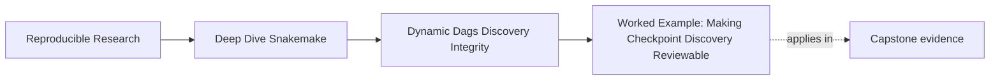
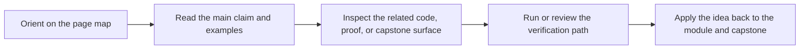

# Worked Example: Making Checkpoint Discovery Reviewable


<!-- page-maps:start -->
## Page Maps




<!-- page-maps:end -->

This file pulls the whole module together around one realistic question:

> how do you let a workflow discover samples from `data/raw/` without turning the DAG into a moving target?

The example stays small on purpose. The point is to make the design visible.

## The scenario

Assume a workflow that should:

1. inspect `data/raw/` for FASTQ files
2. discover which samples exist
3. run one QC job per sample
4. publish a reviewed boundary that keeps the discovered set visible

That sounds ordinary. It still creates most of the mistakes people make with dynamic
Snakemake workflows.

## The weak first draft

```python
from pathlib import Path

SAMPLES = [path.stem for path in Path("data/raw").glob("*.fastq.gz")]

rule all:
    input:
        expand("results/{sample}.json", sample=SAMPLES)

rule qc:
    input:
        "data/raw/{sample}.fastq.gz"
    output:
        "results/{sample}.json"
    shell:
        "python scripts/qc.py --input {input} --output {output}"
```

This draft is small, but it already teaches four bad lessons:

- discovery is an implicit parse-time scan with weak normalization
- output naming is too broad to carry more artifact families safely
- nothing records the discovered sample set for review
- the publish boundary has not been separated from internal execution state

The code works only if you avoid asking serious questions.

## Step 1: repair discovery first

The first repair is not a checkpoint. The first repair is to admit that discovery is a
workflow surface.

So give it one owned artifact:

```python
rule discover_samples:
    input:
        directory("data/raw")
    output:
        "results/discovered_samples.json"
    run:
        import json
        from pathlib import Path

        samples = sorted(
            path.name.removesuffix(".fastq.gz")
            for path in Path(input[0]).glob("*.fastq.gz")
        )
        Path(output[0]).parent.mkdir(parents=True, exist_ok=True)
        Path(output[0]).write_text(
            json.dumps({"samples": samples}, indent=2) + "\n",
            encoding="utf-8",
        )
```

This changes the conversation immediately.

Now the workflow can answer:

- what it discovered
- where that fact lives
- which rule owns the discovery step

That is Core 1 becoming visible.

## Step 2: narrow the artifact family

The original output shape was:

```python
"results/{sample}.json"
```

That path does not teach enough. It will become confusing the moment you add another JSON
artifact family.

A better shape is:

```python
"results/{sample}/qc.json"
```

Now the workflow has:

- one place for sample identity
- one place for artifact identity
- room to grow into `kmer.json`, `screen.json`, or `summary.json` later

That is Core 2 in action: the wildcard owns a narrow, reviewable domain.

## Step 3: introduce the checkpoint only if it earns its keep

Suppose the course wants the workflow to fan out only after the discovered registry
exists. That is a legitimate checkpoint use.

```python
checkpoint discover_samples:
    input:
        directory("data/raw")
    output:
        directory("results/discovery")
    run:
        import json
        from pathlib import Path

        outdir = Path(output[0])
        outdir.mkdir(parents=True, exist_ok=True)
        samples = sorted(
            path.name.removesuffix(".fastq.gz")
            for path in Path(input[0]).glob("*.fastq.gz")
        )
        (outdir / "samples.json").write_text(
            json.dumps({"samples": samples}, indent=2) + "\n",
            encoding="utf-8",
        )


def qc_targets(_wildcards):
    import json
    from pathlib import Path

    checkpoint_job = checkpoints.discover_samples.get()
    registry = Path(checkpoint_job.output[0]) / "samples.json"
    samples = json.loads(registry.read_text(encoding="utf-8"))["samples"]
    return expand("results/{sample}/qc.json", sample=samples)


rule all:
    input:
        qc_targets
```

The checkpoint is justified here because the downstream target set genuinely depends on
the discovery result.

The important part is not the keyword `checkpoint`. The important part is that the
discovered set is written once and reused.

## Step 4: keep discovery visible at the publish boundary

Now imagine the workflow publishes a versioned result bundle.

Weak shape:

- publish only the per-sample QC outputs
- drop the discovery registry entirely

That leaves a downstream reviewer asking:

- why do these exact sample outputs exist
- which sample set drove the DAG
- whether the run discovered something different from yesterday

Stronger shape:

```text
publish/v1/
  discovered_samples.json
  summary.json
  provenance.json
  manifest.json
```

This is Core 4: discovery should remain legible when the workflow crosses into public
contract space.

## Step 5: avoid accidental operational drag

Even a correct design can become awkward if it creates too much setup cost.

Two easy repairs help here:

- keep one shared environment for the QC and summary rules if they truly use the same toolchain
- process one sample per job instead of splitting into many trivial fragment jobs without a real need

That is Core 5: improve speed by repairing boundaries and granularity, not by hiding
truth.

## The repaired module story

By the end of the repairs, the workflow can be described cleanly:

1. raw files in `data/raw/` are the declared discovery surface
2. discovery writes one durable registry
3. downstream fanout reads that registry
4. per-sample outputs live under narrow, predictable paths
5. the publish boundary carries forward the discovery and provenance needed for review

That is what Module 02 means by a dynamic DAG you can trust.

## Review questions for the repaired design

When you inspect a workflow shaped like this, ask:

1. where is the discovered set recorded
2. which downstream rule reads that exact record
3. which paths belong to the public boundary
4. what part of the workflow proves the sample set was deterministic
5. what environment or job-shape choices keep the workflow practical to run

If those answers are visible, the workflow is no longer relying on magic.
