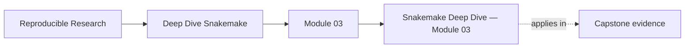
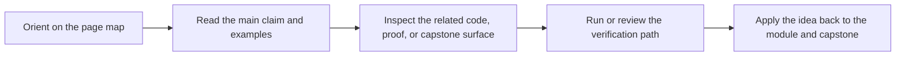
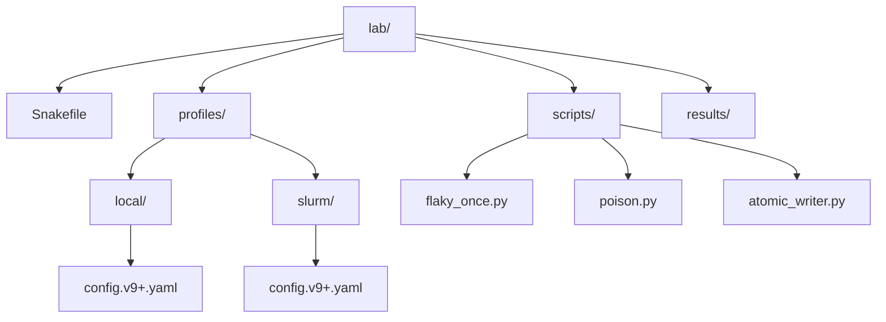
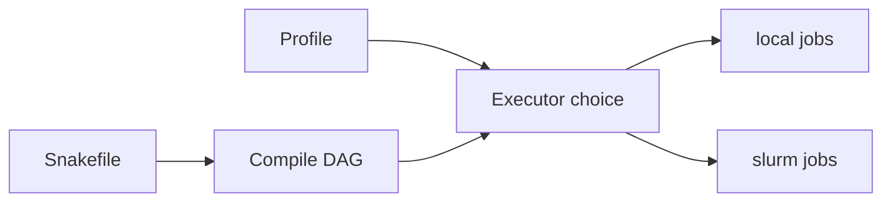
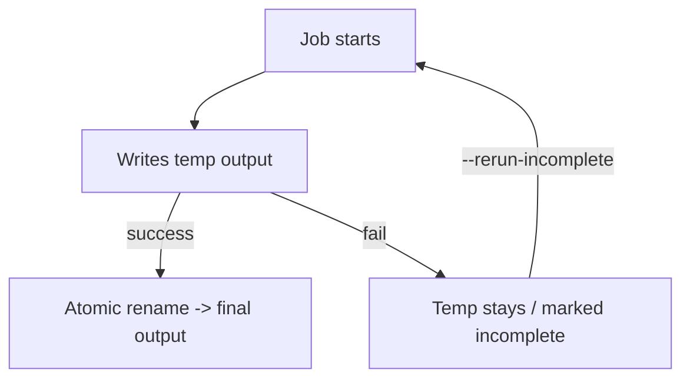
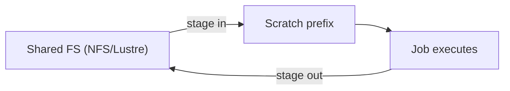
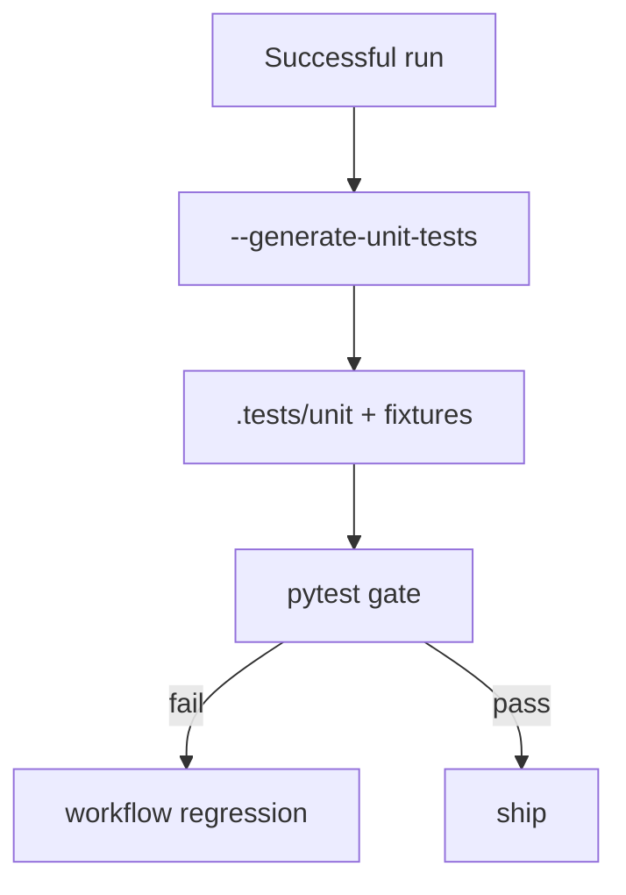
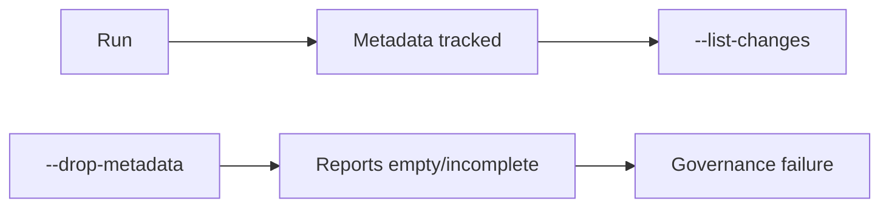

# Snakemake Deep Dive — Module 03


<!-- page-maps:start -->
## Page Maps




<!-- page-maps:end -->

## Production Snakemake: HPC/Cloud Execution, Error Handling, Data Locality, Governance

> **Version & scope contract**
>
> * Target: **Snakemake 9.14.x** (this module relies on profile version files like `config.vX+.yaml`, plugin catalog executors/storage, and the current unit-test generator behavior). Verify:
>
>   * `snakemake --version`
>   * `snakemake --help | sed -n '1,40p'`
> * In scope: **profiles as policy**, executor/storage plugins, **retries + incomplete semantics**, staging/data locality, CI testing, governance/drift.
> * Out of scope: authoring fundamentals (Module 01), checkpoints/wildcard expansion theory (Module 02).

---

## Why this module matters

Production failures often get misdiagnosed as “Snakemake problems” when the real issue is a missing boundary:

- workflow semantics and executor policy are mixed together
- retries exist without a failure contract
- staging and shared filesystem assumptions are implicit
- CI checks prove too little to be trusted

This module teaches how to encode operations as explicit policy and proof instead of tribal command history.

## Reading path

1. Start with the policy-plus-proofs framing.
2. Read profiles and executors before retries and incomplete semantics.
3. Read staging and data locality before CI and governance.
4. Treat the production lab as the concrete thread that ties the module together.

## Capstone connection

The capstone’s profiles, confirm target, artifact verification, and workflow gates are direct embodiments
of this module. If you want to know why the capstone is opinionated about proof artifacts and clean-room runs,
this module is the reason.

## At a Glance

| Focus | Learner question | Capstone timing |
| --- | --- | --- |
| profiles as policy | "Which settings should change execution context without changing meaning?" | inspect the capstone after the policy-versus-semantics split feels clear |
| retries and failure policy | "What should be retried, and what should fail fast?" | compare profiles and proof targets together |
| production proof | "What makes a workflow trustworthy under CI or scheduler pressure?" | use `confirm` and related targets as evidence surfaces |

---

## Orientation: production is “policy + plugins + proofs”

Production Snakemake means you stop relying on “tribal CLI invocations” and you make execution reproducible by encoding **policy in a profile**, **capabilities in plugins**, and **correctness via proof artifacts** (logs, change reports, tests). Profiles in 9.x are explicitly version-scoped (`config.vX+.yaml`) and can set any CLI option by YAML key. ([Snakemake][1])

### Unified cost model

> **Total pain ≈ scheduler friction + FS latency + staging mistakes + poison artifacts + provenance loss**

| What hurts         | What you see                              | Dominant cause                        | First fix                                                         |
| ------------------ | ----------------------------------------- | ------------------------------------- | ----------------------------------------------------------------- |
| Scheduler friction | too many tiny jobs                        | DAG granularity + submit overhead     | group/merge jobs; cap submit rates                                |
| FS latency         | “output missing” after job finished       | shared FS lag                         | raise `--latency-wait` ([Snakemake][1])                           |
| Staging mistakes   | outputs “disappear” / land in wrong place | wrong prefixes / shared-fs-usage lies | make shared-fs-usage explicit + stage to scratch ([Snakemake][1]) |
| Poison artifacts   | partial outputs break downstream          | non-atomic writes + failure           | atomic publish + strict incomplete policy ([Snakemake][1])        |
| Provenance loss    | change reports empty                      | `--drop-metadata`                     | never drop metadata in prod ([Snakemake][1])                      |

---

## Minimal production lab (runnable baseline)

This module uses a tiny workflow that exercises: **profiles**, **executor plugin wiring**, **retries**, **incomplete outputs**, **staging knobs**, **unit-test generation**, and **drift reporting**.

### Golden layout (pre-run)



### Golden “commissioning” command sequence

```bash
snakemake --profile profiles/local -n
snakemake --profile profiles/local --cores 2
snakemake --profile profiles/local --retries 1 results/flaky_once.txt
snakemake --profile profiles/local --generate-unit-tests
pytest .tests/unit/
snakemake --profile profiles/local --list-changes code
```

`--generate-unit-tests` and `.tests/unit` + pytest invocation are official behavior. ([Snakemake][2])
`--list-changes` is the official drift report for changed `input|code|params`. ([Snakemake][1])

---

## Core 1 — Execution backends via profiles (cluster-first by construction)

## Learning objectives

You will be able to:

* Encode execution policy in a **version-scoped profile** and prove it’s applied.
* Switch **local ↔ SLURM** without editing workflow code.
* Predict and fix “profile not applied” failures using evidence.

## Definition

A **profile** is a directory containing `config.vX+.yaml` (preferred) or `config.yaml` (fallback). Each CLI flag `--foo-bar` becomes YAML key `foo-bar:`; profiles can also include auxiliary files. ([Snakemake][1])

## Semantics

* Profiles are *policy*. Workflow code describes the DAG; profile describes how/where it runs. ([Snakemake][1])
* The SLURM executor is a plugin; it can be set via profile with `executor: slurm`. ([Snakemake][3])



## Failure signatures

* **Runs locally despite “cluster intent”** → wrong profile path or wrong filename (`config.v9+.yaml` missing).
* **Unknown executor** → SLURM plugin not installed on the submission host.
* **Logs missing** → SLURM plugin defaults delete successful logs unless configured. ([Snakemake][3])

## Minimal repro (complete)

### 1) Two profiles

`profiles/local/config.v9+.yaml`

```yaml
executor: local
cores: 2
printshellcmds: true
latency-wait: 5
```

`profiles/slurm/config.v9+.yaml`

```yaml
executor: slurm
jobs: 50
printshellcmds: true
latency-wait: 30
slurm-logdir: logs/slurm
slurm-keep-successful-logs: true
```

* `latency-wait` waits for outputs after job completion to tolerate FS latency. ([Snakemake][1])
* SLURM plugin settings `--slurm-logdir` and `--slurm-keep-successful-logs` are documented and default to deleting successful logs unless enabled. ([Snakemake][3])

### 2) Prove the profile is applied

```bash
snakemake --profile profiles/local -n --print-compilation > .proof/local.compile.txt
snakemake --profile profiles/slurm -n --print-compilation > .proof/slurm.compile.txt
```

`--print-compilation` is an official CLI flag for printing the workflow’s Python representation. ([Snakemake][1])

**Expected evidence (stable invariants):**

* Both outputs contain `Building DAG of jobs...`
* The SLURM run shows an executor configured as `slurm` in the compilation output (search within the file for `slurm`).

## Fix pattern

* Put *everything operational* into the profile: executor, job caps, log retention, latency wait.
* Treat ad-hoc CLI flags as incident response only; if it matters, it belongs in versioned profile files (`config.vX+.yaml`). ([Snakemake][1])

## Proof hook

Attach:

* `.proof/slurm.compile.txt` containing “Building DAG” and at least one occurrence of `slurm`.
* The exact profile file content you used.

---

## Core 2 — Robustness: atomicity, retries, incomplete semantics

## Learning objectives

You will be able to:

* Create failure modes that produce **poison outputs**, then eliminate them.
* Use `--retries`, `--keep-incomplete`, and `--rerun-incomplete` correctly.
* Explain why `--drop-metadata` destroys governance tools and refuse it in production.

## Definition

Robustness is enforcing a strict output contract:

* outputs are either **complete and correct**, or **absent / marked incomplete and rerunnable**.

Key CLI:

* `--retries` restarts failing jobs. ([Snakemake][1])
* `--keep-incomplete` keeps failed-job partial outputs. ([Snakemake][1])
* `--rerun-incomplete` reruns jobs whose outputs are recognized as incomplete. ([Snakemake][1])

## Semantics

* `--retries N` restarts a job N times; the `attempt` counter exists to scale resources across retries. ([Snakemake][1])
* `--keep-incomplete` is for forensics; it keeps poison outputs around (dangerous unless paired with strict reruns). ([Snakemake][1])
* `--drop-metadata` makes provenance-based tools like `--list-changes` empty or incomplete—this is explicitly documented. ([Snakemake][1])



## Failure signatures

* “Downstream consumed garbage” → non-atomic writer produced plausible partial output.
* “Works after rerun” → transient failure; you lacked retries.
* “Drift reports show nothing” → metadata was dropped. ([Snakemake][1])

## Minimal repro (complete)

### Repro A — flaky once + retries

`scripts/flaky_once.py`

```python
import os, sys
from pathlib import Path

attempt = int(os.environ.get("SNAKEMAKE_ATTEMPT", "1"))
out = Path(sys.argv[1])
out.parent.mkdir(parents=True, exist_ok=True)

out.write_text(f"attempt={attempt}\n")

if attempt == 1:
    print("Failing on attempt 1 (intentional).", file=sys.stderr)
    sys.exit(42)

print("Succeeded on attempt >=2.", file=sys.stderr)
```

Run:

```bash
snakemake --profile profiles/local results/flaky_once.txt || true
snakemake --profile profiles/local --retries 1 results/flaky_once.txt
cat results/flaky_once.txt
```

**Expected output (verbatim, file content):**

```
attempt=2
```

### Repro B — poison output + incomplete discipline

`scripts/poison.py`

```python
import sys
from pathlib import Path

out = Path(sys.argv[1])
out.parent.mkdir(parents=True, exist_ok=True)

out.write_text("PARTIAL\n")
print("Wrote PARTIAL then crashing.", file=sys.stderr)
sys.exit(13)
```

Run:

```bash
snakemake --profile profiles/local results/poison.txt || true
test -e results/poison.txt && echo "UNSAFE: poison remained" || echo "OK: removed"

snakemake --profile profiles/local --keep-incomplete results/poison.txt || true
printf "poison file content:\n"; cat results/poison.txt
```

**Expected output (verbatim fragments):**

* After default failure:

```
OK: removed
```

* With `--keep-incomplete`:

```
poison file content:
PARTIAL
```

`--keep-incomplete` behavior is explicitly defined. ([Snakemake][1])

### Repro C — atomic writer (the fix)

`scripts/atomic_writer.py`

```python
import sys
from pathlib import Path

final = Path(sys.argv[1])
tmp = final.with_suffix(final.suffix + ".tmp")

final.parent.mkdir(parents=True, exist_ok=True)
tmp.write_text("COMPLETE\n")
tmp.replace(final)  # atomic rename on same filesystem
```

Rule uses atomic writer:

* If the job fails before `replace()`, the final output never appears.

## Fix pattern

* Never write final outputs “in place” unless the write is atomic by construction.
* Use `--keep-incomplete` only during triage; otherwise you risk poisoning future DAG runs.
* Hard rule: **do not use `--drop-metadata`** in production because it invalidates `--list-changes` and provenance reports. ([Snakemake][1])

## Proof hook

Submit:

* `cat results/flaky_once.txt` showing `attempt=2`.
* Evidence that poison file contains `PARTIAL` only when run with `--keep-incomplete`. ([Snakemake][1])

---

## Core 3 — Data locality and staging: storage plugins + explicit prefixes

## Learning objectives

You will be able to:

* Configure staging to local scratch via `--default-storage-provider`, `--local-storage-prefix`, `--remote-job-local-storage-prefix`, and `--shared-fs-usage`.
* Demonstrate staging **with filesystem evidence**, and demonstrate a staging **failure** that proves misconfiguration.
* Encode staging in the profile instead of relying on per-run CLI.

## Definition

Snakemake can map inputs/outputs to **storage providers implemented as plugins**. ([Snakemake][4])
The `fs` storage plugin uses `rsync` to read/write from a locally mounted filesystem and is specifically motivated by avoiding harmful parallel IO patterns on NFS. ([Snakemake][5])

## Semantics

The `fs` plugin documentation gives a canonical staging configuration:

* `--default-storage-provider fs`
* `--local-storage-prefix /local/work/$USER`
* `--shared-fs-usage persistence software-deployment sources source-cache`
  …and shows how to set `remote-job-local-storage-prefix` for job-specific scratch. ([Snakemake][5])

It also explicitly notes you still need a non-remote local storage prefix because some jobs may execute without remote submission. ([Snakemake][5])



## Failure signatures

* Scratch directory stays empty → storage plugin not active (missing plugin install or flags/profile).
* rsync / permission error → scratch prefix not writable (most common real incident).
* Outputs appear locally but not on shared FS → shared-fs-usage / prefix mismatch.

## Minimal repro (complete)

### Repro A — staging success with explicit scratch evidence

Install plugin (once, on the submission host):

```bash
pip install snakemake-storage-plugin-fs
```

Installation is documented in the plugin catalog. ([Snakemake][5])

Run with a visible scratch prefix:

```bash
rm -rf .scratch .snakemake/storage results/staged_demo.txt
snakemake --profile profiles/local -F results/staged_demo.txt \
  --default-storage-provider fs \
  --shared-fs-usage persistence software-deployment sources source-cache \
  --local-storage-prefix .scratch/$USER
```

This exact pattern is recommended by the fs plugin docs (with a scratch path). ([Snakemake][5])

Inspect:

```bash
test -s results/staged_demo.txt
find .scratch/$USER -type f | head -n 3
```

**Expected output (example, verbatim shape):**

```
.scratch/<user>/.../results/staged_demo.txt
.scratch/<user>/.../some_internal_marker
...
```

(Exact paths vary, but the invariant is: **non-empty file list under `.scratch/$USER`**.)

### Repro B — staging failure (misconfigured scratch prefix)

Force a non-writable scratch prefix:

```bash
snakemake --profile profiles/local -F results/staged_demo.txt \
  --default-storage-provider fs \
  --shared-fs-usage persistence software-deployment sources source-cache \
  --local-storage-prefix /root/forbidden_scratch
```

**Expected failure (verbatim fragment):**

* A permission error writing into `/root/forbidden_scratch` (either from Snakemake or rsync).

## Fix pattern

* Treat staging configuration as **policy**: move it into the profile once it works.
* Encode both:

  * `local-storage-prefix` (for local jobs)
  * `remote-job-local-storage-prefix` (for cluster jobs)
    because Snakemake may execute some jobs without remote submission. ([Snakemake][5])

## Proof hook

Provide:

* Output of `find .scratch/$USER -type f | head -n 10`
* Your profile snippet (or CLI) showing `default-storage-provider: fs` and `local-storage-prefix: ...` ([Snakemake][5])

---

## Core 4 — Testing and CI/CD: generate unit tests, then gate

## Learning objectives

You will be able to:

* Generate unit tests with `--generate-unit-tests`.
* Run pytest and interpret failures as workflow regressions (not “pytest problems”).
* Keep unit tests small and deterministic.

## Definition

Snakemake can generate unit tests from a successful run by copying representative job inputs into `.tests/unit` and producing pytest tests. ([Snakemake][2])

## Semantics

* Generate: `snakemake --generate-unit-tests` ([Snakemake][2])
* Run: `pytest .tests/unit/` ([Snakemake][2])
* Each test file is `.tests/unit/test_<rulename>.py` and compares outputs to the “known-good” results; default comparison is byte-by-byte via `cmp/zcmp/bzcmp/xzcmp`. ([Snakemake][2])



## Failure signatures

* “skipped job” warning during generation → representative job inputs not present. ([Snakemake][1])
* pytest fails after legitimate change → you changed a contract; update golden outputs intentionally (and bump version).
* pytest flaky → workflow nondeterminism (random seeds, timestamps, unstable discovery).

## Minimal repro (complete)

Run once:

```bash
snakemake --profile profiles/local --cores 2
```

Generate tests:

```bash
snakemake --profile profiles/local --generate-unit-tests
```

Inspect one generated test file (this is the *verbatim* evidence):

```bash
ls -la .tests/unit | head
find .tests/unit -name "test_*.py" | head -n 1 | xargs sed -n '1,80p'
```

Run pytest:

```bash
pytest .tests/unit/
```

**Expected pytest tail (verbatim shape):**

```
collected <N> items
...
<N> passed
```

## Fix pattern

* Generate tests only from a **small dummy dataset**; the docs explicitly warn against generating tests from big data. ([Snakemake][2])
* CI gates (minimum):

  * `snakemake --lint` ([Snakemake][6])
  * `pytest .tests/unit/` ([Snakemake][2])

## Proof hook

Provide:

* First 30–80 lines of one generated `.tests/unit/test_<rulename>.py` file (via `sed`).
* The pytest summary lines showing collection and pass/fail.

---

## Core 5 — Maintainability and governance: drift reports, contracts, versioning

## Learning objectives

You will be able to:

* Detect drift with `--list-changes` and explain what changed.
* Prove that dropping metadata breaks governance tools (and refuse it).
* Adopt a review checklist that prevents interface breakage.

## Definition

Governance means: stable interfaces + explicit change control + auditable provenance.

Snakemake provides drift tools:

* `--list-changes {input,code,params}` lists output files whose specified items changed since creation. ([Snakemake][1])
* `--drop-metadata` makes provenance-based reports (including `--list_x_changes`) empty or incomplete. ([Snakemake][1])

## Semantics

* `--list-changes code` is your “what did we invalidate?” query after editing scripts/rules. ([Snakemake][1])
* If metadata is dropped, governance fails by definition. This is not a “maybe”; it is stated explicitly. ([Snakemake][1])



## Failure signatures

* “Why did this rerun?” cannot be answered → metadata missing.
* “We changed code but nothing is flagged” → `--drop-metadata` was used, or outputs were recreated without tracking.
* Downstream consumers break → contracts were implicit, not versioned.

## Minimal repro (complete)

1. Converge:

```bash
snakemake --profile profiles/local --cores 2
```

2. Edit a script (e.g., append a harmless comment to `scripts/atomic_writer.py`).

3. Ask Snakemake to enumerate invalidated outputs:

```bash
snakemake --profile profiles/local --list-changes code
```

**Expected behavior:** at least one output is listed as impacted by `code` drift (exact formatting varies). ([Snakemake][1])

4. Demonstrate governance failure explicitly:

```bash
snakemake --profile profiles/local --drop-metadata --cores 2
snakemake --profile profiles/local --list-changes code
```

**Expected behavior:** the second `--list-changes` becomes empty or incomplete specifically because metadata was dropped (this is the documented effect). ([Snakemake][1])

## Fix pattern

Adopt three hard artifacts:

* `workflow/CONTRACT.md`: file naming + formats + schema expectations.
* `workflow/VERSION`: semantic version (bump on contract changes).
* `workflow/REVIEW.md`: checklist requiring:

  * `snakemake --lint` ([Snakemake][6])
  * `snakemake -n --summary --reason`
  * `snakemake --list-changes code|params|input` evidence ([Snakemake][1])
  * “No `--drop-metadata`” attestation ([Snakemake][1])

## Proof hook

Provide:

* The exact output of `snakemake --list-changes code` before and after `--drop-metadata`.
* Your `workflow/VERSION` and a short note: “contract changed? yes/no”.

---

## Appendix — Consolidated reference Snakefile (single-file, end-to-end)

`Snakefile`

```python
rule all:
    input:
        "results/staged_demo.txt",
        "results/flaky_once.txt",
        "results/atomic_ok.txt",

rule staged_demo:
    output:
        "results/staged_demo.txt"
    shell:
        "printf 'staged_demo=ok\\n' > {output}"

rule flaky_once:
    output:
        "results/flaky_once.txt"
    shell:
        "python capstone/flaky_once.py {output}"

rule poison:
    output:
        "results/poison.txt"
    shell:
        "python capstone/poison.py {output}"

rule atomic_ok:
    output:
        "results/atomic_ok.txt"
    shell:
        "python capstone/atomic_writer.py {output}"
```

---

## Closing recap

If you want production-grade Snakemake, stop optimizing rules first. Instead:

1. **Profiles** are policy, version-scoped (`config.vX+.yaml`), and they must fully encode how the DAG is executed. ([Snakemake][1])
2. **Robustness** is atomic outputs + strict incomplete semantics + retries; poison artifacts are a correctness bug, not an inconvenience. ([Snakemake][1])
3. **Data locality** is explicit: staging to scratch must be configured and proven with filesystem evidence; the fs plugin gives canonical patterns. ([Snakemake][5])
4. **CI** is real only when it runs workflow-derived tests (`--generate-unit-tests` + pytest) and gates merges. ([Snakemake][2])
5. **Governance** requires metadata and drift reports; `--drop-metadata` is operational malpractice in production because it breaks those tools by design. ([Snakemake][1])

[1]: https://snakemake.readthedocs.io/en/stable/executing/cli.html "Command line interface | Snakemake 9.14.5 documentation"
[2]: https://snakemake.readthedocs.io/en/stable/snakefiles/testing.html "Automatically generating unit tests | Snakemake 9.14.5 documentation"
[3]: https://snakemake.github.io/snakemake-plugin-catalog/plugins/executor/slurm.html "Snakemake executor plugin: slurm | Snakemake plugin catalog"
[4]: https://snakemake.readthedocs.io/en/stable/snakefiles/storage.html "Storage support | Snakemake 9.14.4 documentation"
[5]: https://snakemake.github.io/snakemake-plugin-catalog/plugins/storage/fs.html "Snakemake storage plugin: fs | Snakemake plugin catalog"
[6]: https://snakemake.readthedocs.io/en/stable/snakefiles/best_practices.html "Best practices | Snakemake 9.14.4 documentation"
