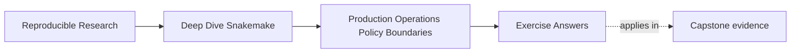
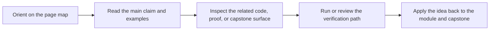

# Exercise Answers

<!-- page-maps:start -->
## Page Maps

<!-- page-maps:end -->

Use this page after you have written your own answers. The point is comparison, not
copying.

The strongest Module 03 answers usually do four things:

- they name the owning operational boundary
- they explain why the current shape is safe or unsafe
- they choose one proportionate proof route
- they describe the repair in terms of repository discipline, not heroics

## Answer 1: Separate policy from workflow meaning

A strong answer sounds like this:

> `latency-wait` and `show-failed-logs` belong in a profile because they change runtime
> behavior without changing the intended outputs. A sample list and publish version do not
> belong in a profile because they change target meaning and downstream contract surfaces.
> If those semantic values moved into a profile, local and CI contexts could appear to be
> harmless policy differences while actually changing what the workflow means.

Why this is strong:

- it gives two good policy examples and two bad ones
- it explains the review risk, not only the placement rule

## Answer 2: Write a small failure policy

A strong answer distinguishes failure classes cleanly.

Example answer shape:

- retryable:
  - transient infrastructure or storage hiccup
- fail-fast:
  - wrong config value or invalid sample contract
- rerun-incomplete:
  - partial output left behind after a crashed job
- logs:
  - per-job logs help determine whether the failure was transient, semantic, or partial-publication related

Why this is strong:

- it makes retry, fail-fast, and rerun-incomplete different on purpose
- it treats logs as evidence for the decision, not as decoration

## Answer 3: Review one staging or locality assumption

A strong answer sounds like this:

> the workflow may use a different scratch or staging location on shared infrastructure, but
> the declared final output paths and publish boundary must stay semantically stable. If the
> team confuses scratch placement with final output meaning, reviewers can no longer tell
> which paths are temporary and which are part of the contract.

Why this is strong:

- it allows context variation honestly
- it protects the stable trust surface

## Answer 4: Choose the smallest honest proof route

A strong answer matches the route to the question:

- planning difference between local and CI:
  - compare dry-runs
- visible profile differences for review:
  - `make profile-audit`
- strongest repository confidence:
  - `make confirm`

The strongest answers also explain why the routes are not interchangeable:

- `confirm` is too heavy for a simple planning question
- dry-run is too weak for the strongest clean-room claim
- profile-audit is better than intuition for context-comparison review

## Answer 5: Review one operational diff like a maintainer

A strong answer begins with the owning boundary:

- first inspect the changed profile file
- then inspect the changed proof route or target
- ask:
  - does this change execution context only, or workflow meaning too
  - what claim is stronger or weaker after the proof-route edit

Why this is strong:

- it reviews in boundary order
- it does not let a policy diff drift into vague trust language

## What all five answers should have in common

The best Module 03 answers usually:

1. distinguish policy from semantics clearly
2. explain recovery as a contract rather than a habit
3. treat proof routes as proportionate tools instead of ritual commands
4. describe operational governance as something the repository should teach

If your answers do those four things, the module is landing in the right way.
