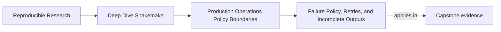

# Failure Policy, Retries, and Incomplete Outputs

<!-- page-maps:start -->
## Page Maps

<!-- page-maps:end -->

Production operation is not only about getting a run to finish.

It is also about deciding what the workflow should do when something goes wrong:

- retry
- stop
- keep evidence
- rerun from incomplete state

Those decisions form a failure policy. If that policy is vague, the repository will
recover inconsistently and leave ambiguous state behind.

## The sentence to keep

When a job fails, ask:

> should the next action be retry, rerun, or refusal to trust the output?

That question is the center of this page.

## Retries are for transient failure, not semantic uncertainty

A retry is justified when the same declared job is likely to succeed on a second attempt
without changing its meaning.

Typical examples:

- network or mirror hiccups during a download step
- scheduler or infrastructure instability
- temporary shared-filesystem timing issues

A retry is not a fix for:

- wrong inputs
- bad parameters
- nondeterministic rule logic
- hidden semantic state

If the job meaning is wrong, retrying only repeats the wrong job.

## Incomplete outputs are part of the contract

Production workflows must be honest about partially written outputs.

The repository should answer:

- what happens if a job fails halfway through
- whether any final-looking file remains behind
- how the next run recognizes that state

This is why incomplete-output handling matters. It is not merely cleanup.

## Keep the recovery story small and explicit

A healthy recovery story usually looks like this:

1. a job fails
2. logs preserve evidence
3. partial or incomplete outputs are not trusted as final
4. the next run reruns the affected work deliberately

That is a much better teaching model than "rerun until it works."

## A weak first response

Weak production habit:

- enable retries everywhere
- keep partial outputs casually
- assume later jobs will sort it out

This feels resilient. It is often the opposite:

- poison artifacts survive longer
- later failures become harder to interpret
- maintainers lose the original failure boundary

The repository becomes noisier instead of safer.

## A stronger failure-policy split

Use three categories:

### 1. Retryable failure

The job can be attempted again because the contract is still the same and the failure is
likely transient.

### 2. Rerunnable incomplete state

The job produced incomplete state that should be recognized and rebuilt, not trusted.

### 3. Fail-fast contract error

The job or configuration is wrong in a way that no retry should hide.

This split gives the workflow one of the most important operational qualities: honest
recovery.

## Logs belong in the same discussion

Failure policy without logs is weak because the repository cannot explain what happened.

Per-job logs are especially important in production because they answer:

- which exact job failed
- what command it ran
- whether the error looks transient or semantic

Logs do not replace recovery policy. They make it reviewable.

## One simple decision table

| Situation | Better response |
| --- | --- |
| filesystem lag delayed visible outputs even though the job completed | tune latency or rerun policy, not workflow meaning |
| external infrastructure failed briefly | allow retry |
| wrong sample or bad config key caused the failure | fail fast and fix inputs |
| job left behind a partial final-looking output | treat it as incomplete and rerun deliberately |
| repeated retries still produce different outputs or errors | stop and inspect the rule contract |

This is the kind of operational table a human team can actually use.

## What "keep evidence" should mean

Keeping evidence does not mean keeping every broken file forever.

It means:

- preserve logs
- make incomplete state recognizable
- avoid promoting partial outputs into trusted boundaries

That is how the next maintainer can tell whether the workflow should retry, rerun, or be
repaired.

## Common failure modes

| Failure mode | What it looks like | Better repair |
| --- | --- | --- |
| retries enabled indiscriminately | wrong jobs get repeated instead of fixed | reserve retries for transient failure classes |
| partial outputs remain trusted | downstream steps read poison artifacts | publish atomically and rerun incomplete work deliberately |
| logs are global or missing | nobody can locate the failing job clearly | keep per-job logs or equivalently narrow evidence |
| incomplete handling is inconsistent across contexts | local recovery differs from CI without explanation | make the policy explicit in profiles and repository docs |
| retry is used to mask nondeterminism | failures seem random and irreproducible | repair the underlying rule contract first |

## The explanation a reviewer trusts

Strong explanation:

> this rule may be retried for transient infrastructure errors, but incomplete outputs are
> never trusted as final; failed jobs keep per-job logs, and the next run reruns incomplete
> work instead of silently continuing from poison artifacts.

Weak explanation:

> if it flakes, we just retry and usually it settles down.

The strong version gives an operational contract. The weak version gives a coping habit.

## End-of-page checkpoint

Before leaving this page, you should be able to:

- name one failure that deserves retry and one that does not
- explain why incomplete-output handling is part of output trust
- describe how logs support recovery decisions
- explain why retries cannot repair semantic workflow defects
