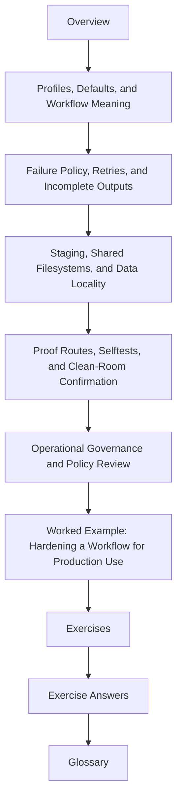

# Module 03: Production Operations and Policy Boundaries

Modules 01 and 02 teach workflow truth and disciplined dynamic behavior. Module 03 asks
the next practical question:

> how do you run that workflow under real pressure without letting operational convenience change its meaning?

This module is about making production operation explicit. Profiles, retries, staging,
logs, and confirmation routes are useful only when they stay on the policy side of the
line instead of leaking into workflow semantics.

## What this module is for

By the end of Module 03, you should be able to explain five things in plain language:

- what belongs in a profile and what belongs in workflow meaning
- which failures may be retried and which should stop the run immediately
- how incomplete outputs, logs, and failure evidence keep recovery honest
- how staging and shared-filesystem assumptions affect operation without rewriting semantics
- what proof route shows that a production workflow still deserves trust

## Study route



Read the module in that order the first time. When you return later, jump straight to the
page that matches the operational pressure in front of you.

## The ten files in this module

1. Overview (`index.md`)
2. [Profiles, Defaults, and Workflow Meaning](profiles-defaults-and-workflow-meaning.md)
3. [Failure Policy, Retries, and Incomplete Outputs](failure-policy-retries-and-incomplete-outputs.md)
4. [Staging, Shared Filesystems, and Data Locality](staging-shared-filesystems-and-data-locality.md)
5. [Proof Routes, Selftests, and Clean-Room Confirmation](proof-routes-selftests-and-clean-room-confirmation.md)
6. [Operational Governance and Policy Review](operational-governance-and-policy-review.md)
7. [Worked Example: Hardening a Workflow for Production Use](worked-example-hardening-a-workflow-for-production-use.md)
8. [Exercises](exercises.md)
9. [Exercise Answers](exercise-answers.md)
10. [Glossary](glossary.md)

## How to use the file set

| If you need to... | Start here |
| --- | --- |
| separate profile settings from workflow meaning | [Profiles, Defaults, and Workflow Meaning](profiles-defaults-and-workflow-meaning.md) |
| decide when to retry, rerun, or fail fast | [Failure Policy, Retries, and Incomplete Outputs](failure-policy-retries-and-incomplete-outputs.md) |
| reason about latency, scratch space, and shared-storage assumptions | [Staging, Shared Filesystems, and Data Locality](staging-shared-filesystems-and-data-locality.md) |
| choose the smallest honest production proof route | [Proof Routes, Selftests, and Clean-Room Confirmation](proof-routes-selftests-and-clean-room-confirmation.md) |
| review policy drift and operational ownership over time | [Operational Governance and Policy Review](operational-governance-and-policy-review.md) |
| see the whole module as one repaired production workflow | [Worked Example: Hardening a Workflow for Production Use](worked-example-hardening-a-workflow-for-production-use.md) |
| test your own understanding | [Exercises](exercises.md) |
| compare your reasoning against a reference answer | [Exercise Answers](exercise-answers.md) |
| stabilize the module vocabulary | [Glossary](glossary.md) |

## The running question

Carry this question through every page:

> if the execution context changes tomorrow, what exact boundary proves the workflow meaning did not?

Good Module 03 answers usually mention one or more of these:

- a profile setting that is clearly operational
- a failure policy that keeps poison outputs from being trusted
- a staging or latency assumption that is declared instead of implied
- a selftest or confirmation route that compares runs honestly
- a governance rule that keeps policy drift reviewable

## The running example

This module keeps returning to one practical workflow shape:

- the workflow can run locally or in CI through different profiles
- partial failures leave logs and rerunnable evidence instead of ambiguous state
- a clean-room route proves the repository from the outside
- a policy review can explain which settings changed execution context and which would have changed workflow meaning

That is the smallest production story worth teaching.

## Commands to keep close

These commands form the evidence loop for Module 03:

```bash
snakemake --profile profiles/local -n
snakemake --profile profiles/ci -n
snakemake --lint
make profile-audit
make confirm
```

They answer different questions:

- what the workflow plans under one local policy surface
- what changes under a second policy surface
- whether the workflow already shows contract problems
- how the repository packages profile differences for review
- whether the strongest built-in confirmation path still passes

## Learning outcomes

By the end of this module, you should be able to:

- keep profile policy separate from workflow semantics
- design retry and incomplete-output handling without hiding real failures
- explain how staging and filesystem latency affect operational trust
- choose a proportionate proof route for workflow operation
- review policy changes as durable repository decisions instead of one-off shell habits

## Exit standard

Do not move on until all of these are true:

- you can explain one profile change that is safe and one that would be semantic drift
- you can describe one failure that should be retried and one that should fail fast
- you can say where a partial output becomes safe to trust or must be rerun
- you can name one proof route stronger than dry-run and one reason it matters
- you can explain how another maintainer should review a policy change later

When those become ordinary, Module 03 has done its job.
