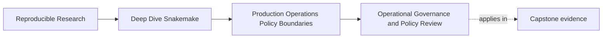
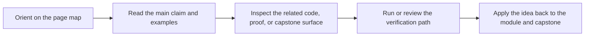

# Operational Governance and Policy Review

<!-- page-maps:start -->
## Page Maps

<!-- page-maps:end -->

Production operation does not stay healthy because one maintainer is careful once.

It stays healthy when the repository makes policy changes reviewable later.

That is the governance question for Module 03:

> if a profile, proof route, or recovery policy changes next month, how will the next maintainer know whether the change was operational, semantic, or dangerous?

This page answers that question.

## Governance starts with naming the boundary

Policy review becomes vague when teams cannot name what a policy surface is allowed to do.

Module 03 keeps the boundary small:

- profiles may change execution context
- failure policy may change recovery behavior
- staging policy may change operational placement
- proof routes may change how the repository demonstrates trust

None of those should silently change workflow meaning.

That is the sentence governance must keep alive.

## What a healthy policy change looks like

A healthy operational diff usually has three qualities:

- the owning boundary is obvious
- the review question is proportionate
- the evidence route is named

Example:

- boundary: `profiles/ci/config.yaml`
- question: does this change CI execution context without changing workflow meaning
- evidence route: compare dry-runs or run `make profile-audit`

That is a much stronger review habit than "looks harmless."

## What a weak policy change looks like

Weak operational diffs often have these warning signs:

- semantic settings move into a profile because it felt convenient
- recovery behavior changes without an explanation of the failure class
- proof commands are edited without clarifying what claim got stronger or weaker
- one maintainer starts using extra local flags that the repository never records

Those are governance problems because the next reviewer cannot reconstruct the intent.

## The repository should teach review order

Good governance is not only about what is stored. It is also about where a reviewer looks
first.

For Module 03, the healthy review order is usually:

1. profile files
2. workflow or config files only if the policy boundary seems to leak
3. proof-route targets such as `profile-audit`, `verify`, or `confirm`
4. resulting evidence bundles if the change claims to affect trust

That review order keeps operational diffs from turning into random repository archaeology.

## One durable governance habit

When a production change lands, the reviewer should be able to answer:

- what boundary owns this change
- what question should this diff settle
- what command or artifact confirms the answer

If one of those is missing, the change is harder to trust than it should be.

## A useful governance table

| Change type | First review question | Good first proof route |
| --- | --- | --- |
| profile diff | does this alter context only, or workflow meaning too | dry-run comparison or `make profile-audit` |
| retry or incomplete-policy diff | which failure class is this now treating differently | rule logs plus one rerun or recovery demonstration |
| staging or latency diff | does this change placement only, or the trust boundary too | context comparison and one executed verification route |
| proof-target diff | what claim is stronger or weaker after this edit | run the changed proof route deliberately |
| local shell habit not in the repository | should this become an explicit policy surface | encode it in profile, Makefile, or docs before relying on it |

This is the kind of table that helps a real maintainer review calmly.

## Why command folklore is a governance smell

If the real production story lives in Slack messages, wiki fragments, or one maintainer's
shell history, the repository is already harder to trust.

That is why Module 03 keeps returning to:

- versioned profiles
- named proof routes
- stable review bundles

These are governance tools because they move operational knowledge back into reviewable
repository surfaces.

## Common failure modes

| Failure mode | What it looks like | Better repair |
| --- | --- | --- |
| a profile accumulates semantic toggles over time | operational review quietly becomes semantic review | move meaning back into config or workflow code |
| proof routes multiply without distinct purposes | nobody knows which command proves what | document the proof ladder and keep route purposes narrow |
| local incident flags become permanent habits | production operation depends on memory | promote durable habits into profiles or Make targets |
| policy bundles are generated but never read with a question in mind | evidence exists without judgment | record the review question alongside the route |
| governance depends on one maintainer's intuition | continuity breaks during handoff | encode review order and ownership in repository surfaces |

## The explanation a reviewer trusts

Strong explanation:

> this diff changes CI execution policy only, so the first review surface is the CI profile;
> the policy boundary is checked with `make profile-audit`, and no semantic workflow files
> should need to change for the review to stay clean.

Weak explanation:

> this is just an ops tweak, so it probably does not matter much.

The strong version preserves review discipline. The weak version erodes it.

## End-of-page checkpoint

Before leaving this page, you should be able to:

- explain why policy changes need named ownership boundaries
- describe one healthy review order for an operational diff
- identify one sign that command folklore is replacing repository governance
- explain how proof routes support handoff and long-term maintenance
