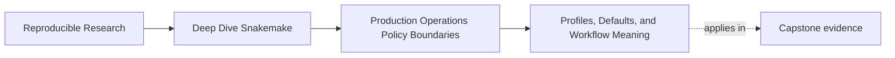
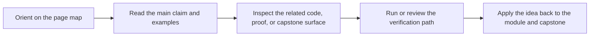

# Profiles, Defaults, and Workflow Meaning


<!-- page-maps:start -->
## Page Maps




<!-- page-maps:end -->

Module 03 begins with the boundary that most production confusion grows out of:

> a profile may change how the workflow runs, but it must not change what the workflow means.

If that sentence is fuzzy, every later operational decision becomes harder to review.

## Profiles are for operating context

Profiles are where a repository records run policy such as:

- whether incomplete work should rerun
- whether shell commands should be printed
- how long to wait for filesystem latency
- which executor or scheduler-facing defaults apply

Those settings matter. They still do not define the analytical meaning of the workflow.

The workflow meaning should still come from:

- declared inputs
- config that changes the intended outputs
- rule code and helper code
- published contract surfaces

That is the boundary this page is defending.

## Why this split matters in practice

When profiles and workflow meaning blur together, several bad things happen at once:

- a local convenience file quietly changes what gets built
- CI and local runs produce different intended results without anyone naming the reason
- a profile review sounds operational even though it is hiding a semantic change
- later maintainers cannot tell whether a diff needs scientific review or only runtime review

Strong production workflows make that distinction reviewable before the incident happens.

## A healthy profile example

From the capstone, a local profile contains settings like:

```yaml
rerun-incomplete: true
printshellcmds: true
show-failed-logs: true
latency-wait: 30
```

Those are strong policy examples because they answer operational questions:

- how much run detail should be shown
- how patient should the run be with filesystem lag
- what should happen after an incomplete output is detected

None of those settings says which samples exist or what the publish bundle is supposed to
mean.

## A weak profile example

This would be a bad profile boundary:

```yaml
samples:
  - sampleA
  - sampleB
publish_version: v2
```

Why it is bad:

- `samples` changes the target set
- `publish_version` changes a public contract surface
- both settings alter workflow meaning, not just runtime context

Those values belong in workflow config or in explicit repository code, not in a
machine-facing profile.

## Defaults are not a loophole

Learners sometimes understand the profile rule and then break it through defaults inside
the workflow:

- hidden environment-variable fallbacks
- local-path shortcuts that only one maintainer knows
- runtime branches based on hostnames or current shells

Those are not cleaner than bad profiles. They are just harder to review.

Healthy defaults should be:

- visible in `Snakefile` or config
- stable across contexts unless deliberately overridden
- harmless when the operating profile changes

## One useful review table

| Question | If yes, it belongs closer to... |
| --- | --- |
| does this change which outputs the workflow is supposed to produce | workflow config or code |
| does this change scheduling, visibility, or failure handling only | profile policy |
| would a downstream contract need to change if this changed | workflow meaning |
| could local, CI, and SLURM all vary this safely | profile policy |

This table is not perfect. It is still a strong habit for human review.

## The capstone pattern worth copying

The capstone keeps three profile directories:

- `profiles/local/`
- `profiles/ci/`
- `profiles/slurm/`

That design teaches an important lesson:

- the workflow meaning is one thing
- the operating contexts are several
- the repository is allowed to represent that difference openly

Profiles are not a hack here. They are the formal place where context variation lives.

## A good audit question

When a profile changes, do not ask only:

> does the workflow still run?

Ask:

> would this diff require semantic review if it were moved into config or rule code?

If the answer is yes, the boundary is probably wrong already.

## Common failure modes

| Failure mode | What it looks like | Better repair |
| --- | --- | --- |
| sample or reference data appears in a profile | local and CI differ in target meaning | move semantic inputs into config |
| hidden shell defaults choose a workflow branch | the run depends on who launched it | promote the choice into explicit config or code |
| profile names are vague | nobody can explain why two profiles exist | name them by operating context, such as `local`, `ci`, or `slurm` |
| profile diffs are reviewed casually | semantic drift sneaks in under operational language | review profile changes against the policy-versus-meaning boundary explicitly |
| command-line flags are the only real policy record | the repository cannot explain how it was normally run | version the stable flags in profiles |

## The explanation a reviewer trusts

Strong explanation:

> `profiles/local` and `profiles/ci` differ in operational settings like log visibility and
> latency handling, but the sample set, publish version, and rule logic stay in workflow
> config and code, so changing profiles alters context without altering meaning.

Weak explanation:

> profiles are where we put the stuff that is easier not to hardcode.

The first explanation gives a boundary. The second gives a convenience excuse.

## End-of-page checkpoint

Before leaving this page, you should be able to:

- name three settings that belong in a profile
- name two settings that do not belong in a profile
- explain why local, CI, and SLURM profiles can differ safely
- describe one review question that catches policy leaking into workflow meaning
