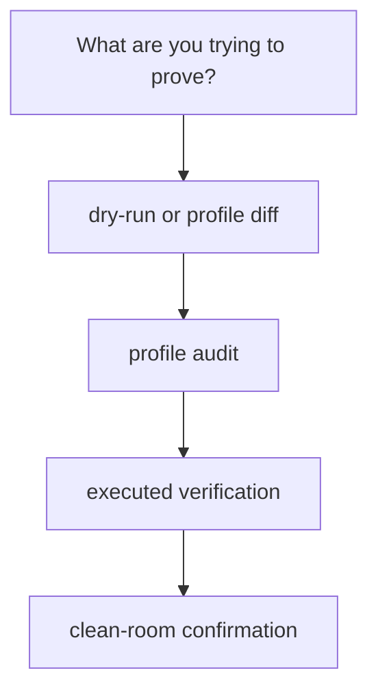

# Proof Routes, Selftests, and Clean-Room Confirmation

Production confidence should not come from one feeling:

> it worked on my machine once.

Module 03 replaces that feeling with proof routes. The idea is simple:

- choose the smallest honest command for the question
- keep stronger routes available when the claim grows
- let the repository explain why each route exists

That is how operational trust becomes teachable.

## Not every question needs the strongest proof

A common bad habit is to jump straight to the heaviest confirmation command for every
question.

That wastes time and teaches the wrong lesson. The real skill is proportion:

- dry-run for planning questions
- profile comparison for policy questions
- executed verification for contract questions
- clean-room confirmation for stewardship questions

This module is about learning that ladder, not only memorizing the top rung.

## A practical proof ladder for Module 03

### 1. Dry-run

Use this when the question is:

- what would run
- how does one profile differ from another at planning time
- has the workflow meaning stayed stable at the DAG level

Typical commands:

```bash
snakemake --profile profiles/local -n
snakemake --profile profiles/ci -n
```

### 2. Profile audit

Use this when the question is:

- which settings differ across local, CI, and scheduler contexts
- are those differences policy or semantic drift

Typical command:

```bash
make profile-audit
```

This is a human-review route, not just a run route.

### 3. Executed verification

Use this when the question is:

- does the workflow execute and leave behind the expected evidence
- are the published artifacts complete and aligned

Typical commands in the capstone include `make verify` and `make verify-report`.

### 4. Clean-room confirmation

Use this when the question is:

- can the repository still prove itself through its strongest built-in route
- would another maintainer trust the workflow as a working specimen

Typical command:

```bash
make confirm
```

This is not the first proof route. It is the strongest one.

## Why selftests matter

A selftest is the repository testing its own workflow contract, not only the scientific or
analytical code inside one rule.

Good selftests usually check things like:

- stable outputs across different core counts
- workflow lint cleanliness
- drift detection surfaces
- basic contract alignment of published artifacts

That makes selftest a workflow-level proof surface.

## The capstone selftest teaches the right habit

The capstone selftest compares a normalized published summary across different core counts.

That is valuable because it asks a real production question:

> does the workflow keep the same meaning when the execution context changes in an allowed way?

That is stronger than merely asking whether both runs exited successfully.

## One helpful mental model



The direction here is important:

- move upward only when the claim changes
- do not use the strongest route as a substitute for understanding the smaller one

## Common proof-route mistakes

| Mistake | Why it hurts | Better repair |
| --- | --- | --- |
| using `confirm` for every small question | slows review and hides which claim is actually under test | start with the narrowest honest route |
| trusting dry-run for publish integrity | planning alone cannot prove executed contract surfaces | escalate to executed verification when the claim requires it |
| treating selftest as only a program test | workflow-level drift stays unchecked | include workflow invariants such as determinism or contract alignment |
| collecting evidence without a review question | bundles grow but comprehension stays weak | name the question before picking the route |
| comparing local and CI behavior only by intuition | policy drift becomes anecdotal | package the difference in a profile-audit surface |

## The explanation a reviewer trusts

Strong explanation:

> dry-run answers the planning question, `make profile-audit` answers the policy-difference
> question, `make verify` answers the executed-contract question, and `make confirm`
> answers the strongest clean-room confidence question; each route exists because it proves
> a different claim.

Weak explanation:

> we usually just run the biggest target so we know everything is fine.

The strong version teaches proportion. The weak version teaches ritual.

## End-of-page checkpoint

Before leaving this page, you should be able to:

- name one question that only needs dry-run
- name one question that needs a profile audit bundle
- explain why selftests are workflow proofs rather than only program tests
- describe when clean-room confirmation is proportionate and when it is not
