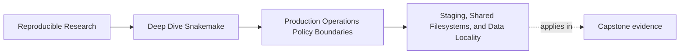
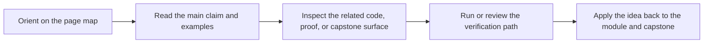
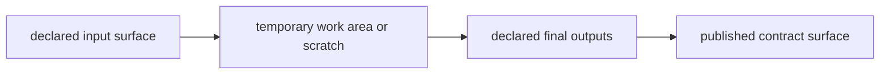

# Staging, Shared Filesystems, and Data Locality

<!-- page-maps:start -->
## Page Maps

<!-- page-maps:end -->

Many production failures are blamed on "the cluster" or "Snakemake being weird" when the
real issue is simpler:

> the repository never stated what it assumes about where files live and when they become visible.

This page is about making those assumptions explicit.

## Data locality is an operational boundary

The workflow meaning may be unchanged while the operating context changes:

- local filesystem
- CI workspace
- shared cluster filesystem
- scratch or staged working directory

Those contexts can differ safely, but only if the repository treats them as policy
surfaces instead of invisible background facts.

## The two questions to ask first

When an output "goes missing" or appears late, ask:

1. where was the job really writing
2. when should another process be allowed to trust that write

Those questions are often more useful than staring at one failed command.

## Shared filesystems add timing pressure

On a shared filesystem, a job may finish before another process sees the output
immediately. That does not mean the workflow semantics changed. It means the operating
context needs an explicit patience policy.

This is where settings such as latency handling belong:

- they acknowledge the storage model
- they remain operational rather than semantic
- they help the workflow remain honest under normal infrastructure lag

That is a legitimate profile concern.

## Scratch and staging are not semantic detours

Teams often stage work to local scratch or temporary directories for good reasons:

- faster local IO
- reduced pressure on shared storage
- simpler cleanup during execution

That can be healthy. It becomes dangerous when the repository stops answering:

- which paths are temporary
- which path is the final trusted publication surface
- how staged outputs become durable outputs

Staging is safe only when the final contract remains clear.

## One healthy mental model

This model matters because it keeps three roles separate:

- where work happens
- where final workflow outputs live
- what downstream users are allowed to trust

When those collapse into one vague directory story, incidents get harder to explain.

## A weak staging habit

Weak operational habit:

- write directly to whatever path is convenient on the current machine
- move files around ad hoc when the scheduler changes
- let each maintainer decide whether scratch is used

This creates repository behavior that feels situational rather than intentional.

The repository may still run. Another maintainer will not know which path story to trust.

## A stronger staging pattern

Healthy staging design usually has these properties:

- the final output path is still the declared contract
- temporary or scratch paths are clearly operational
- publication into the final path is deliberate
- profiles or operating docs explain the context difference

This keeps the workflow semantics stable even while the operating context changes.

## What should stay out of workflow meaning

The following often belong in policy rather than workflow meaning:

- latency expectations
- scratch or staging location
- executor-facing storage behavior
- log-location conventions for one operating context

The following usually do not belong purely in policy:

- which files count as final outputs
- whether a file is part of the publish boundary
- which sample identities the workflow is meant to process

That is the same module boundary in a new setting.

## Common failure modes

| Failure mode | What it looks like | Better repair |
| --- | --- | --- |
| shared-filesystem lag is treated as random workflow failure | reruns feel arbitrary | make latency handling explicit in policy |
| scratch usage changes the apparent final path story | maintainers cannot tell what is durable | keep final outputs and scratch paths separate |
| local and CI use different path assumptions without review | one context works and the other feels haunted | document and encode the context difference in profiles or operation docs |
| staging hides partial publication | files appear in final locations too early | keep publication explicit and deliberate |
| temporary paths become accidental contracts | downstream tools start depending on scratch layout | reserve stable trust only for declared final outputs |

## The explanation a reviewer trusts

Strong explanation:

> the workflow may stage work in a context-specific scratch area, but the final outputs are
> still published into the same declared contract paths; profile settings handle latency and
> execution context, while publish and results paths remain semantically stable.

Weak explanation:

> on the cluster we write files somewhere else first because that is just how it works.

The first explanation gives a boundary. The second gives a habit without a contract.

## End-of-page checkpoint

Before leaving this page, you should be able to:

- explain why data locality is an operational boundary
- describe one legitimate policy use for latency handling
- distinguish scratch space from final output contracts
- explain one staging design that keeps workflow meaning stable across contexts
