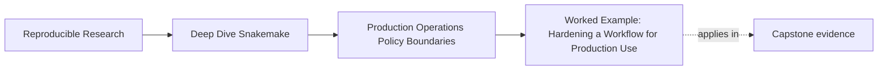

# Worked Example: Hardening a Workflow for Production Use


<!-- page-maps:start -->
## Page Maps




<!-- page-maps:end -->

This file ties the whole module together around one realistic problem:

> a workflow runs locally, but the team now wants to run it in CI and review it like a production repository.

The question is not "how do we add more flags?" The question is how to make the workflow
operable without blurring its meaning.

## The starting situation

Assume the repository already has:

- truthful rule contracts
- explicit dynamic discovery from Module 02
- a stable publish boundary

What it does not yet have is a clean production story.

The maintainers currently do this:

- one person runs `snakemake -p --rerun-incomplete`
- another person adds extra flags in CI
- partial failures are handled ad hoc
- no one can explain which settings are policy and which would change workflow meaning

That is a good Module 03 starting point because it is common and fixable.

## Step 1: move stable run policy into profiles

The first repair is not a scheduler change. It is naming the operating contexts.

So introduce:

```text
profiles/
  local/config.yaml
  ci/config.yaml
  slurm/config.yaml
```

Now the repository can answer:

- what local runs normally do
- what CI runs normally do
- what scheduler-oriented policy looks like

This is Core 1 becoming concrete. The team stops relying on private shell habits.

## Step 2: give failures a small honest policy

The team then reviews how failed runs behave.

Weak current behavior:

- retry until it passes
- inspect the terminal if something looks wrong
- trust whatever files are left behind

The repair is to state a failure policy:

- transient failure may be retried
- incomplete outputs are rerun deliberately
- logs remain available for review
- semantic errors fail fast instead of hiding under retries

This is Core 2: recovery becomes a contract, not a mood.

## Step 3: make storage assumptions explicit

Next, the team notices that local runs and CI runs do not feel the same:

- CI sometimes needs more patience for output visibility
- a scheduler-oriented run may use different scratch or staging assumptions

The weak reaction would be to patch the workflow code for each context.

The stronger reaction is:

- keep the final output and publish paths semantically stable
- place latency and staging assumptions in operating policy
- review scratch behavior as context, not as workflow meaning

This is Core 3: data locality changes how the workflow runs, not what the workflow means.

## Step 4: connect operation to proof routes

At this point the repository has profiles and a failure story, but the team still needs a
review route.

So define a proof ladder:

- dry-run for planning
- `make profile-audit` for policy comparison
- `make verify` for executed workflow confidence
- `make confirm` for the strongest clean-room repository proof

This is Core 4: production trust grows by named routes, not by one giant ritual command.

## Step 5: make policy review survivable for the next maintainer

The last repair is governance.

The repository should make it obvious that:

- profile changes are reviewed first as policy diffs
- semantic workflow changes belong elsewhere
- proof-route changes should explain which claim got stronger or weaker

This is Core 5: the repository teaches its own review order instead of leaving it to
memory.

## The repaired production story

By the end of these repairs, the workflow can be described cleanly:

1. workflow meaning stays in rule code, config, and publish contracts
2. profiles encode operating context only
3. failures leave rerunnable or reviewable state instead of ambiguous poison
4. storage and latency assumptions are explicit
5. proof routes scale from dry-run to clean-room confirmation

That is what it means to harden a workflow for production use without turning it into a
different workflow.

## Review questions for the repaired design

When you inspect a repository shaped like this, ask:

1. which profile settings are context only
2. how does the repository distinguish retryable from fail-fast conditions
3. where are staging and latency assumptions recorded
4. which proof route answers the current operational question
5. how would the next maintainer review a profile diff without guesswork

If those answers are visible, the module’s production story has landed.
