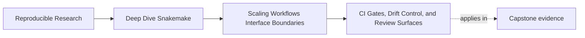
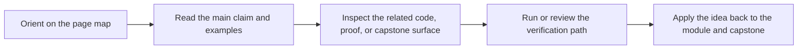
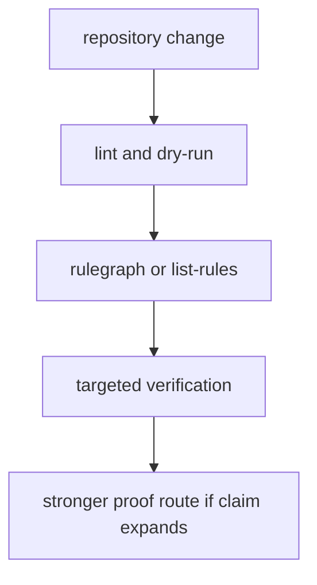

# CI Gates, Drift Control, and Review Surfaces

<!-- page-maps:start -->
## Page Maps

<!-- page-maps:end -->

Scaling does not stay safe because people intend to be careful.

It stays safe because the repository makes the risky boundaries visible early.

That is what CI gates and review surfaces are for.

## A gate should defend a named contract

Weak gating culture says:

> add more checks until the repository feels safer.

Strong gating culture says:

> choose the smallest gate that proves one specific scaling boundary is still intact.

That difference matters. Otherwise the repository accumulates noisy checks without
teaching what they protect.

## What good scaling gates usually defend

In Module 04, gates are most useful when they protect things like:

- the workflow still plans correctly
- rule families remain visible and lint-clean
- interface paths or schemas have not drifted silently
- public contracts still parse and align
- repository growth did not make the graph harder to review

These are scaling questions, not merely "did one command exit zero" questions.

## A practical gate ladder

Useful gates often build on one another:

- `--lint` for immediate design hygiene
- dry-run for plan visibility
- rule listing or rulegraph for surface visibility
- targeted tests or verification for interface trust
- stronger end-to-end proof routes when the change claims repository-level safety

The ladder matters because not every diff deserves the heaviest route first.

## Drift control is part of the same story

As the repository grows, changes become harder to see by eye alone.

Drift surfaces help answer:

- did code changes affect planned outputs
- did parameter or interface changes alter what should rerun
- did a public contract change even though the filenames look similar

Without drift evidence, scaling review becomes guesswork faster than most teams expect.

## One healthy review pattern

This is a scaling pattern because it keeps the repository reviewable as changes get wider.

## What makes a review surface useful

A review surface is useful when it helps a human answer a precise question quickly.

Examples:

- `--list-rules` helps review whether a split still exposes the expected rule families
- `--rulegraph` helps review whether relationships stayed legible after modularization
- a verification bundle helps review whether the publish contract still aligns

Those are stronger than "we ran CI and it passed" because they teach what passed.

## Common failure modes

| Failure mode | What it looks like | Better repair |
| --- | --- | --- |
| gates are added without named ownership | CI becomes noisy but not more informative | tie each gate to one contract question |
| only end-to-end routes are trusted | small boundary failures are harder to localize | keep narrower review surfaces available |
| drift is noticed only after outputs look strange | interface changes arrive too late | add earlier drift or validation evidence |
| rule splits happen without a surface check | the repository gets bigger and less legible | review `--list-rules` or rulegraph deliberately |
| validation exists but no one knows what it protects | the gate feels bureaucratic | state the protected boundary in docs or review comments |

## The explanation a reviewer trusts

Strong explanation:

> this gate exists because the workflow was split into new rule families; `--list-rules`
> and the rulegraph confirm the visible surface still matches the intended architecture,
> while verification checks the public contract only when the change reaches that boundary.

Weak explanation:

> we added a few more CI checks because the repository is getting larger.

The strong version names the contract. The weak version names only anxiety.

## End-of-page checkpoint

Before leaving this page, you should be able to:

- explain why a gate should defend a named boundary
- name one narrow review surface and one stronger proof route
- describe how drift evidence supports scaling review
- explain why CI success without boundary clarity is still weak governance
